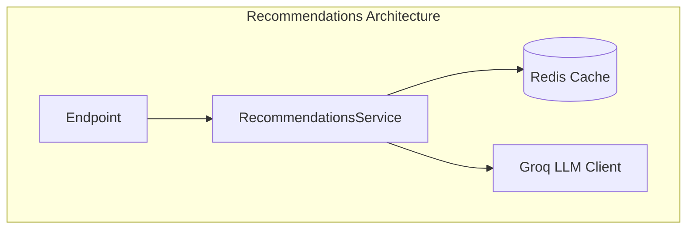
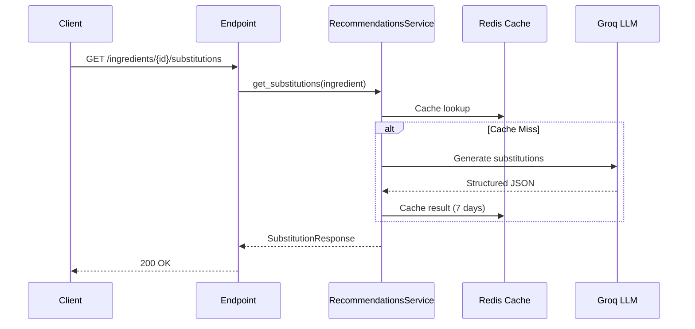
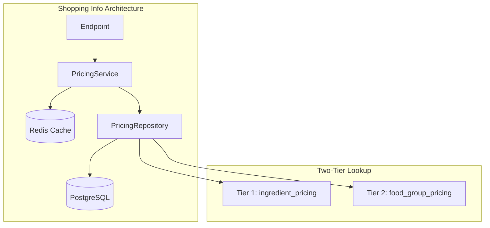
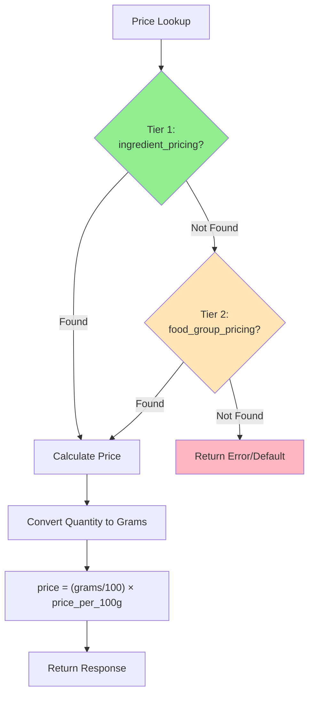
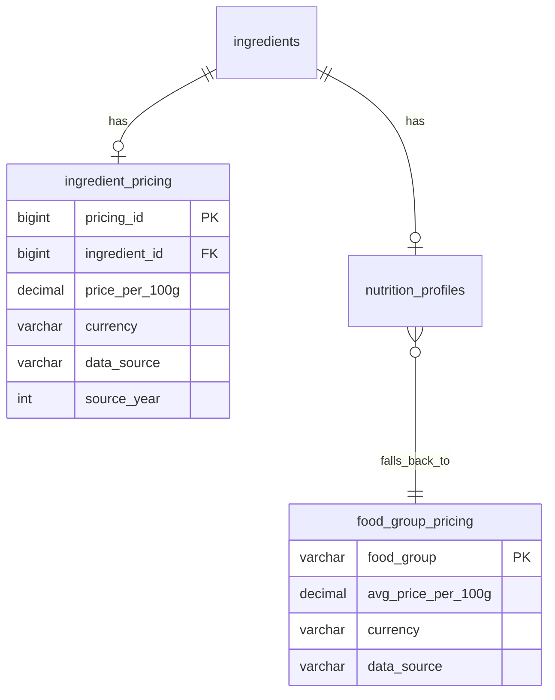

# Plan: Recommendations & Shopping Feature Data Sources

## Data Source Strategy Summary

| Feature              | Data Source         | Rationale                                                |
| -------------------- | ------------------- | -------------------------------------------------------- |
| **Substitutions**    | LLM (Groq)          | Follows existing pattern, flexible, handles edge cases   |
| **Pairings**         | LLM (Groq)          | Follows existing pattern, generates creative suggestions |
| **Shopping/Pricing** | USDA-based database | User preference for reliability over LLM estimation      |

---

## Part 1: Recommendations Feature (LLM-Powered)

### Architecture Overview

Both substitutions and pairings will follow the existing LLM pattern established by `RecipeLinkExtractor`:

```
API Request → Service → LLM Client (Groq) → Structured Response
                ↓
            Redis Cache (configurable TTL)
```

### 1.1 Ingredient Substitutions

**Data Flow:**

1. Receive ingredient ID + optional quantity
2. Fetch ingredient details from Recipe Management Service
3. Generate LLM prompt with ingredient context
4. Parse structured JSON response with substitutes + conversion ratios
5. Cache result by ingredient name

**LLM Prompt Strategy:**

```
Given ingredient: {name} ({food_group})
Optional context: quantity {amount} {unit}

Generate 5-10 substitutions with:
- Substitute ingredient name
- Conversion ratio (e.g., 0.75x for whole wheat flour replacing all-purpose)
- Best use case (baking, cooking, raw)
- Flavor/texture notes
```

**Response Schema (Pydantic):**

```python
class SubstitutionResult(BaseModel):
    ingredient: str
    conversion_ratio: float
    conversion_unit: IngredientUnit
    notes: str | None
    confidence: float  # 0-1 from LLM
```

**Cache Strategy:**

- Key: `substitution:{ingredient_name_normalized}`
- TTL: 7 days (substitutions are relatively stable)
- Store raw LLM output, paginate at response time

### 1.2 Recipe Pairings

**Data Flow:**

1. Receive recipe ID
2. Fetch recipe details (title, ingredients, cuisine tags)
3. Generate LLM prompt with recipe context
4. Parse structured JSON response with pairing suggestions
5. Cache result by recipe ID

**LLM Prompt Strategy:**

```
Recipe: {title}
Key ingredients: {top_5_ingredients}
Cuisine type: {cuisine} (if available)
Meal type: {meal_type} (if available)

Suggest 5-10 complementary recipes/dishes that:
- Balance the meal nutritionally
- Complement flavor profiles
- Match cuisine style
- Consider course (appetizer, side, dessert)
```

**Response Schema:**

```python
class PairingSuggestion(BaseModel):
    recipe_name: str
    url: str | None  # If known recipe URL
    pairing_reason: str
    course_type: str  # appetizer, side, main, dessert
    confidence: float
```

**Cache Strategy:**

- Key: `pairing:{recipe_id}`
- TTL: 24 hours (shorter since recipes may change)

---

## Part 2: Shopping Feature (Database-Powered)

### Architecture Overview

```
API Request → Service → Pricing Repository → PostgreSQL
                ↓              ↓
            Redis Cache    ingredient_pricing → food_group_pricing (fallback)
```

### 2.1 Database Schema Design

**Two-tier approach: Per-ingredient + food group fallback**

✅ **IMPLEMENTED** in `schema-copy/052_create_ingredient_pricing_table.sql` and `schema-copy/053_create_food_group_pricing_table.sql`

```sql
-- Primary: Per-ingredient pricing (USDA + Kaggle import)
CREATE TABLE recipe_manager.ingredient_pricing (
    pricing_id BIGSERIAL PRIMARY KEY,
    ingredient_id BIGINT NOT NULL UNIQUE REFERENCES ingredients(ingredient_id) ON DELETE CASCADE,
    price_per_100g DECIMAL(10,4) NOT NULL CHECK (price_per_100g >= 0),
    currency VARCHAR(3) NOT NULL DEFAULT 'USD',
    data_source VARCHAR(50) NOT NULL CHECK (data_source IN ('USDA_FVP', 'USDA_MEAT', 'USDA_FMAP', 'KAGGLE', 'MANUAL')),
    source_year INTEGER CHECK (source_year IS NULL OR (source_year >= 2000 AND source_year <= 2100)),
    notes TEXT,
    created_at TIMESTAMPTZ DEFAULT now(),
    updated_at TIMESTAMPTZ DEFAULT now()
);

-- Fallback: Food group averages (uses FOOD_GROUP_ENUM for type safety)
CREATE TABLE recipe_manager.food_group_pricing (
    food_group FOOD_GROUP_ENUM PRIMARY KEY,  -- VEGETABLES, FRUITS, GRAINS, etc.
    avg_price_per_100g DECIMAL(10,4) NOT NULL CHECK (avg_price_per_100g >= 0),
    currency VARCHAR(3) NOT NULL DEFAULT 'USD',
    data_source VARCHAR(50) NOT NULL DEFAULT 'USDA_FMAP' CHECK (data_source IN ('USDA_FVP', 'USDA_MEAT', 'USDA_FMAP', 'KAGGLE', 'MANUAL')),
    notes TEXT,
    updated_at TIMESTAMPTZ DEFAULT now()
);
```

### 2.2 Pricing Data Sources

**Primary Sources (Per-Ingredient):**

| Source    | Dataset                                                                                       | Items     | Coverage                                 |
| --------- | --------------------------------------------------------------------------------------------- | --------- | ---------------------------------------- |
| USDA_FVP  | [Fruit & Vegetable Prices](https://www.ers.usda.gov/data-products/fruit-and-vegetable-prices) | 150+      | Produce                                  |
| USDA_MEAT | [Meat Price Spreads](https://www.ers.usda.gov/data-products/meat-price-spreads)               | ~50       | Beef, pork, chicken, turkey, eggs, dairy |
| KAGGLE    | TBD grocery dataset                                                                           | TBD       | Spices, grains, nuts, legumes, etc.      |
| MANUAL    | Manual curation                                                                               | As needed | High-value or common items               |

**Fallback Source (Food Group):**

| Source    | Dataset                                                                                                | Groups |
| --------- | ------------------------------------------------------------------------------------------------------ | ------ |
| USDA_FMAP | [Food-at-Home Monthly Prices](https://www.ers.usda.gov/data-products/food-at-home-monthly-area-prices) | 90     |

**Data Import Strategy:**

1. Import USDA Fruit & Vegetable Prices (~150 items)
2. Import USDA Meat Price Spreads (~50 items)
3. Import Kaggle grocery data for gaps (spices, grains, nuts, legumes)
4. Seed food group fallback from USDA F-MAP
5. Manual curation for any remaining high-value items

### 2.3 Price Calculation Flow

**Ingredient Shopping Info:**

1. Fetch ingredient by ID from Recipe Management Service
2. **Tier 1:** Look up `price_per_100g` from `ingredient_pricing`
3. **Tier 2 (fallback):** If not found, get `food_group` from `nutrition_profiles`, look up `avg_price_per_100g` from `food_group_pricing`
4. Convert requested quantity to grams using `UnitConverter`
5. Calculate: `price = (grams / 100) * price_per_100g`
6. Return with source info and confidence level (higher for Tier 1)

**Recipe Shopping Info:**

1. Fetch all ingredients for recipe
2. Calculate price for each ingredient (as above)
3. Aggregate total
4. Return breakdown + total + count of Tier 1 vs Tier 2 lookups

### 2.4 Cache Strategy

- Key: `shopping:{ingredient_id}:{amount}:{unit}`
- TTL: 24 hours (prices can change)
- Cache individual ingredient lookups
- Don't cache recipe totals (computed from cached ingredients)

---

## Implementation Sequence

### Phase 1: Core Infrastructure

1. Add `food_group_pricing` table + seed data migration
2. Create `PricingRepository` with food group lookup
3. Create `PricingService` with caching layer
4. Add pricing schemas to `/src/app/schemas/shopping.py`

### Phase 2: Shopping Endpoints

1. Implement `GET /ingredients/{id}/shopping-info`
2. Implement `GET /recipes/{id}/shopping-info`
3. Add integration tests

### Phase 3: Recommendations Infrastructure

1. Create `RecommendationsService` base class
2. Add recommendation schemas to `/src/app/schemas/recommendations.py`
3. Create LLM prompt templates

### Phase 4: Recommendation Endpoints

1. Implement `GET /ingredients/{id}/substitutions`
2. Implement `GET /recipes/{id}/pairings`
3. Add integration tests

---

## Files to Create/Modify

### New Files

```
src/app/schemas/shopping.py           # Shopping response schemas
src/app/schemas/recommendations.py    # Recommendation response schemas
src/app/services/shopping/            # Shopping service directory
  ├── __init__.py
  ├── service.py                      # PricingService
  └── repository.py                   # PricingRepository
src/app/services/recommendations/     # Recommendations service directory
  ├── __init__.py
  ├── service.py                      # RecommendationsService
  ├── substitutions.py                # Substitution logic
  └── pairings.py                     # Pairing logic
src/app/api/v1/endpoints/shopping.py  # Shopping endpoints (if separate file)
```

### Modified Files

```
src/app/api/v1/endpoints/ingredients.py  # Add substitutions, shopping-info
src/app/api/v1/endpoints/recipes.py      # Add pairings, shopping-info
src/app/api/v1/router.py                 # Register new routes
src/app/database/repositories/__init__.py # Export PricingRepository
```

### Database Migration

```
migrations/versions/XXX_add_food_group_pricing.py
```

---

## Testing & Documentation Requirements

### Per-Task Testing Requirements

#### Ingredient Substitutions Endpoint

**Unit Tests:**

- `test_substitutions_service_generates_valid_prompt` - LLM prompt includes ingredient name, food group
- `test_substitutions_service_parses_llm_response` - Correctly extracts substitutions from JSON
- `test_substitutions_service_caches_result` - Verifies Redis caching with correct key/TTL
- `test_substitutions_schema_validation` - Response matches `SubstitutionResult` schema

**Integration Tests:**

- `test_substitutions_endpoint_returns_200` - Happy path with valid ingredient ID
- `test_substitutions_endpoint_404_unknown_ingredient` - Returns 404 for non-existent ID
- `test_substitutions_endpoint_pagination` - `limit` and `offset` work correctly
- `test_substitutions_endpoint_with_quantity` - Optional `amount`/`measurement` params

**Documentation:**

- OpenAPI spec entry in `docs/api/recipe-scraper-openapi.yaml`
- Example request/response in endpoint docstring

---

#### Recipe Pairings Endpoint

**Unit Tests:**

- `test_pairings_service_generates_valid_prompt` - LLM prompt includes recipe title, ingredients, cuisine
- `test_pairings_service_parses_llm_response` - Correctly extracts pairings from JSON
- `test_pairings_service_caches_result` - Verifies Redis caching with correct key/TTL
- `test_pairings_schema_validation` - Response matches `PairingSuggestion` schema

**Integration Tests:**

- `test_pairings_endpoint_returns_200` - Happy path with valid recipe ID
- `test_pairings_endpoint_404_unknown_recipe` - Returns 404 for non-existent ID
- `test_pairings_endpoint_pagination` - `limit` and `offset` work correctly

**Documentation:**

- OpenAPI spec entry in `docs/api/recipe-scraper-openapi.yaml`
- Example request/response in endpoint docstring

---

#### Ingredient Shopping Info Endpoint

**Unit Tests:**

- `test_pricing_repository_tier1_lookup` - Finds price in `ingredient_pricing`
- `test_pricing_repository_tier2_fallback` - Falls back to `food_group_pricing`
- `test_pricing_service_calculates_price` - `(grams / 100) * price_per_100g`
- `test_pricing_service_caches_result` - Verifies Redis caching
- `test_pricing_service_unit_conversion` - Correctly converts cups, tbsp, etc. to grams
- `test_shopping_schema_validation` - Response matches schema

**Integration Tests:**

- `test_shopping_endpoint_returns_200` - Happy path with valid ingredient ID
- `test_shopping_endpoint_404_unknown_ingredient` - Returns 404 for non-existent ID
- `test_shopping_endpoint_with_quantity` - Scales price by `amount`/`measurement`
- `test_shopping_endpoint_tier1_vs_tier2_confidence` - Higher confidence for Tier 1

**Documentation:**

- OpenAPI spec entry in `docs/api/recipe-scraper-openapi.yaml`
- Example request/response in endpoint docstring

---

#### Recipe Shopping Info Endpoint

**Unit Tests:**

- `test_recipe_shopping_aggregates_ingredients` - Sums prices for all ingredients
- `test_recipe_shopping_handles_missing_ingredients` - Graceful handling of unknowns
- `test_recipe_shopping_response_structure` - Includes breakdown + total

**Integration Tests:**

- `test_recipe_shopping_endpoint_returns_200` - Happy path with valid recipe ID
- `test_recipe_shopping_endpoint_404_unknown_recipe` - Returns 404 for non-existent ID
- `test_recipe_shopping_endpoint_partial_pricing` - Returns 206 if some ingredients missing price

**Documentation:**

- OpenAPI spec entry in `docs/api/recipe-scraper-openapi.yaml`
- Example request/response in endpoint docstring

---

### Manual Testing Checklist

```bash
# Shopping
curl "http://localhost:8000/api/v1/recipe-scraper/ingredients/1/shopping-info?amount=2&measurement=CUP"
curl "http://localhost:8000/api/v1/recipe-scraper/recipes/1/shopping-info"

# Recommendations
curl "http://localhost:8000/api/v1/recipe-scraper/ingredients/1/substitutions?limit=5"
curl "http://localhost:8000/api/v1/recipe-scraper/recipes/1/pairings?limit=5"
```

### Definition of Done (Per Task)

- [ ] All unit tests pass
- [ ] All integration tests pass
- [ ] OpenAPI spec updated
- [ ] Endpoint docstring includes example
- [ ] Manual curl test succeeds
- [ ] Code reviewed

---

## Feature Documentation Requirements

Following the format of `docs/nutritional-info.md` and `docs/allergen-info.md`, create two new documentation files:

### `docs/recommendations.md` - Recommendations Feature

**Table of Contents:**

1. Overview (high-level architecture mermaid diagram)
2. API Endpoints (substitutions + pairings with params/responses)
3. Processing Flow (mermaid sequence diagrams for LLM flow)
4. LLM Prompt Strategy (prompt templates, response parsing)
5. Caching Strategy (mermaid diagram, keys, TTLs)
6. Error Handling (LLM failures, fallbacks)

**Required Mermaid Diagrams:**





---

### `docs/shopping-info.md` - Shopping Feature

**Table of Contents:**

1. Overview (high-level architecture mermaid diagram)
2. API Endpoints (ingredient + recipe shopping-info)
3. Processing Flow (mermaid sequence diagrams)
4. Two-Tier Pricing Lookup (mermaid flowchart)
5. Price Calculation (formula, unit conversion)
6. Caching Strategy (mermaid diagram, keys, TTLs)
7. Database Schema (mermaid ER diagram)
8. Error Handling (missing prices, fallbacks)
9. Data Attribution (USDA ERS sources)

**Required Mermaid Diagrams:**







---

## Decisions (Finalized)

| Decision                | Choice                               | Rationale                                                                 |
| ----------------------- | ------------------------------------ | ------------------------------------------------------------------------- |
| **Pricing granularity** | Per-ingredient + food group fallback | Two-tier: USDA/Kaggle data per ingredient, food group average as fallback |
| **Data sources**        | USDA datasets + Kaggle supplement    | USDA FVP (produce), USDA Meat, Kaggle (spices/grains/nuts)                |
| **Currency**            | USD only                             | MVP scope, can add multi-currency later                                   |
| **Update frequency**    | Manual updates                       | Keep it simple, update seed data as needed                                |

---

## Beads Issue Structure

✅ **EXISTING** - Issues already created in beads

### Epic: Recommendations Feature (`recipe-scraper-service-7og`)

- `recipe-scraper-service-6he` - Implement ingredient substitutions endpoint (LLM-powered)
- `recipe-scraper-service-kjh` - Implement recipe pairings endpoint (LLM-powered)

### Epic: Shopping Feature (`recipe-scraper-service-l8f`)

- `recipe-scraper-service-a6b` - Implement ingredient shopping-info endpoint
- `recipe-scraper-service-4hu` - Implement recipe shopping-info endpoint

**Note:** Pricing data is seeded when the database is created (see `schema-copy/052_*` and `053_*`)

### Dependencies

- Recipe shopping-info depends on ingredient shopping-info (reuses PricingService)
