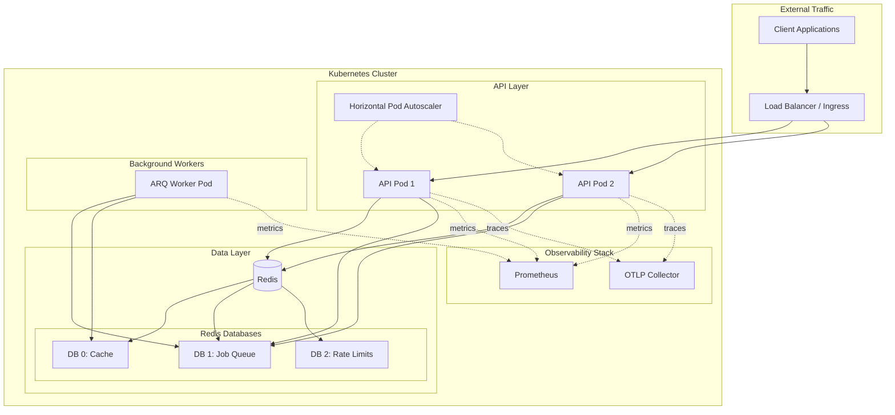
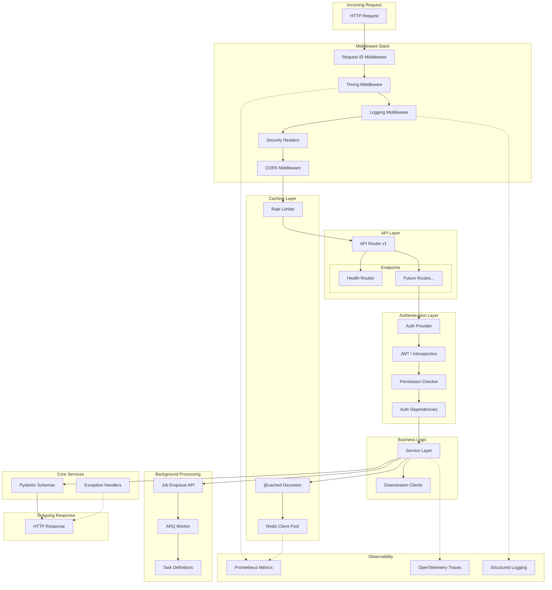
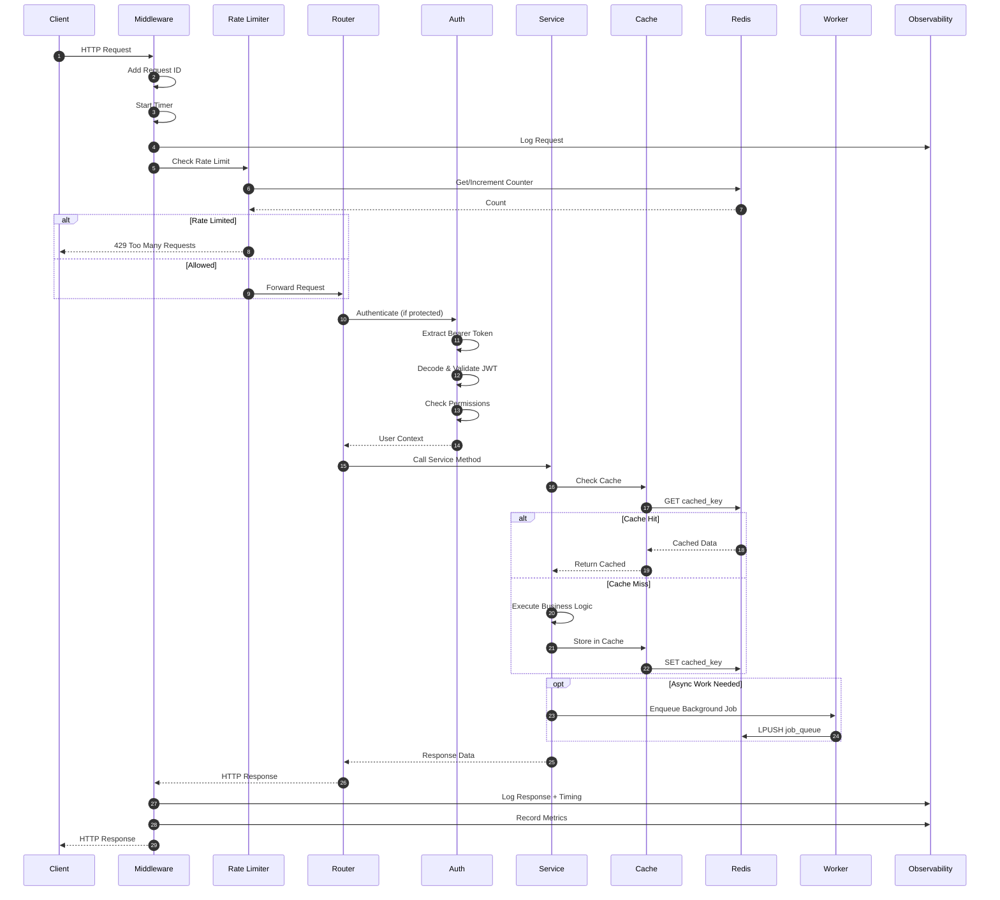

# Recipe Scraper Service

Enterprise-grade FastAPI microservice for recipe scraping with JWT authentication,
Redis caching, background job processing, and full observability.

## Architecture Overview



### Application Architecture



### Request Lifecycle



## Features

- **FastAPI Framework** - Modern async Python web framework with automatic OpenAPI docs
- **JWT Authentication** - Secure token-based auth with access/refresh token flow
- **Redis Caching** - High-performance caching with configurable TTLs
- **Rate Limiting** - Protect endpoints from abuse with SlowAPI
- **Background Jobs** - Async task processing with ARQ (Redis-backed)
- **Full Observability** - Prometheus metrics, OpenTelemetry tracing, structured JSON logging
- **Production Ready** - Multi-stage Docker builds, Kubernetes manifests, HPA, PDB, NetworkPolicies
- **Comprehensive Tests** - 530+ tests with 90%+ coverage (unit, integration, e2e, performance)

## Quick Start

### Prerequisites

- Python 3.14+
- Redis 7+
- [uv](https://github.com/astral-sh/uv) (recommended) or pip

### Local Development

```bash
# Clone and navigate
cd recipe-scraper-service

# Install dependencies with uv
uv sync

# Or with pip
pip install -e ".[dev]"

# Start Redis (Docker)
docker run -d --name redis -p 6379:6379 redis:7-alpine

# Run the service
uvicorn app.main:app --reload

# Run tests
pytest

# Run with coverage
pytest --cov=app --cov-report=html
```

### Docker

```bash
# Build production image
docker build -t recipe-scraper-service .

# Build development image
docker build --target development -t recipe-scraper-service:dev .

# Run with Docker Compose
docker compose up -d
```

## Project Structure

```text
recipe-scraper-service/
├── src/app/                    # Application source code
│   ├── api/                    # API endpoints
│   │   └── v1/
│   │       ├── endpoints/      # Route handlers
│   │       └── router.py       # API router
│   ├── auth/                   # Authentication
│   │   ├── jwt.py              # JWT token handling
│   │   ├── oauth2.py           # OAuth2 schemes
│   │   ├── permissions.py      # RBAC permissions
│   │   └── dependencies.py     # FastAPI dependencies
│   ├── cache/                  # Caching layer
│   │   ├── redis.py            # Redis client management
│   │   ├── decorators.py       # @cached decorator
│   │   └── rate_limit.py       # Rate limiting
│   ├── core/                   # Core framework
│   │   ├── config.py           # Settings management
│   │   ├── exceptions.py       # Custom exceptions
│   │   ├── events/             # Lifecycle events
│   │   └── middleware/         # HTTP middleware
│   ├── observability/          # Monitoring
│   │   ├── logging.py          # Structured logging
│   │   ├── metrics.py          # Prometheus metrics
│   │   └── tracing.py          # OpenTelemetry tracing
│   ├── workers/                # Background jobs
│   │   ├── arq.py              # ARQ configuration
│   │   ├── jobs.py             # Job enqueueing
│   │   └── tasks/              # Task definitions
│   ├── schemas/                # Pydantic models
│   ├── services/               # Business logic
│   └── main.py                 # Application entry
├── tests/                      # Test suite
│   ├── unit/                   # Unit tests
│   ├── integration/            # Integration tests
│   ├── e2e/                    # End-to-end tests
│   └── performance/            # Benchmark tests
├── k8s/                        # Kubernetes manifests
│   ├── base/                   # Base resources
│   └── overlays/               # Environment overrides
├── scripts/                    # Utility scripts
├── docs/                       # Documentation
└── pyproject.toml              # Project configuration
```

## API Endpoints

| Endpoint         | Method | Description        | Auth |
| ---------------- | ------ | ------------------ | ---- |
| `/`              | GET    | Service info       | No   |
| `/api/v1/health` | GET    | Liveness probe     | No   |
| `/api/v1/ready`  | GET    | Readiness probe    | No   |
| `/metrics`       | GET    | Prometheus metrics | No   |
| `/docs`          | GET    | OpenAPI Swagger UI | No   |
| `/redoc`         | GET    | OpenAPI ReDoc      | No   |

> **Note**: Authentication is handled by an external auth-service. This service validates
> tokens via configurable providers (introspection, local JWT, or header-based for
> development).

## Configuration

All configuration is via environment variables:

| Variable                          | Default                | Description                                  |
| --------------------------------- | ---------------------- | -------------------------------------------- |
| `APP_NAME`                        | Recipe Scraper Service | Application name                             |
| `ENVIRONMENT`                     | development            | Environment (development/staging/production) |
| `DEBUG`                           | false                  | Enable debug mode                            |
| `JWT_SECRET_KEY`                  | -                      | **Required in production**                   |
| `JWT_ACCESS_TOKEN_EXPIRE_MINUTES` | 30                     | Access token TTL                             |
| `JWT_REFRESH_TOKEN_EXPIRE_DAYS`   | 7                      | Refresh token TTL                            |
| `REDIS_HOST`                      | localhost              | Redis hostname                               |
| `REDIS_PORT`                      | 6379                   | Redis port                                   |
| `REDIS_PASSWORD`                  | -                      | Redis password                               |
| `RATE_LIMIT_DEFAULT`              | 100/minute             | Default rate limit                           |
| `RATE_LIMIT_AUTH`                 | 5/minute               | Auth endpoint rate limit                     |
| `OTLP_ENDPOINT`                   | -                      | OpenTelemetry collector endpoint             |
| `LOG_LEVEL`                       | INFO                   | Logging level                                |
| `LOG_FORMAT`                      | json                   | Log format (json/text)                       |

See [docs/configuration.md](docs/configuration.md) for the complete list.

## Documentation

- [Architecture](docs/architecture.md) - System design and component overview
- [API Reference](docs/api.md) - Detailed API documentation
- [Development Guide](docs/development.md) - Local setup and contribution guidelines
- [Deployment Guide](docs/deployment.md) - Production deployment instructions
- [Configuration](docs/configuration.md) - Complete configuration reference

## Testing

```bash
# Run all tests
pytest

# Run by category
pytest -m unit          # Unit tests only
pytest -m integration   # Integration tests (requires Redis)
pytest -m e2e           # End-to-end tests
pytest -m performance   # Benchmark tests

# With coverage report
pytest --cov=app --cov-report=html
open htmlcov/index.html
```

## Deployment

### Kubernetes

```bash
# Deploy to development
kubectl apply -k k8s/overlays/development

# Deploy to staging
kubectl apply -k k8s/overlays/staging

# Deploy to production
kubectl apply -k k8s/overlays/production
```

See [docs/deployment.md](docs/deployment.md) for detailed instructions.

## License

MIT License - see [LICENSE](LICENSE) for details.
