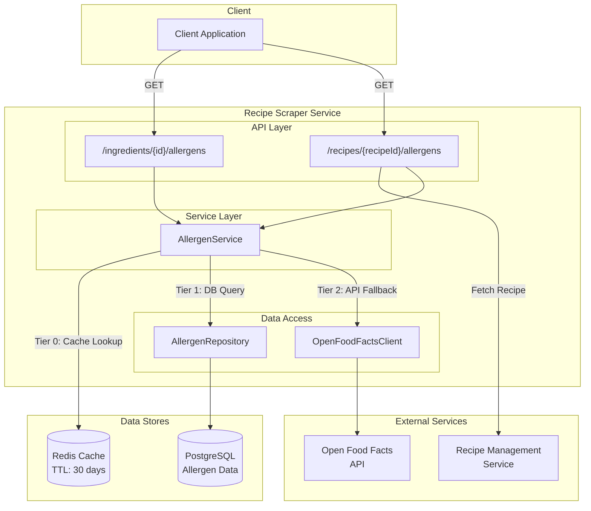
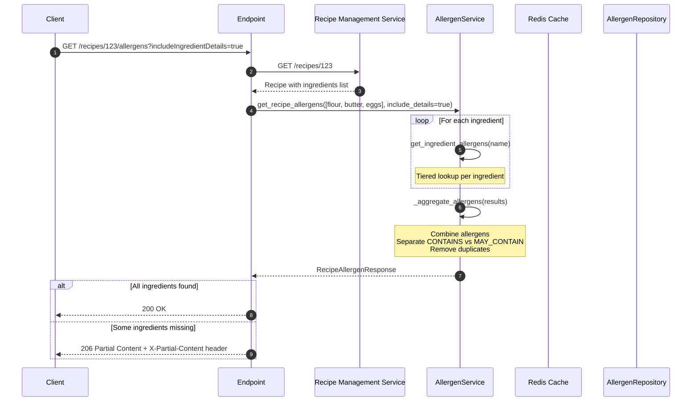
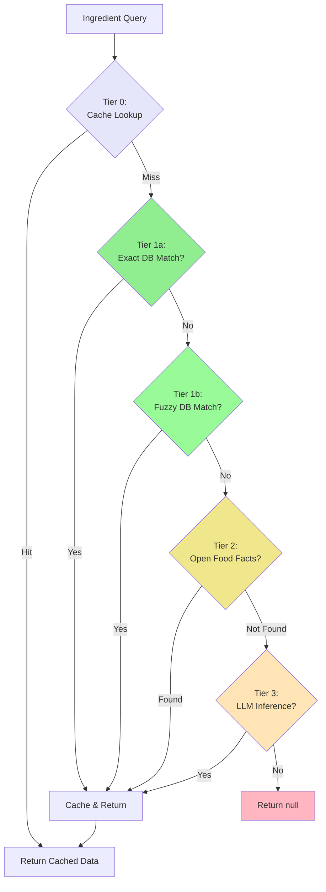
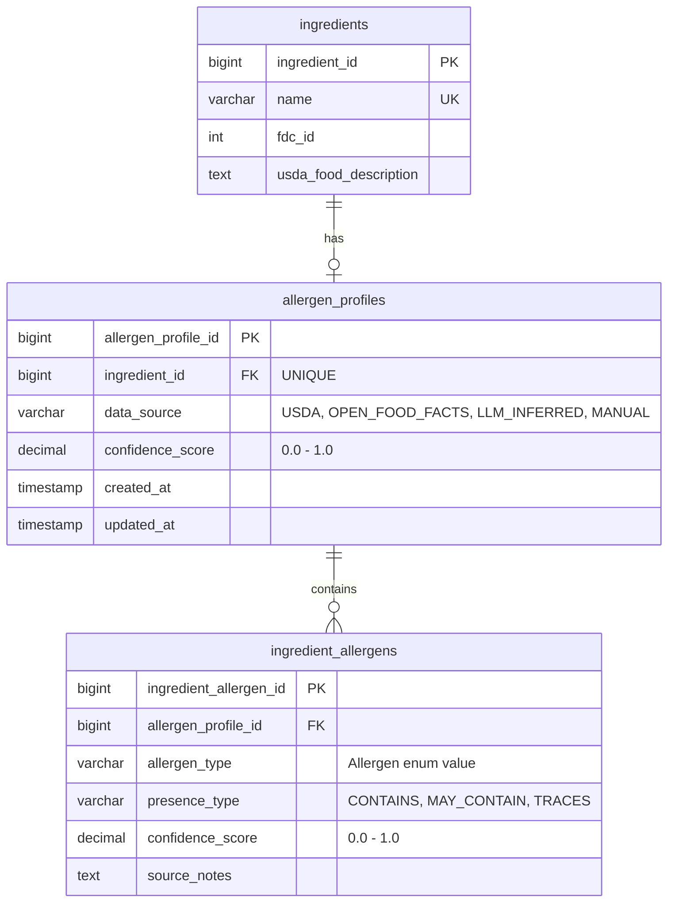

# Allergen Information Feature

This document explains the allergen information lookup and aggregation system, which provides allergen data for
ingredients and recipes using a tiered data source strategy including database lookups, Open Food Facts API, and
future LLM inference.

## Table of Contents

1. [Overview](#1-overview)
2. [API Endpoints](#2-api-endpoints)
3. [Processing Flow](#3-processing-flow)
4. [Tiered Lookup Strategy](#4-tiered-lookup-strategy)
5. [Caching Strategy](#5-caching-strategy)
6. [Database Schema](#6-database-schema)
7. [Error Handling](#7-error-handling)
8. [Data Attribution](#8-data-attribution)

---

## 1. Overview

The allergen information feature provides comprehensive allergen data for both individual ingredients and complete
recipes. The system uses a tiered lookup strategy to maximize data availability while maintaining high confidence
scores. Data sources include the internal PostgreSQL database (USDA-based), Open Food Facts API, and a placeholder
for future LLM inference.

### High-Level Architecture



### Key Components

| Component           | Purpose                                                           |
| ------------------- | ----------------------------------------------------------------- |
| AllergenService     | Orchestrates tiered lookup, caching, and allergen aggregation     |
| AllergenRepository  | PostgreSQL access for allergen profiles with exact/fuzzy matching |
| OpenFoodFactsClient | API client for Open Food Facts product allergen data              |
| Redis Cache         | 30-day caching of allergen data per ingredient                    |

### Allergen Classification

The system tracks allergens using three presence types:

| Presence Type | Description                                      | Example                   |
| ------------- | ------------------------------------------------ | ------------------------- |
| CONTAINS      | Ingredient definitely contains this allergen     | Milk in cheese            |
| MAY_CONTAIN   | Cross-contamination or shared equipment possible | Nuts in chocolate factory |
| TRACES        | May contain trace amounts                        | Gluten traces in oats     |

---

## 2. API Endpoints

### Ingredient Allergen Info

**Endpoint:** `GET /api/v1/recipe-scraper/ingredients/{ingredient_id}/allergens`

Retrieves allergen data for a single ingredient.

| Parameter     | Type | Required | Description                    |
| ------------- | ---- | -------- | ------------------------------ |
| ingredient_id | int  | Yes      | Database ingredient identifier |

**Response (200 OK):**

```json
{
  "ingredientId": 101,
  "ingredientName": "wheat flour",
  "usdaFoodDescription": "Flour, wheat, all-purpose, enriched",
  "allergens": [
    {
      "allergen": "GLUTEN",
      "presenceType": "CONTAINS",
      "confidenceScore": 1.0,
      "sourceNotes": null
    },
    {
      "allergen": "WHEAT",
      "presenceType": "CONTAINS",
      "confidenceScore": 1.0,
      "sourceNotes": null
    }
  ],
  "dataSource": "USDA",
  "overallConfidence": 1.0
}
```

**Response (404 Not Found):**

```json
{
  "error": "NOT_FOUND",
  "message": "No allergen data found for ingredient: unicorn-meat"
}
```

### Recipe Allergen Info

**Endpoint:** `GET /api/v1/recipe-scraper/recipes/{recipeId}/allergens`

Aggregates allergen data for all ingredients in a recipe.

| Parameter                | Type | Required | Default | Description                      |
| ------------------------ | ---- | -------- | ------- | -------------------------------- |
| recipeId                 | int  | Yes      | -       | Recipe identifier                |
| includeIngredientDetails | bool | No       | false   | Include per-ingredient breakdown |

**Response Codes:**

- **200 OK** - All ingredients found
- **206 Partial Content** - Some ingredients missing allergen data (X-Partial-Content header lists missing IDs)
- **404 Not Found** - Recipe not found
- **503 Service Unavailable** - Recipe Management Service unavailable

**Response (200 OK):**

```json
{
  "contains": ["GLUTEN", "MILK", "EGGS"],
  "mayContain": ["TREE_NUTS"],
  "allergens": [
    {
      "allergen": "GLUTEN",
      "presenceType": "CONTAINS",
      "confidenceScore": 1.0,
      "sourceNotes": null
    },
    {
      "allergen": "MILK",
      "presenceType": "CONTAINS",
      "confidenceScore": 1.0,
      "sourceNotes": null
    },
    {
      "allergen": "EGGS",
      "presenceType": "CONTAINS",
      "confidenceScore": 0.95,
      "sourceNotes": "From Open Food Facts: Eggs, whole"
    },
    {
      "allergen": "TREE_NUTS",
      "presenceType": "MAY_CONTAIN",
      "confidenceScore": 0.95,
      "sourceNotes": "From Open Food Facts: Chocolate chips"
    }
  ],
  "ingredientDetails": null,
  "missingIngredients": []
}
```

**Response (206 Partial Content) with Details:**

```http
HTTP/1.1 206 Partial Content
X-Partial-Content: 105,108
```

```json
{
  "contains": ["GLUTEN", "MILK"],
  "mayContain": [],
  "allergens": [...],
  "ingredientDetails": {
    "flour": {
      "ingredientId": 101,
      "ingredientName": "flour",
      "allergens": [{"allergen": "GLUTEN", "presenceType": "CONTAINS", ...}],
      "dataSource": "USDA",
      "overallConfidence": 1.0
    },
    "butter": {
      "ingredientId": 102,
      "ingredientName": "butter",
      "allergens": [{"allergen": "MILK", "presenceType": "CONTAINS", ...}],
      "dataSource": "USDA",
      "overallConfidence": 1.0
    }
  },
  "missingIngredients": [105, 108]
}
```

---

## 3. Processing Flow

### Single Ingredient Lookup

```mermaid
sequenceDiagram
    autonumber
    participant C as Client
    participant EP as Endpoint
    participant AS as AllergenService
    participant RC as Redis Cache
    participant AR as AllergenRepository
    participant DB as PostgreSQL
    participant OFF as OpenFoodFactsClient
    participant API as Open Food Facts API

    C->>EP: GET /ingredients/101/allergens
    EP->>AS: get_ingredient_allergens("wheat flour")

    AS->>RC: GET allergen:wheat flour
    alt Tier 0: Cache Hit
        RC-->>AS: Cached IngredientAllergenResponse
        AS-->>EP: Return cached response
    else Tier 0: Cache Miss
        RC-->>AS: null

        AS->>AR: get_by_ingredient_name("wheat flour")
        AR->>DB: Exact match query
        alt Tier 1a: Exact Match Found
            DB-->>AR: Allergen data rows
            AR-->>AS: AllergenData[]
        else Tier 1b: Try Fuzzy Match
            DB-->>AR: null
            AS->>AR: get_by_ingredient_name_fuzzy("wheat flour")
            AR->>DB: Fuzzy search (prefix/contains/trigram)
            alt Fuzzy Match Found
                DB-->>AR: Best matching data
                AR-->>AS: AllergenData[]
            else No DB Match
                DB-->>AR: null
                AR-->>AS: empty

                AS->>OFF: search_by_name("wheat flour")
                OFF->>API: GET /cgi/search.pl?search_terms=wheat flour
                alt Tier 2: API Match
                    API-->>OFF: Product with allergen tags
                    OFF-->>AS: OpenFoodFactsProduct
                else Tier 3: LLM (placeholder)
                    API-->>OFF: No match
                    OFF-->>AS: null
                    AS->>AS: LLM inference (not yet implemented)
                end
            end
        end

        AS->>RC: SETEX allergen:wheat flour (TTL: 30 days)
    end

    AS-->>EP: IngredientAllergenResponse
    EP-->>C: 200 OK + JSON
```

### Recipe Aggregation Flow



---

## 4. Tiered Lookup Strategy

The AllergenService uses a tiered approach to maximize data availability while maintaining confidence scores.



### Confidence Scores by Source

| Tier | Data Source       | Confidence Score | Description                      |
| ---- | ----------------- | ---------------- | -------------------------------- |
| 1    | USDA (PostgreSQL) | 1.0              | Highest confidence, curated data |
| 2    | Open Food Facts   | 0.95             | Community-verified product data  |
| 3    | LLM Inference     | 0.75             | AI-inferred (placeholder)        |
| -    | Manual Entry      | Varies           | Admin-entered data               |

### Fuzzy Matching Strategy

When exact name matching fails, the system uses PostgreSQL `pg_trgm` for fuzzy matching:

| Priority | Criteria       | Description                                                |
| -------- | -------------- | ---------------------------------------------------------- |
| 1st      | Exact Match    | Case-insensitive exact name match                          |
| 2nd      | Prefix Match   | Name starts with query (e.g., "butter" → "butter, salted") |
| 3rd      | Contains Match | Name contains query (e.g., "flour" → "wheat flour")        |
| 4th      | Trigram > 0.3  | Similarity score above threshold                           |

---

## 5. Caching Strategy

```mermaid
flowchart TB
    subgraph "Ingredient Cache"
        direction TB
        KEY1["Key: allergen:{ingredient_name}"]
        TTL1["TTL: 30 days (2,592,000 seconds)"]
        DATA1["Stores: IngredientAllergenResponse JSON"]
    end

    subgraph "Recipe Cache (Future)"
        direction TB
        KEY2["Key: recipe_allergen:{recipe_id}"]
        TTL2["TTL: 7 days (604,800 seconds)"]
        DATA2["Stores: RecipeAllergenResponse JSON"]
    end

    subgraph "Cache Flow"
        direction LR
        REQ[Request] --> LOOKUP[Cache Lookup]
        LOOKUP -->|Hit| RESPONSE[Return Response]
        LOOKUP -->|Miss| TIERED[Tiered Lookup]
        TIERED --> CACHE_SET[Cache Result]
        CACHE_SET --> RESPONSE
    end

    style KEY1 fill:#E6E6FA
    style TTL1 fill:#E6E6FA
    style DATA1 fill:#E6E6FA
    style KEY2 fill:#DDA0DD
    style TTL2 fill:#DDA0DD
    style DATA2 fill:#DDA0DD
```



### Key Design Decisions

1. **Normalized Keys**: Cache keys use lowercase ingredient names

   - `allergen:wheat flour` not `allergen:Wheat Flour`
   - Prevents duplicate caching for case variations

2. **Long TTL for Ingredients**: 30-day expiration

   - Allergen data rarely changes for ingredients
   - Reduces API calls to Open Food Facts
   - Reduces database load

3. **Shorter TTL for Recipes**: 7 days (future implementation)

   - Recipe ingredients may be updated
   - Still provides significant performance benefit

4. **Graceful Degradation**: Cache failures don't fail requests
   - Falls back to direct data source access
   - Errors logged but not propagated to client

### Cache Key Format

```text
allergen:{normalized_ingredient_name}

Examples:
- allergen:butter
- allergen:wheat flour
- allergen:chocolate chips
```

---

## 6. Database Schema



### Query Pattern

The repository uses JOINs to fetch complete allergen profiles:

```sql
SELECT
    i.ingredient_id,
    i.name AS ingredient_name,
    i.usda_food_description,
    ap.data_source,
    ap.confidence_score AS profile_confidence,
    ia.allergen_type,
    ia.presence_type,
    ia.confidence_score,
    ia.source_notes
FROM recipe_manager.ingredients i
JOIN recipe_manager.allergen_profiles ap
    ON i.ingredient_id = ap.ingredient_id
LEFT JOIN recipe_manager.ingredient_allergens ia
    ON ap.allergen_profile_id = ia.allergen_profile_id
WHERE LOWER(i.name) = LOWER($1)
```

### Database Requirements

Fuzzy matching requires the PostgreSQL `pg_trgm` extension:

```sql
-- Enable trigram extension
CREATE EXTENSION IF NOT EXISTS pg_trgm;

-- Create GIN index for fast similarity searches
CREATE INDEX idx_ingredients_name_trgm
    ON recipe_manager.ingredients USING GIN (name gin_trgm_ops);
```

---

## 7. Error Handling

### Error Codes Reference

| HTTP Status | Error Code          | Scenario                                   |
| ----------- | ------------------- | ------------------------------------------ |
| 200         | -                   | Success - all allergen data found          |
| 206         | -                   | Partial Content - some ingredients missing |
| 400         | BAD_REQUEST         | Invalid parameter format                   |
| 404         | NOT_FOUND           | Ingredient or recipe not found             |
| 503         | SERVICE_UNAVAILABLE | Recipe Management Service unavailable      |

### Error Response Format

```json
{
  "error": "NOT_FOUND",
  "message": "No allergen data found for ingredient: unicorn-meat"
}
```

### Partial Content Response

When recipe aggregation encounters missing ingredients:

```http
HTTP/1.1 206 Partial Content
X-Partial-Content: 103,105,108

{
  "contains": ["GLUTEN", "MILK"],
  "mayContain": [],
  "allergens": [...],
  "ingredientDetails": {...},
  "missingIngredients": [103, 105, 108]
}
```

The `X-Partial-Content` header contains comma-separated ingredient IDs that could not be resolved.

### Allergen Aggregation Rules

When aggregating allergens across recipe ingredients:

1. **CONTAINS takes precedence**: If any ingredient CONTAINS an allergen, the recipe CONTAINS it
2. **MAY_CONTAIN is secondary**: Only listed if no ingredient CONTAINS it
3. **Highest confidence wins**: When same allergen appears multiple times, keep highest confidence
4. **No duplicates**: Each allergen appears only once in `contains` or `mayContain` lists

---

## 8. Data Attribution

### Open Food Facts

Allergen data from the Open Food Facts API is community-contributed and verified:

> **Open Food Facts** - The free food products database
> <https://world.openfoodfacts.org/>

Open Food Facts data is available under the [Open Database License (ODbL)](https://opendatacommons.org/licenses/odbl/1-0/).

### USDA FoodData Central

Database allergen profiles are linked to USDA FoodData Central entries:

> **U.S. Department of Agriculture, Agricultural Research Service. FoodData Central, 2019.** > <https://fdc.nal.usda.gov/>

### FDA Big 9 Allergens

The system recognizes the FDA's nine major food allergens that must be declared on food labels:

| Allergen  | Enum Value | Notes                               |
| --------- | ---------- | ----------------------------------- |
| Milk      | MILK       | Includes casein, whey, lactose      |
| Eggs      | EGGS       | Includes albumin, globulin          |
| Fish      | FISH       | Species-specific declarations       |
| Shellfish | SHELLFISH  | Crustaceans (shrimp, crab, lobster) |
| Tree Nuts | TREE_NUTS  | Almonds, cashews, walnuts, etc.     |
| Peanuts   | PEANUTS    | Legume, not a tree nut              |
| Wheat     | WHEAT      | Primary gluten source               |
| Soybeans  | SOYBEANS   | Includes soy lecithin               |
| Sesame    | SESAME     | Added to Big 9 in 2023              |

### EU Additional Allergens

The system also tracks EU-mandated allergens:

| Allergen  | Enum Value | Notes                        |
| --------- | ---------- | ---------------------------- |
| Celery    | CELERY     | Including celeriac           |
| Mustard   | MUSTARD    | Seeds and prepared mustard   |
| Lupin     | LUPIN      | Legume, flour used in baking |
| Sulphites | SULPHITES  | When > 10mg/kg or 10mg/L     |
| Molluscs  | SHELLFISH  | Grouped with shellfish       |

### Supported Allergen Types

The complete list of supported allergens:

```text
Major Allergens:    MILK, EGGS, FISH, SHELLFISH, TREE_NUTS, PEANUTS, WHEAT, SOYBEANS, SESAME
Additional:         CELERY, MUSTARD, LUPIN, SULPHITES
Specific Nuts:      ALMONDS, CASHEWS, HAZELNUTS, WALNUTS
Other:              GLUTEN, COCONUT, CORN, YEAST, GELATIN, KIWI, PORK, BEEF, ALCOHOL,
                    SULFUR_DIOXIDE, PHENYLALANINE
Special Values:     NONE, UNKNOWN
```
