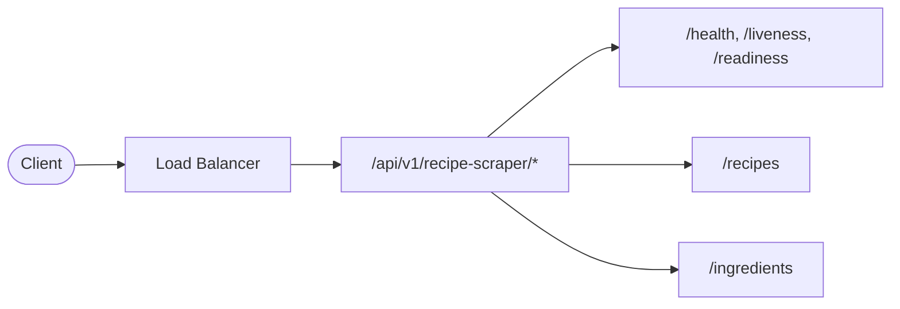
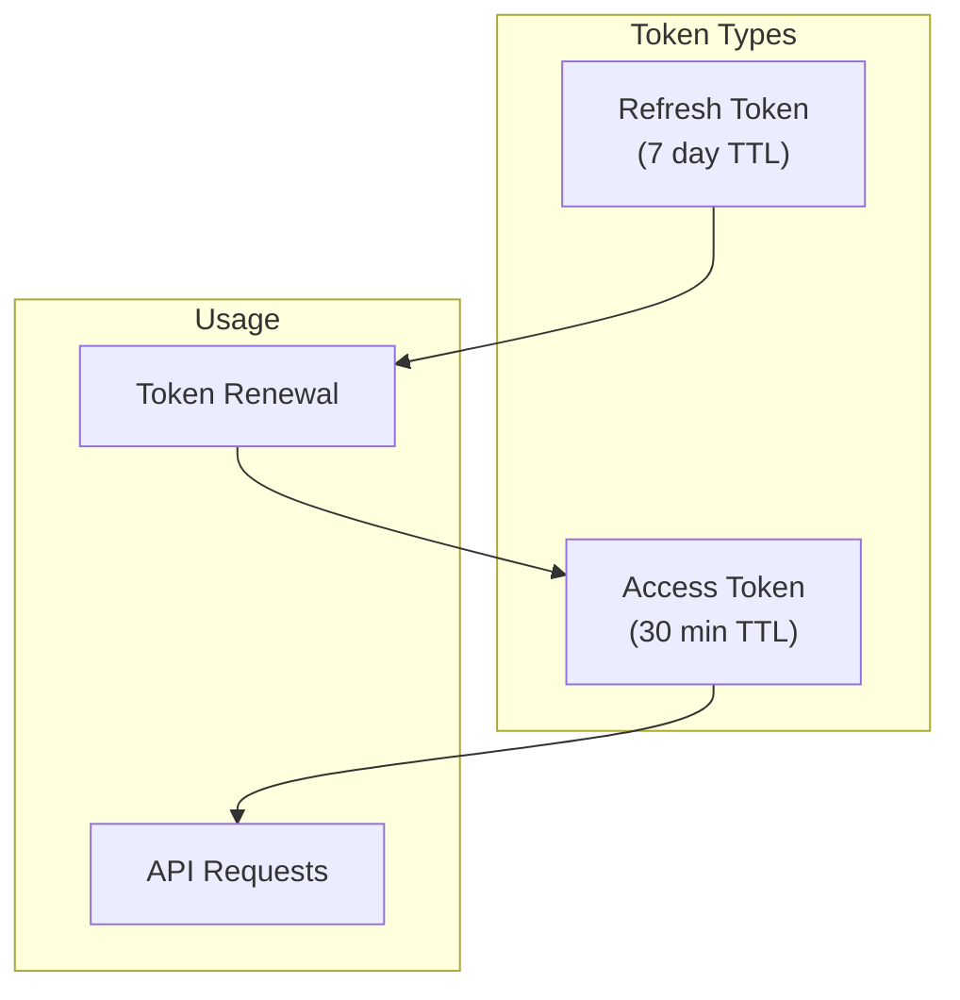
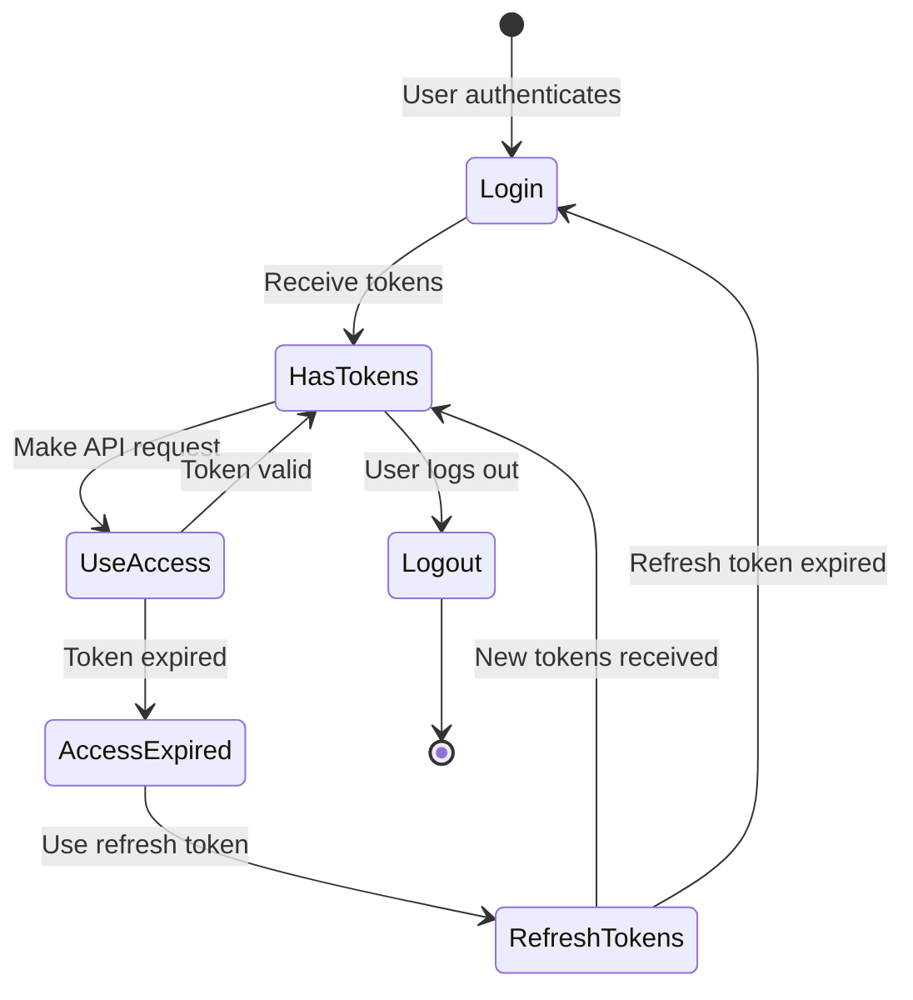
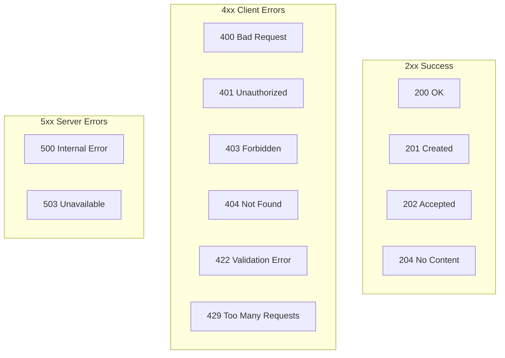
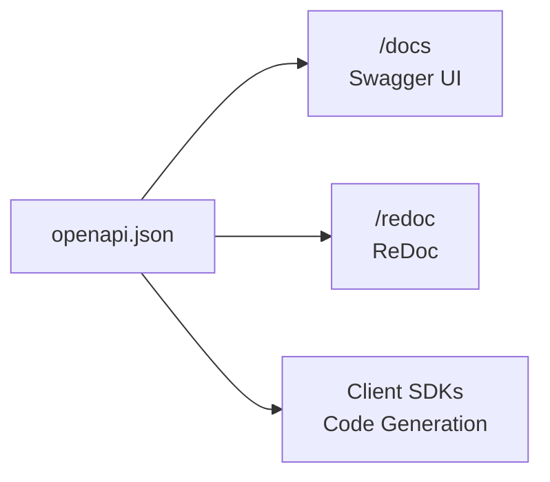

# API Reference

Complete API documentation for the Recipe Scraper Service.

## Base URL

| Environment | URL                               |
| ----------- | --------------------------------- |
| Development | `http://localhost:8000`           |
| Staging     | `https://api.staging.example.com` |
| Production  | `https://api.example.com`         |

## API Versioning

All API endpoints are versioned under `/api/v1/recipe-scraper/`. The version and service name are included in the URL path.

- **Health/monitoring endpoints**: `/api/v1/recipe-scraper/health`, `/api/v1/recipe-scraper/liveness`, `/api/v1/recipe-scraper/readiness`
- **Recipe business endpoints**: `/api/v1/recipe-scraper/recipes`, `/api/v1/recipe-scraper/ingredients`, etc.



## Authentication

### Overview

The API uses JWT (JSON Web Tokens) for authentication with an access/refresh token pattern.



### Token Format

Include the access token in the `Authorization` header:

```http
Authorization: Bearer <access_token>
```

### Token Lifecycle



---

## Endpoints

### Health & Status

#### `GET /`

Service information and status.

**Authentication**: None

**Response** `200 OK`:

```json
{
  "name": "Recipe Scraper Service",
  "version": "0.1.0",
  "environment": "development",
  "docs_url": "/docs"
}
```

---

#### `GET /api/v1/recipe-scraper/health`

Liveness probe for Kubernetes. Returns healthy if the service is running.

**Authentication**: None

**Response** `200 OK`:

```json
{
  "status": "healthy",
  "timestamp": "2024-01-15T10:30:00Z",
  "version": "0.1.0",
  "environment": "production"
}
```

---

#### `GET /api/v1/recipe-scraper/ready`

Readiness probe checking all dependencies (Redis, etc.).

**Authentication**: None

**Response** `200 OK`:

```json
{
  "status": "ready",
  "timestamp": "2024-01-15T10:30:00Z",
  "version": "0.1.0",
  "environment": "production",
  "dependencies": {
    "redis_cache": "healthy",
    "redis_queue": "healthy",
    "redis_rate_limit": "healthy"
  }
}
```

**Response** `503 Service Unavailable` (degraded):

```json
{
  "status": "degraded",
  "timestamp": "2024-01-15T10:30:00Z",
  "version": "0.1.0",
  "environment": "production",
  "dependencies": {
    "redis_cache": "unhealthy",
    "redis_queue": "healthy",
    "redis_rate_limit": "healthy"
  }
}
```

---

### Authentication (External Auth Service)

> **Note**: Authentication is handled by an external auth-service. This service validates
> tokens via configurable providers (introspection, local JWT, or header-based for development).
> See `docs/architecture.md` for details on the auth provider pattern.

**OAuth2 Token Endpoint**: `POST /oauth/token`

**Authentication Flow**:

1. Client obtains tokens from the external auth-service
2. Client includes access token in `Authorization: Bearer <token>` header
3. This service validates tokens using the configured auth provider

---

### Metrics

#### `GET /metrics`

Prometheus metrics endpoint.

**Authentication**: None

**Response** `200 OK`:

```text
# HELP http_requests_total Total HTTP requests
# TYPE http_requests_total counter
http_requests_total{method="GET",path="/api/v1/recipe-scraper/health",status="200"} 1547
http_requests_total{method="POST",path="/api/v1/recipe-scraper/recipes",status="201"} 89
http_requests_total{method="GET",path="/api/v1/recipe-scraper/recipes/popular",status="200"} 156

# HELP http_request_duration_seconds HTTP request duration
# TYPE http_request_duration_seconds histogram
http_request_duration_seconds_bucket{le="0.01"} 1423
http_request_duration_seconds_bucket{le="0.05"} 1598
http_request_duration_seconds_bucket{le="0.1"} 1632
...
```

---

## Error Handling

### Error Response Format

All errors follow a consistent format:

```json
{
  "detail": "Human-readable error message",
  "error": "ERROR_CODE",
  "request_id": "abc-123-def"
}
```

### HTTP Status Codes



| Code  | Description       | When Used                         |
| ----- | ----------------- | --------------------------------- |
| `200` | OK                | Successful GET, PUT, PATCH        |
| `201` | Created           | Successful POST creating resource |
| `202` | Accepted          | Async operation started           |
| `204` | No Content        | Successful DELETE, logout         |
| `400` | Bad Request       | Malformed request                 |
| `401` | Unauthorized      | Missing/invalid auth              |
| `403` | Forbidden         | Insufficient permissions          |
| `404` | Not Found         | Resource doesn't exist            |
| `422` | Validation Error  | Invalid request data              |
| `429` | Too Many Requests | Rate limit exceeded               |
| `500` | Internal Error    | Server error                      |
| `503` | Unavailable       | Service unhealthy                 |

### Rate Limiting

Endpoints are rate-limited to prevent abuse:

| Endpoint Pattern           | Limit      |
| -------------------------- | ---------- |
| `/api/v1/recipe-scraper/*` | 100/minute |
| All other endpoints        | 100/minute |

**Rate Limit Headers**:

```http
X-RateLimit-Limit: 100
X-RateLimit-Remaining: 95
X-RateLimit-Reset: 1705310460
```

**Response** `429 Too Many Requests`:

```json
{
  "detail": "Rate limit exceeded",
  "error": "RATE_LIMITED",
  "retry_after": 45
}
```

---

## Request/Response Headers

### Request Headers

| Header          | Required             | Description                                               |
| --------------- | -------------------- | --------------------------------------------------------- |
| `Authorization` | For protected routes | `Bearer <token>`                                          |
| `Content-Type`  | For POST/PUT/PATCH   | `application/json` or `application/x-www-form-urlencoded` |
| `X-Request-ID`  | Optional             | Client-provided request ID for tracing                    |

### Response Headers

| Header                  | Description                                           |
| ----------------------- | ----------------------------------------------------- |
| `X-Request-ID`          | Unique request identifier (generated if not provided) |
| `X-Process-Time`        | Request processing duration in seconds                |
| `X-RateLimit-Limit`     | Rate limit ceiling                                    |
| `X-RateLimit-Remaining` | Remaining requests in window                          |
| `X-RateLimit-Reset`     | Unix timestamp when limit resets                      |

---

## OpenAPI Documentation

Interactive API documentation is available at:

| URL             | Description                           |
| --------------- | ------------------------------------- |
| `/docs`         | Swagger UI - interactive API explorer |
| `/redoc`        | ReDoc - clean API reference           |
| `/openapi.json` | Raw OpenAPI 3.0 specification         |


