# Architecture

This document provides a deep dive into the Recipe Scraper Service architecture,
covering design decisions, component interactions, and implementation patterns.

## System Overview

The service follows a layered architecture pattern with clear separation of concerns:

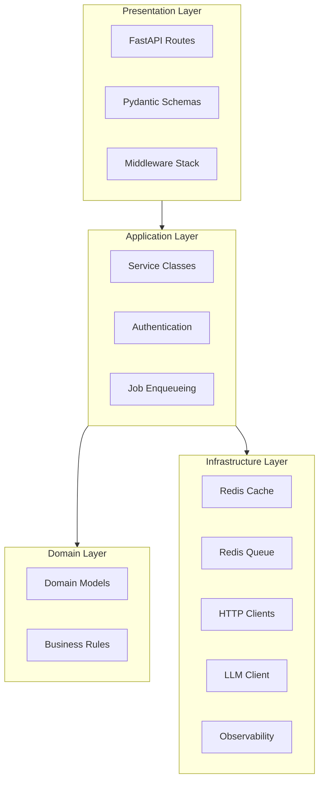

## Component Deep Dive

### Middleware Stack

Requests pass through multiple middleware layers before reaching route handlers:

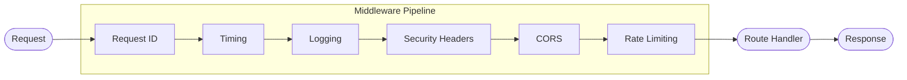

| Middleware       | Purpose                                                | Location                              |
| ---------------- | ------------------------------------------------------ | ------------------------------------- |
| Request ID       | Adds unique `X-Request-ID` header for tracing          | `core/middleware/request_id.py`       |
| Timing           | Records request duration, adds `X-Process-Time` header | `core/middleware/timing.py`           |
| Logging          | Logs request/response with structured JSON             | `core/middleware/logging.py`          |
| Security Headers | Adds security headers (CSP, X-Frame-Options, etc.)     | `core/middleware/security_headers.py` |
| CORS             | Cross-Origin Resource Sharing handling                 | FastAPI built-in                      |
| Rate Limiting    | Request throttling via SlowAPI + Redis                 | `cache/rate_limit.py`                 |

### Authentication Flow

The service uses a pluggable authentication provider pattern that supports multiple modes:

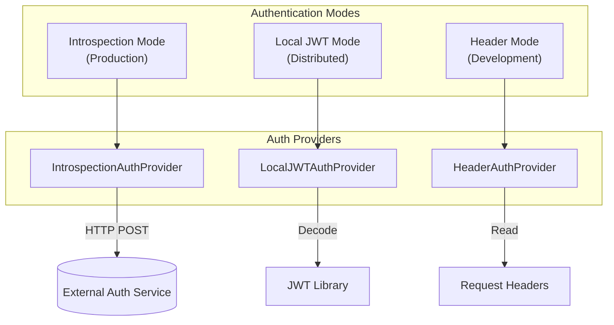

#### Mode Selection

| Mode            | Use Case                                | Configuration                               |
| --------------- | --------------------------------------- | ------------------------------------------- |
| `introspection` | Production with centralized auth        | `AUTH_SERVICE_URL`, client credentials      |
| `local_jwt`     | Distributed systems, offline validation | `JWT_SECRET_KEY` (shared with auth-service) |
| `header`        | Local development, testing              | Header names (`X-User-ID`, etc.)            |
| `disabled`      | Internal services, testing              | None                                        |

#### Introspection Mode Flow

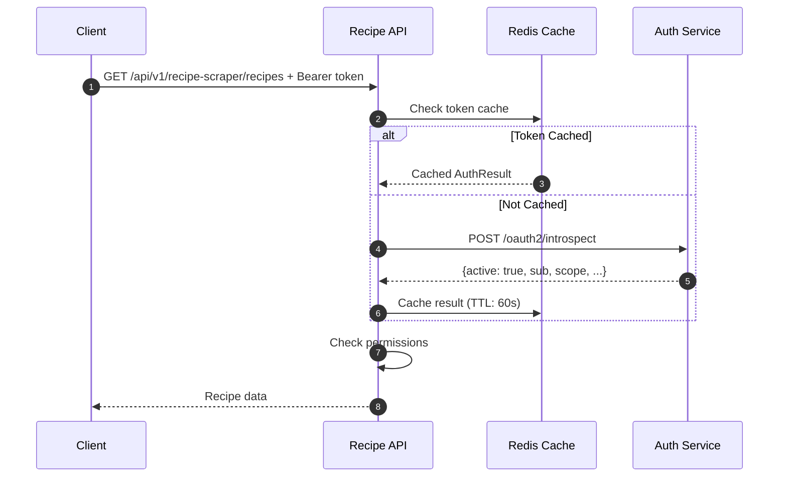

#### AuthResult Model

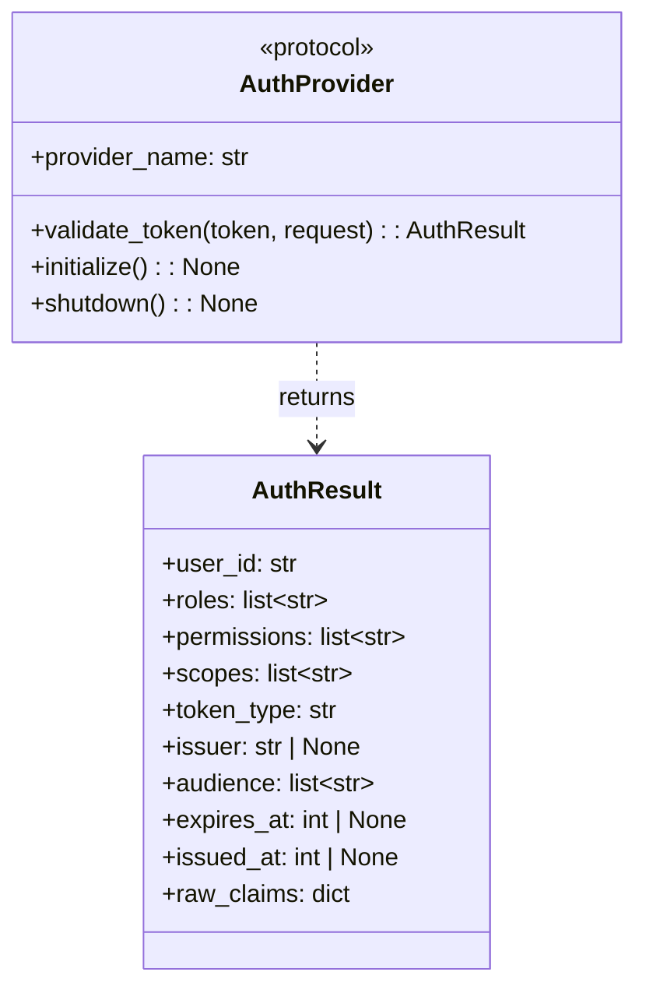

#### Provider Factory

The factory creates the appropriate provider based on `AUTH_MODE`:

```python
# Configuration determines which provider is used
AUTH_MODE=introspection  # Uses IntrospectionAuthProvider
AUTH_MODE=local_jwt      # Uses LocalJWTAuthProvider
AUTH_MODE=header         # Uses HeaderAuthProvider
AUTH_MODE=disabled       # Uses DisabledAuthProvider
```

### Permission System

Role-Based Access Control (RBAC) with hierarchical permissions:

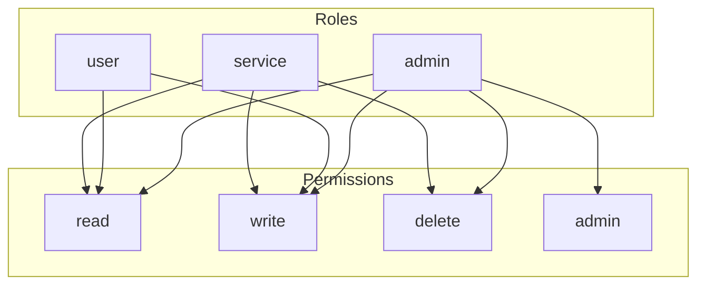

### Caching Layer

Multi-purpose Redis usage with database isolation:

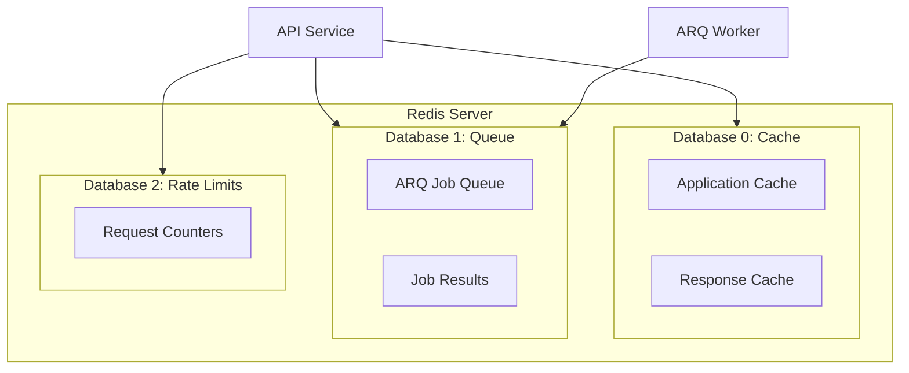

#### Cache Decorator

The `@cached` decorator provides transparent caching:

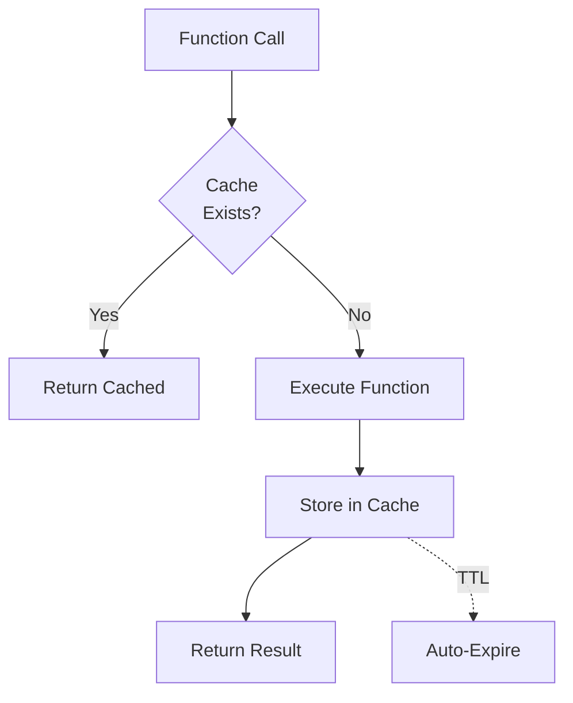

### Background Job Processing

Async task processing with ARQ (Async Redis Queue):

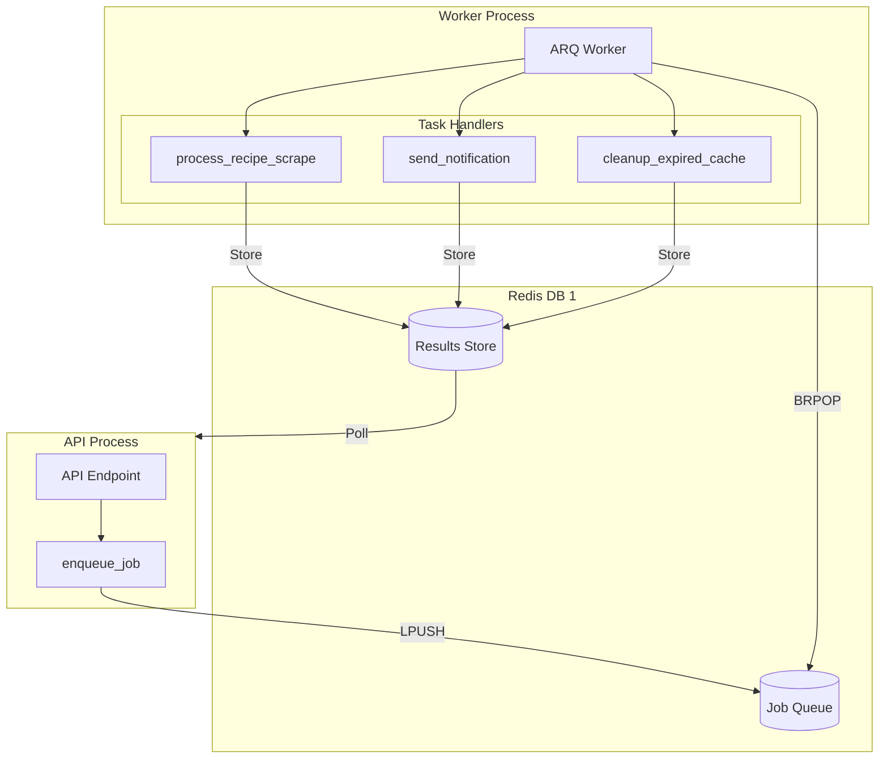

#### Job Lifecycle

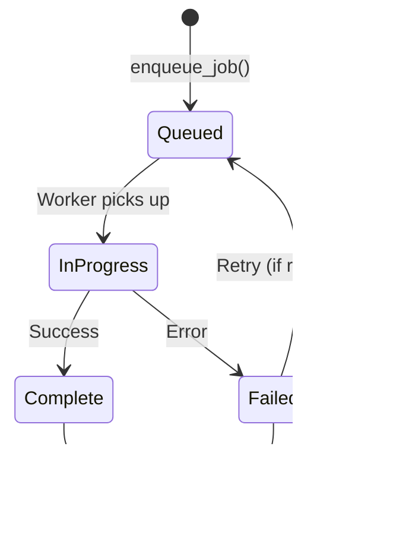

### LLM Integration

AI-powered features using a fallback-enabled LLM client with Redis caching:

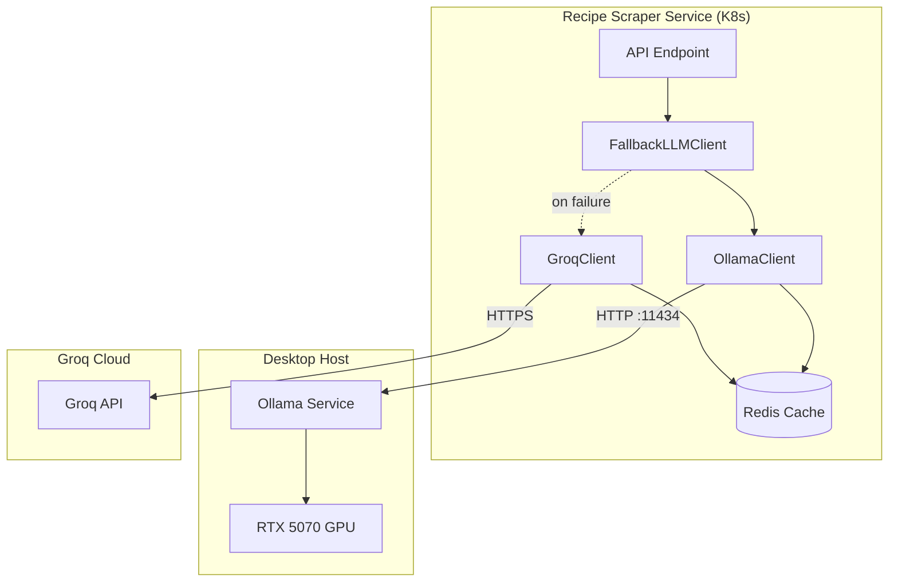

#### Provider Strategy

| Provider   | Role     | Description                             |
| ---------- | -------- | --------------------------------------- |
| **Ollama** | Primary  | Local inference on host GPU (RTX 5070)  |
| **Groq**   | Fallback | Cloud inference when Ollama unavailable |

#### Why Host-Based Ollama?

Ollama runs on the desktop host (not in K8s) to:

- **Share GPU with display server** - The desktop GPU serves 4 monitors and LLM inference
- **Simplify deployment** - No GPU scheduling complexity in K8s
- **Resource efficiency** - Single Ollama instance serves all environments

#### LLM Request Flow

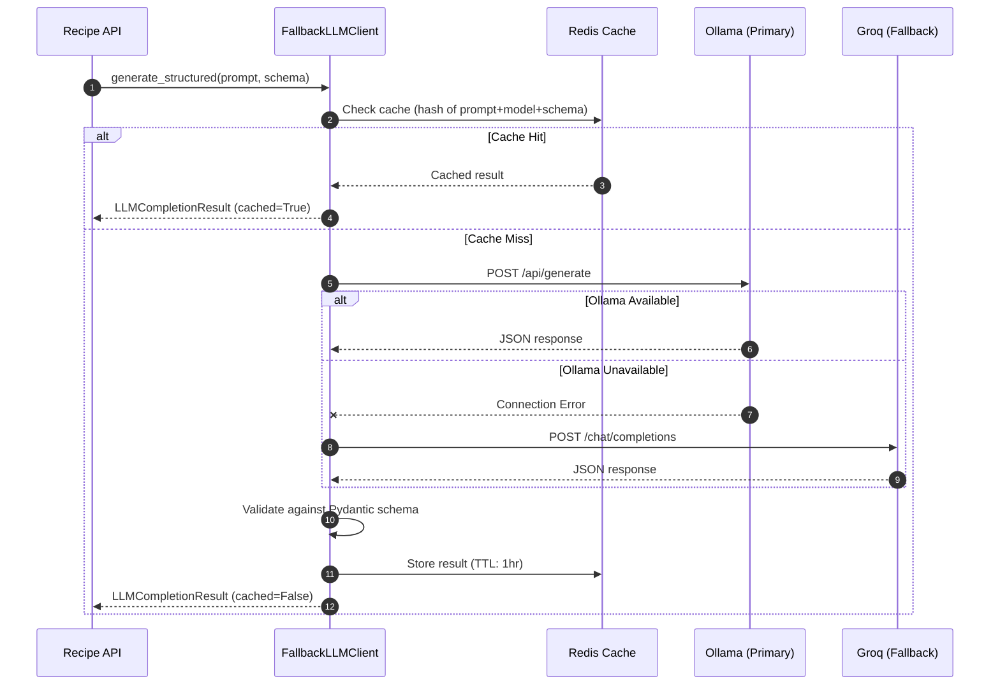

#### LLM Use Cases

| Feature            | Description                                  | Output Schema      |
| ------------------ | -------------------------------------------- | ------------------ |
| Recipe Extraction  | Parse unstructured HTML into structured data | `ExtractedRecipe`  |
| Ingredient Parsing | Normalize ingredient text (qty, unit, name)  | `ParsedIngredient` |
| Substitutions      | AI-powered ingredient substitution           | `SubstitutionList` |
| Pairings           | Recipe pairing recommendations               | `PairingResult`    |

See [LLM Integration Guide](./llm.md) for client usage and configuration.

### Observability Stack

Three pillars of observability: Metrics, Traces, and Logs:

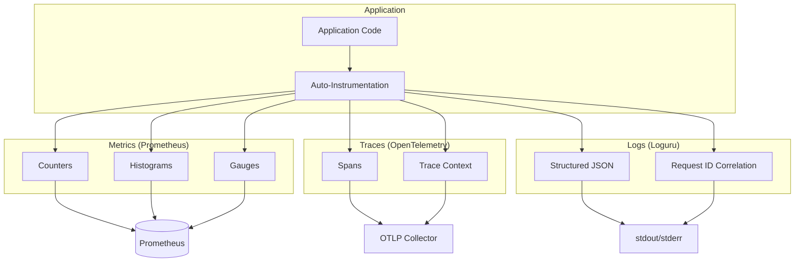

#### Metrics Collected

| Metric                          | Type      | Description                                 |
| ------------------------------- | --------- | ------------------------------------------- |
| `http_requests_total`           | Counter   | Total HTTP requests by method, path, status |
| `http_request_duration_seconds` | Histogram | Request latency distribution                |
| `http_requests_in_progress`     | Gauge     | Currently processing requests               |
| `redis_operations_total`        | Counter   | Redis operations by command                 |
| `background_jobs_total`         | Counter   | Jobs enqueued by task type                  |

### Error Handling

Centralized exception handling with consistent error responses:

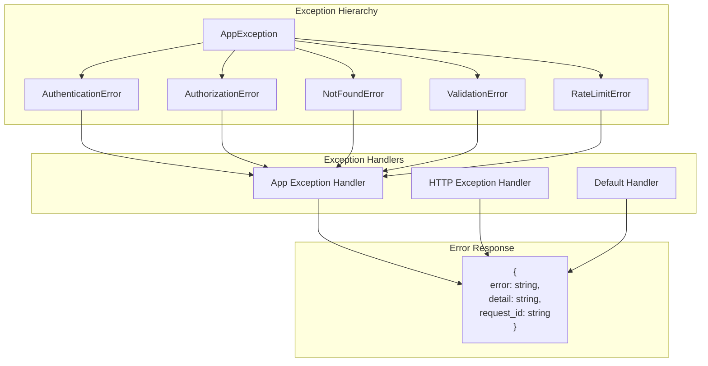

## Data Flow Examples

### Recipe Scrape Request

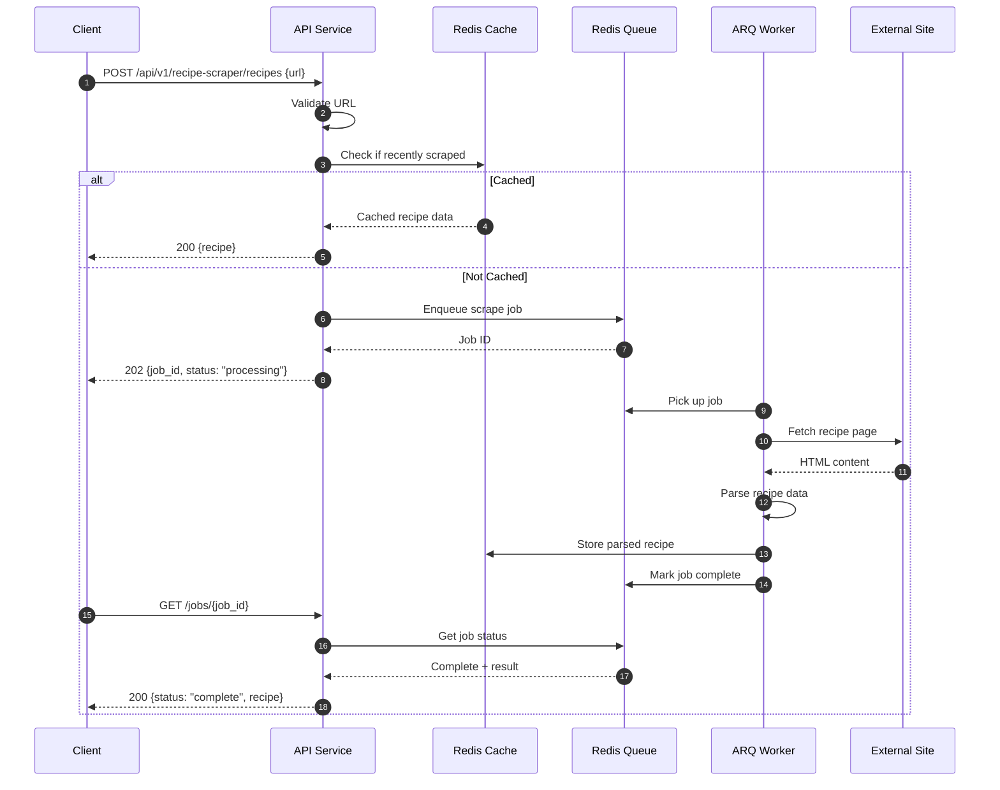

## Design Decisions

### Why FastAPI?

- **Async-first**: Built on Starlette with native async/await support
- **Type Safety**: Pydantic integration for request/response validation
- **Auto-documentation**: OpenAPI spec generated from type hints
- **Performance**: One of the fastest Python web frameworks

### Why Redis for Everything?

Using Redis for cache, queue, and rate limiting simplifies operations:

- Single dependency to manage
- Database isolation via separate DB numbers
- Atomic operations for rate limiting
- Pub/sub capability for future features

### Why ARQ over Celery?

- **Async Native**: Built for async/await from the ground up
- **Lightweight**: Minimal dependencies, simple API
- **Redis Only**: No broker abstraction overhead
- **Type Hints**: Full typing support

## Security Considerations

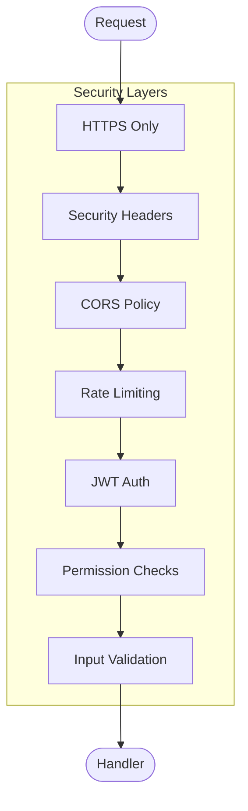

- **Transport**: TLS termination at ingress/load balancer
- **Headers**: CSP, X-Frame-Options, X-Content-Type-Options
- **Authentication**: JWT with short-lived access tokens
- **Authorization**: Role-based with explicit permission checks
- **Rate Limiting**: Per-IP and per-user limits
- **Input Validation**: Pydantic models for all inputs
