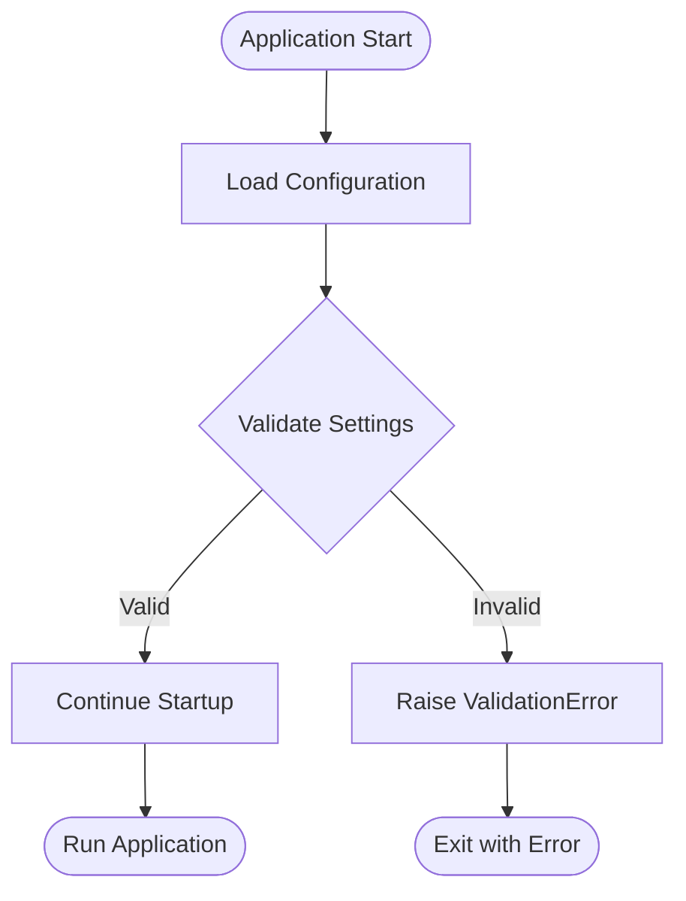

# Configuration Reference

Complete reference for all configuration options in the Recipe Scraper Service.

## Configuration Loading


Configuration is loaded using Pydantic Settings with the following precedence (highest to lowest):

1. Environment variables
2. `.env` file values
3. Default values in code

## Environment Variables

### Application

| Variable      | Type    | Default                  | Description                                              |
| ------------- | ------- | ------------------------ | -------------------------------------------------------- |
| `APP_NAME`    | string  | `Recipe Scraper Service` | Application display name                                 |
| `APP_VERSION` | string  | `0.1.0`                  | Application version                                      |
| `ENVIRONMENT` | string  | `development`            | Environment name: `development`, `staging`, `production` |
| `DEBUG`       | boolean | `false`                  | Enable debug mode (verbose errors, debug endpoints)      |
| `HOST`        | string  | `0.0.0.0`                | Server bind address                                      |
| `PORT`        | integer | `8000`                   | Server bind port                                         |

### API

| Variable        | Type   | Default   | Description              |
| --------------- | ------ | --------- | ------------------------ |
| `API_V1_PREFIX` | string | `/api/v1` | API version 1 URL prefix |

### Authentication


| Variable                          | Type    | Default              | Description                                                                                   |
| --------------------------------- | ------- | -------------------- | --------------------------------------------------------------------------------------------- |
| `JWT_SECRET_KEY`                  | string  | _(insecure default)_ | **REQUIRED in production**. Secret key for signing JWTs. Generate with `openssl rand -hex 32` |
| `JWT_ALGORITHM`                   | string  | `HS256`              | JWT signing algorithm                                                                         |
| `JWT_ACCESS_TOKEN_EXPIRE_MINUTES` | integer | `30`                 | Access token TTL in minutes                                                                   |
| `JWT_REFRESH_TOKEN_EXPIRE_DAYS`   | integer | `7`                  | Refresh token TTL in days                                                                     |
| `SERVICE_API_KEYS`                | string  | _(empty)_            | Comma-separated list of API keys for service-to-service auth                                  |

### Authentication Provider

The service supports multiple authentication modes via pluggable providers:


| Variable                            | Type    | Default              | Description                                                   |
| ----------------------------------- | ------- | -------------------- | ------------------------------------------------------------- |
| `AUTH_MODE`                         | string  | `local_jwt`          | Auth mode: `introspection`, `local_jwt`, `header`, `disabled` |
| `AUTH_SERVICE_URL`                  | string  | _(empty)_            | External auth service base URL (required for introspection)   |
| `AUTH_SERVICE_CLIENT_ID`            | string  | _(empty)_            | OAuth2 client ID for introspection                            |
| `AUTH_SERVICE_CLIENT_SECRET`        | string  | _(empty)_            | OAuth2 client secret for introspection                        |
| `AUTH_INTROSPECTION_CACHE_TTL`      | integer | `60`                 | Seconds to cache introspection results                        |
| `AUTH_INTROSPECTION_TIMEOUT`        | float   | `5.0`                | HTTP timeout for introspection calls                          |
| `AUTH_INTROSPECTION_FALLBACK_LOCAL` | boolean | `false`              | Fall back to local JWT if introspection fails                 |
| `AUTH_HEADER_USER_ID`               | string  | `X-User-ID`          | Header name for user ID (header mode)                         |
| `AUTH_HEADER_ROLES`                 | string  | `X-User-Roles`       | Header name for roles (header mode)                           |
| `AUTH_HEADER_PERMISSIONS`           | string  | `X-User-Permissions` | Header name for permissions (header mode)                     |
| `AUTH_JWT_ISSUER`                   | string  | _(empty)_            | Expected JWT issuer (optional validation)                     |
| `AUTH_JWT_AUDIENCE`                 | string  | _(empty)_            | Expected JWT audience (comma-separated, optional)             |

#### Mode Usage

**Introspection Mode** (Production with external auth-service):

```bash
AUTH_MODE=introspection
AUTH_SERVICE_URL=http://auth-service:8080/api/v1/auth
AUTH_SERVICE_CLIENT_ID=recipe-scraper-service
AUTH_SERVICE_CLIENT_SECRET=${AUTH_CLIENT_SECRET}
AUTH_INTROSPECTION_CACHE_TTL=60
```

**Local JWT Mode** (Default - validates tokens locally):

```bash
AUTH_MODE=local_jwt
JWT_SECRET_KEY=shared-secret-with-auth-service
AUTH_JWT_ISSUER=https://auth.example.com  # Optional
```

**Header Mode** (Development/Testing only):

```bash
AUTH_MODE=header
AUTH_HEADER_USER_ID=X-User-ID
AUTH_HEADER_ROLES=X-User-Roles
```

### CORS

| Variable       | Type   | Default   | Description                                                                                       |
| -------------- | ------ | --------- | ------------------------------------------------------------------------------------------------- |
| `CORS_ORIGINS` | string | _(empty)_ | Comma-separated list of allowed origins. Example: `http://localhost:3000,https://app.example.com` |

### Redis


| Variable               | Type    | Default     | Description                           |
| ---------------------- | ------- | ----------- | ------------------------------------- |
| `REDIS_HOST`           | string  | `localhost` | Redis server hostname                 |
| `REDIS_PORT`           | integer | `6379`      | Redis server port                     |
| `REDIS_PASSWORD`       | string  | _(empty)_   | Redis password (optional)             |
| `REDIS_CACHE_DB`       | integer | `0`         | Redis database for caching            |
| `REDIS_QUEUE_DB`       | integer | `1`         | Redis database for job queue          |
| `REDIS_RATE_LIMIT_DB`  | integer | `2`         | Redis database for rate limiting      |
| `CLIENT_CACHE_MAX_AGE` | integer | `30`        | HTTP cache-control max-age in seconds |

**Computed Properties** (read-only):

- `REDIS_CACHE_URL` - Full Redis URL for cache database
- `REDIS_QUEUE_URL` - Full Redis URL for queue database
- `REDIS_RATE_LIMIT_URL` - Full Redis URL for rate limit database

### Rate Limiting

| Variable             | Type   | Default      | Description                             |
| -------------------- | ------ | ------------ | --------------------------------------- |
| `RATE_LIMIT_DEFAULT` | string | `100/minute` | Default rate limit for all endpoints    |
| `RATE_LIMIT_AUTH`    | string | `5/minute`   | Rate limit for authentication endpoints |

**Rate Limit Format**: `<requests>/<period>`

| Period | Examples     |
| ------ | ------------ |
| second | `10/second`  |
| minute | `100/minute` |
| hour   | `1000/hour`  |
| day    | `10000/day`  |

### Logging

| Variable     | Type   | Default | Description                                                    |
| ------------ | ------ | ------- | -------------------------------------------------------------- |
| `LOG_LEVEL`  | string | `INFO`  | Logging level: `DEBUG`, `INFO`, `WARNING`, `ERROR`, `CRITICAL` |
| `LOG_FORMAT` | string | `json`  | Log output format: `json` or `text`                            |


### Observability

| Variable          | Type    | Default   | Description                                                           |
| ----------------- | ------- | --------- | --------------------------------------------------------------------- |
| `OTLP_ENDPOINT`   | string  | _(empty)_ | OpenTelemetry collector endpoint (e.g., `http://otel-collector:4317`) |
| `ENABLE_TRACING`  | boolean | `true`    | Enable OpenTelemetry tracing                                          |
| `METRICS_ENABLED` | boolean | `true`    | Enable Prometheus metrics endpoint                                    |
| `SENTRY_DSN`      | string  | _(empty)_ | Sentry DSN for error tracking                                         |

### Feature Flags

| Variable                | Type    | Default | Description                |
| ----------------------- | ------- | ------- | -------------------------- |
| `FEATURE_FLAGS_ENABLED` | boolean | `true`  | Enable feature flag system |

## Example Configurations

### Development (.env)

```bash
# Application
APP_NAME=Recipe Scraper Service
ENVIRONMENT=development
DEBUG=true

# Server
HOST=0.0.0.0
PORT=8000

# JWT (insecure - development only!)
JWT_SECRET_KEY=dev-secret-key-change-in-prod
JWT_ACCESS_TOKEN_EXPIRE_MINUTES=60
JWT_REFRESH_TOKEN_EXPIRE_DAYS=30

# Redis
REDIS_HOST=localhost
REDIS_PORT=6379

# CORS
CORS_ORIGINS=http://localhost:3000,http://localhost:5173

# Rate Limiting (relaxed for development)
RATE_LIMIT_DEFAULT=1000/minute
RATE_LIMIT_AUTH=100/minute

# Logging
LOG_LEVEL=DEBUG
LOG_FORMAT=text

# Observability
ENABLE_TRACING=false
METRICS_ENABLED=true
```

### Production

```bash
# Application
APP_NAME=Recipe Scraper Service
ENVIRONMENT=production
DEBUG=false

# Server
HOST=0.0.0.0
PORT=8000

# JWT (use secure secret!)
JWT_SECRET_KEY=${JWT_SECRET_KEY}  # From secret manager
JWT_ACCESS_TOKEN_EXPIRE_MINUTES=15
JWT_REFRESH_TOKEN_EXPIRE_DAYS=7

# Redis
REDIS_HOST=redis-cluster.internal
REDIS_PORT=6379
REDIS_PASSWORD=${REDIS_PASSWORD}  # From secret manager

# CORS
CORS_ORIGINS=https://app.example.com,https://www.example.com

# Rate Limiting
RATE_LIMIT_DEFAULT=100/minute
RATE_LIMIT_AUTH=5/minute

# Logging
LOG_LEVEL=WARNING
LOG_FORMAT=json

# Observability
OTLP_ENDPOINT=http://otel-collector:4317
ENABLE_TRACING=true
METRICS_ENABLED=true
SENTRY_DSN=${SENTRY_DSN}  # From secret manager
```

## Validation

Configuration is validated at startup using Pydantic:



### Common Validation Errors

| Error                                         | Cause                  | Solution                     |
| --------------------------------------------- | ---------------------- | ---------------------------- |
| `field required`                              | Missing required field | Set the environment variable |
| `value is not a valid integer`                | Wrong type             | Check value format           |
| `ensure this value has at least X characters` | Value too short        | Provide longer value         |

## Security Best Practices


1. **Never commit secrets** - Use environment variables or secret managers
2. **Generate strong JWT secrets** - Use `openssl rand -hex 32`
3. **Disable debug in production** - `DEBUG=false`
4. **Restrict CORS origins** - Only allow known domains
5. **Use conservative rate limits** - Protect against abuse
6. **Enable observability** - Monitor in production
7. **Rotate secrets regularly** - Update JWT secrets periodically

## Accessing Configuration in Code

```python
from app.core.config import get_settings, settings

# Using cached singleton
settings = get_settings()
print(settings.APP_NAME)
print(settings.REDIS_CACHE_URL)

# Or import directly
from app.core.config import settings

if settings.is_production:
    # Production-specific logic
    pass

# In FastAPI dependencies
from fastapi import Depends
from app.core.config import Settings, get_settings

@app.get("/info")
async def info(settings: Settings = Depends(get_settings)):
    return {"environment": settings.ENVIRONMENT}
```
