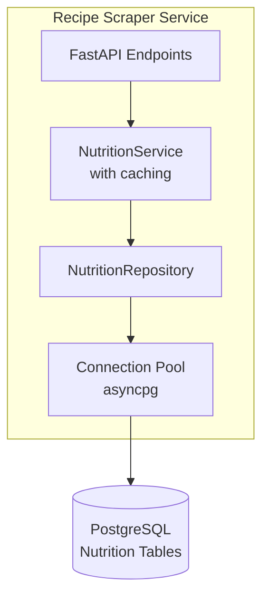
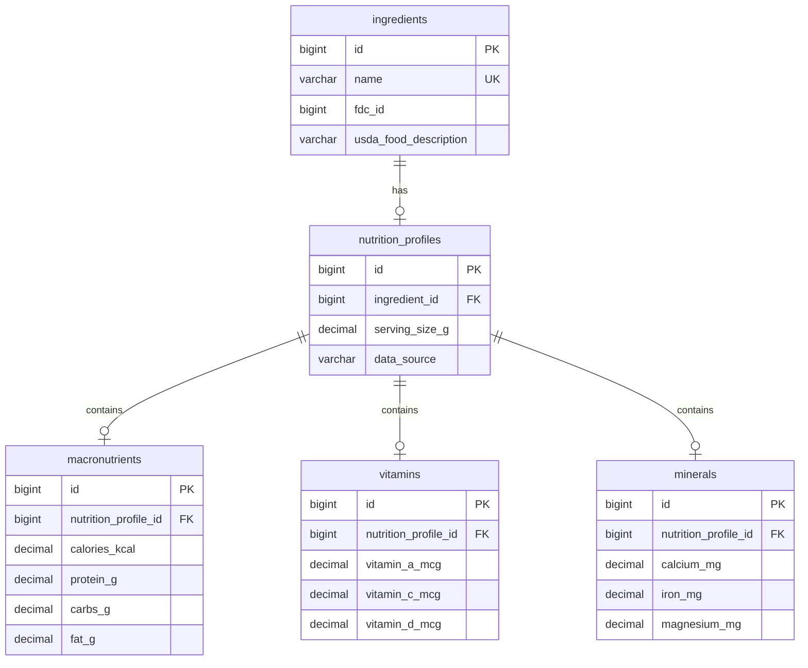

# Database Integration

This document describes the PostgreSQL database integration for nutrition data queries in the Recipe Scraper Service.

## Overview

The Recipe Scraper Service connects to a PostgreSQL database to query nutritional
information for recipe ingredients. The database is read-only from this service's
perspective - data is populated by a separate import job from USDA FoodData Central.

## Architecture



## Configuration

### Environment Variables

| Variable            | Description            | Required | Default |
| ------------------- | ---------------------- | -------- | ------- |
| `DATABASE_PASSWORD` | PostgreSQL password    | Yes      | -       |
| `DATABASE__HOST`    | Override database host | No       | -       |
| `DATABASE__PORT`    | Override database port | No       | -       |
| `DATABASE__NAME`    | Override database name | No       | -       |
| `DATABASE__USER`    | Override database user | No       | -       |

### YAML Configuration

Base configuration in `config/base/database.yaml`:

```yaml
database:
  host: nutrition-database-service.nutrition.svc.cluster.local
  port: 5432
  name: nutrition
  user: scraper_readonly
  min_pool_size: 5
  max_pool_size: 20
  command_timeout: 30.0
  ssl: true
```

Local development override in `config/environments/local/database.yaml`:

```yaml
database:
  host: localhost
  port: 5432
  user: postgres
  ssl: false
```

## Usage

### Repository Pattern

The `NutritionRepository` provides methods for querying nutrition data:

```python
from app.database import NutritionRepository

# Using global connection pool (recommended)
repo = NutritionRepository()

# Query single ingredient by name
data = await repo.get_by_ingredient_name("chicken breast")
if data:
    print(f"Calories: {data.macronutrients.calories_kcal}")

# Query multiple ingredients
data_map = await repo.get_by_ingredient_names(["chicken", "rice", "broccoli"])
for name, nutrition in data_map.items():
    print(f"{name}: {nutrition.macronutrients.protein_g}g protein")

# Query by USDA FDC ID
data = await repo.get_by_fdc_id(171077)
```

### Data Models

The repository returns `NutritionData` objects with nested structures:

```python
from app.database import NutritionData, MacronutrientsData, VitaminsData, MineralsData

# NutritionData contains:
# - ingredient_id: int
# - ingredient_name: str
# - fdc_id: int | None (USDA FoodData Central ID)
# - usda_food_description: str | None
# - serving_size_g: Decimal (default: 100.00)
# - data_source: str (default: "USDA")
# - macronutrients: MacronutrientsData | None
# - vitamins: VitaminsData | None
# - minerals: MineralsData | None
```

### Connection Pool Access

For direct database access (advanced use):

```python
from app.database import get_database_pool

pool = get_database_pool()
async with pool.acquire() as conn:
    result = await conn.fetch("SELECT * FROM ingredients WHERE name = $1", "chicken")
```

## Health Checks

The database health is included in the `/ready` endpoint:

```json
{
  "status": "ready",
  "version": "0.1.0",
  "environment": "development",
  "dependencies": {
    "redis_cache": "healthy",
    "redis_queue": "healthy",
    "redis_rate_limit": "healthy",
    "database": "healthy"
  }
}
```

Possible database statuses:

- `healthy` - Connection pool is active and responding
- `not_initialized` - Pool not created (service started without database)
- `unhealthy` - Pool exists but queries failing

## Database Schema

The nutrition database uses a 5-table normalized schema:



See `docs/nutrition-database.md` for complete schema details and USDA import instructions.

## Testing

### Unit Tests

Run unit tests (mocked database):

```bash
uv run pytest tests/unit/database/ -v
```

### Integration Tests

Run integration tests with real PostgreSQL via testcontainers:

```bash
uv run pytest tests/integration/test_database.py -v
```

**Note:** Integration tests require Docker to be running.

## Troubleshooting

### Connection Refused

If you see "Connection refused" errors:

1. Check the database host is reachable
2. Verify the port is correct
3. Ensure the database service is running
4. Check firewall/network policies in Kubernetes

### Pool Exhaustion

If queries timeout waiting for connections:

1. Increase `max_pool_size` in configuration
2. Check for connection leaks (missing async context managers)
3. Review slow query logs

### SSL Errors

If SSL connection fails:

1. Verify `ssl: true` is set for production
2. Check SSL certificates are valid
3. Ensure the database server supports SSL
