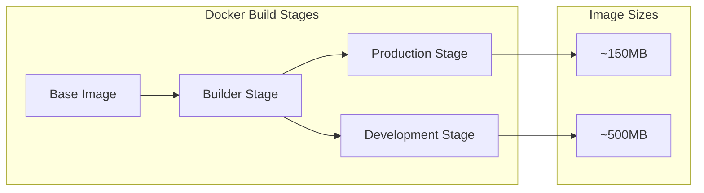
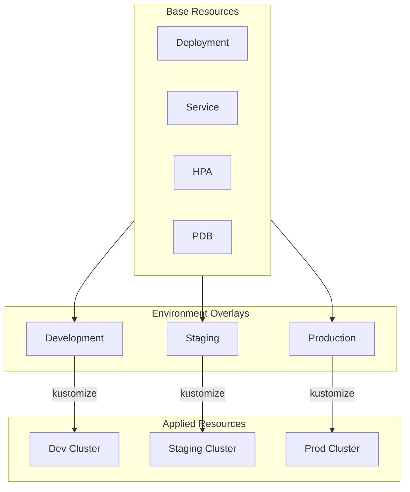
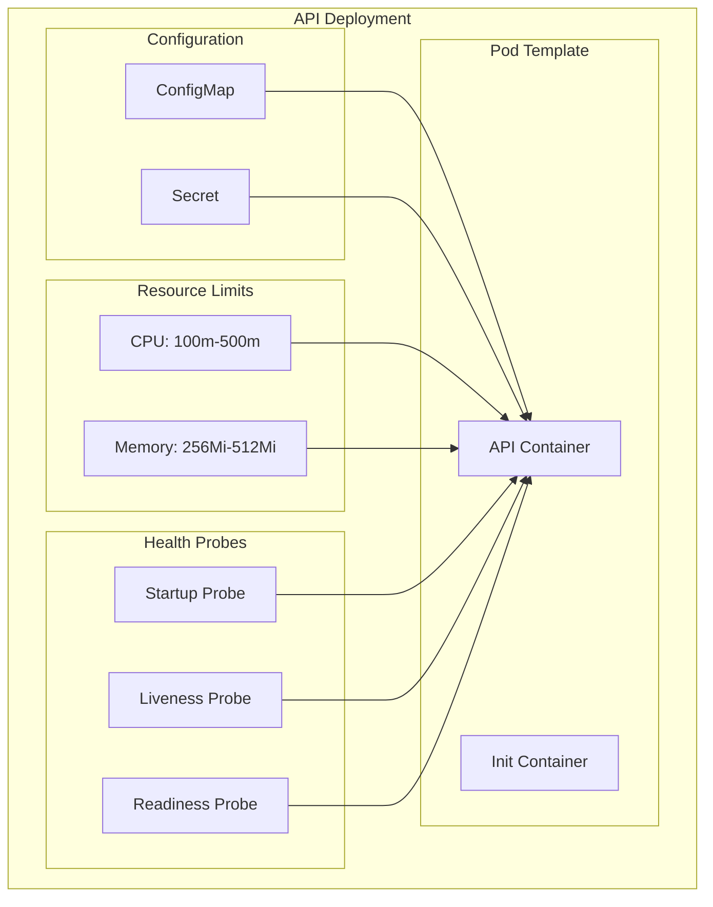
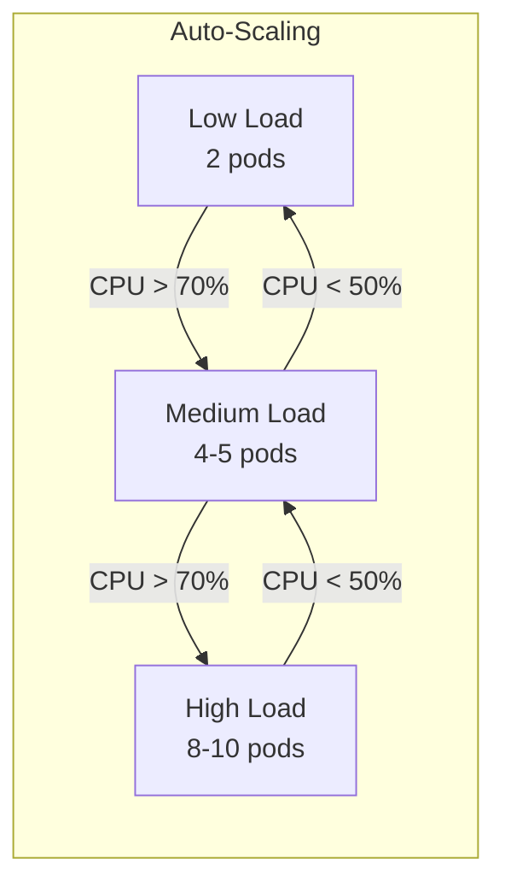
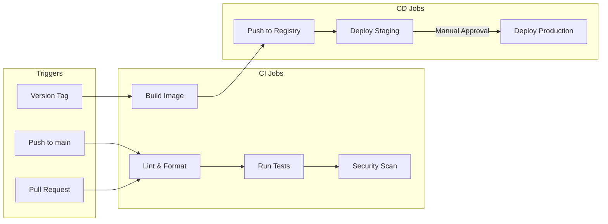
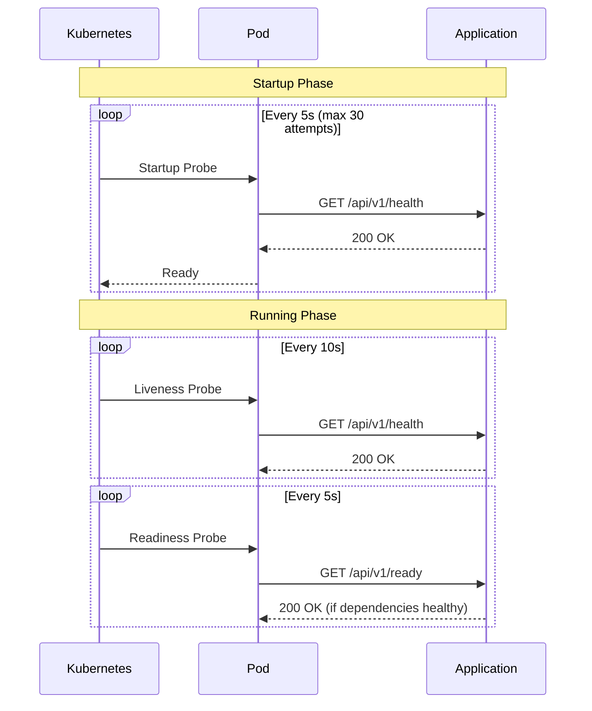
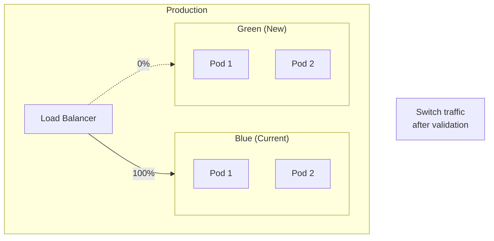

# Deployment Guide

This guide covers deploying the Recipe Scraper Service to production environments.

## Deployment Architecture

```mermaid
flowchart TB
    subgraph Internet["Internet"]
        Users([Users])
    end

    subgraph Cloud["Cloud Provider"]
        subgraph Ingress["Ingress Layer"]
            LB[Load Balancer]
            Ingress[Ingress Controller]
        end

        subgraph K8s["Kubernetes Cluster"]
            subgraph Namespace["recipe-scraper Namespace"]
                subgraph API["API Deployment"]
                    API1[API Pod 1]
                    API2[API Pod 2]
                    API3[API Pod ...]
                end

                subgraph Worker["Worker Deployment"]
                    Worker1[Worker Pod 1]
                end

                HPA[HPA]
                PDB[PDB]
                NetPol[Network Policy]
            end
        end

        subgraph Data["Data Layer"]
            Redis[(Redis Cluster)]
        end

        subgraph Observability["Observability"]
            Prometheus[Prometheus]
            Grafana[Grafana]
            OTLP[OTLP Collector]
        end
    end

    Users --> LB --> Ingress --> API1 & API2 & API3
    API1 & API2 & API3 --> Redis
    Worker1 --> Redis
    HPA -.-> API
    API1 & API2 & API3 -.-> Prometheus
    API1 & API2 & API3 -.-> OTLP
```

## Docker

### Building Images

```bash
# Production image
docker build -t recipe-scraper-service:latest .

# Development image (includes dev dependencies)
docker build --target development -t recipe-scraper-service:dev .

# With specific Python version
docker build --build-arg PYTHON_VERSION=3.14 -t recipe-scraper-service:latest .
```

### Multi-Stage Build



| Stage         | Purpose               | Size   |
| ------------- | --------------------- | ------ |
| `base`        | Python + UV setup     | -      |
| `builder`     | Install dependencies  | -      |
| `production`  | Minimal runtime image | ~150MB |
| `development` | Full dev environment  | ~500MB |

### Running Containers

```bash
# Run API server
docker run -p 8000:8000 \
  -e REDIS_HOST=redis \
  -e JWT_SECRET_KEY=your-secret \
  recipe-scraper-service:latest

# Run worker
docker run \
  -e REDIS_HOST=redis \
  -e JWT_SECRET_KEY=your-secret \
  recipe-scraper-service:latest \
  scripts/start-worker.sh
```

### Docker Compose

```yaml
# docker-compose.yml
version: "3.8"

services:
  api:
    build: .
    ports:
      - "8000:8000"
    environment:
      - REDIS_HOST=redis
      - JWT_SECRET_KEY=${JWT_SECRET_KEY}
    depends_on:
      - redis

  worker:
    build: .
    command: scripts/start-worker.sh
    environment:
      - REDIS_HOST=redis
      - JWT_SECRET_KEY=${JWT_SECRET_KEY}
    depends_on:
      - redis

  redis:
    image: redis:7-alpine
    ports:
      - "6379:6379"
    volumes:
      - redis-data:/data

volumes:
  redis-data:
```

```bash
# Start all services
docker compose up -d

# View logs
docker compose logs -f api

# Stop all services
docker compose down
```

## Kubernetes

### Directory Structure

```text
k8s/
├── base/                       # Base resources
│   ├── deployment.yaml         # API deployment
│   ├── worker-deployment.yaml  # Worker deployment
│   ├── service.yaml            # ClusterIP service
│   ├── serviceaccount.yaml     # Service account
│   ├── hpa.yaml                # Horizontal Pod Autoscaler
│   ├── pdb.yaml                # Pod Disruption Budget
│   ├── networkpolicy.yaml      # Network policies
│   ├── ingress.yaml            # Ingress rules
│   └── kustomization.yaml      # Kustomize config
├── overlays/
│   ├── development/            # Dev overrides
│   ├── staging/                # Staging overrides
│   └── production/             # Production overrides
└── config/
    ├── development.env         # Dev config
    ├── staging.env             # Staging config
    └── production.env          # Production config
```

### Deployment Flow



### Deploy with Kustomize

```bash
# Preview what will be deployed
kubectl kustomize k8s/overlays/development

# Deploy to development
kubectl apply -k k8s/overlays/development

# Deploy to staging
kubectl apply -k k8s/overlays/staging

# Deploy to production
kubectl apply -k k8s/overlays/production
```

### Resource Configuration

#### API Deployment



#### Horizontal Pod Autoscaler

```yaml
# HPA configuration
spec:
  minReplicas: 2
  maxReplicas: 10
  metrics:
    - type: Resource
      resource:
        name: cpu
        target:
          type: Utilization
          averageUtilization: 70
```



#### Pod Disruption Budget

```yaml
# Ensure at least 1 pod available during disruptions
spec:
  minAvailable: 1
  selector:
    matchLabels:
      app.kubernetes.io/name: recipe-scraper-service
```

### Secrets Management

```bash
# Create secret from env file
kubectl create secret generic recipe-scraper-secrets \
  --from-env-file=k8s/config/secrets.env \
  -n recipe-scraper

# Create secret from literal values
kubectl create secret generic recipe-scraper-secrets \
  --from-literal=JWT_SECRET_KEY=your-secret-key \
  --from-literal=REDIS_PASSWORD=redis-password \
  -n recipe-scraper
```

### Monitoring Deployment

```bash
# Check deployment status
kubectl get deployments -n recipe-scraper

# Watch pods
kubectl get pods -n recipe-scraper -w

# Check HPA status
kubectl get hpa -n recipe-scraper

# View logs
kubectl logs -f deployment/recipe-scraper-service -n recipe-scraper

# Describe pod for troubleshooting
kubectl describe pod <pod-name> -n recipe-scraper
```

## CI/CD Pipeline

### GitHub Actions Workflow



### Example Workflow

```yaml
# .github/workflows/ci.yml
name: CI/CD

on:
  push:
    branches: [main]
  pull_request:
    branches: [main]
  release:
    types: [published]

jobs:
  test:
    runs-on: ubuntu-latest
    services:
      redis:
        image: redis:7-alpine
        ports:
          - 6379:6379
    steps:
      - uses: actions/checkout@v4
      - uses: astral-sh/setup-uv@v1
      - run: uv sync
      - run: uv run pytest --cov=app

  build:
    needs: test
    runs-on: ubuntu-latest
    steps:
      - uses: actions/checkout@v4
      - uses: docker/build-push-action@v5
        with:
          push: ${{ github.event_name == 'release' }}
          tags: ghcr.io/${{ github.repository }}:${{ github.ref_name }}
```

## Environment Configuration

### Development

```bash
ENVIRONMENT=development
DEBUG=true
LOG_LEVEL=DEBUG
REDIS_HOST=localhost
```

### Staging

```bash
ENVIRONMENT=staging
DEBUG=false
LOG_LEVEL=INFO
REDIS_HOST=redis-staging.internal
OTLP_ENDPOINT=http://otel-collector:4317
```

### Production

```bash
ENVIRONMENT=production
DEBUG=false
LOG_LEVEL=WARNING
REDIS_HOST=redis-prod.internal
OTLP_ENDPOINT=http://otel-collector:4317
SENTRY_DSN=https://xxx@sentry.io/xxx
```

## Health Checks

### Kubernetes Probes



| Probe     | Endpoint         | Purpose                    | Failure Action      |
| --------- | ---------------- | -------------------------- | ------------------- |
| Startup   | `/api/v1/health` | Wait for app startup       | Keep waiting        |
| Liveness  | `/api/v1/health` | Check if app is alive      | Restart pod         |
| Readiness | `/api/v1/ready`  | Check if can serve traffic | Remove from service |

## Rollback

### Kubernetes Rollback

```bash
# View rollout history
kubectl rollout history deployment/recipe-scraper-service -n recipe-scraper

# Rollback to previous version
kubectl rollout undo deployment/recipe-scraper-service -n recipe-scraper

# Rollback to specific revision
kubectl rollout undo deployment/recipe-scraper-service --to-revision=2 -n recipe-scraper

# Check rollout status
kubectl rollout status deployment/recipe-scraper-service -n recipe-scraper
```

### Blue-Green Deployment (Future)



## Troubleshooting

### Common Issues

| Issue                | Symptoms         | Solution                   |
| -------------------- | ---------------- | -------------------------- |
| Pod not starting     | CrashLoopBackOff | Check logs, verify config  |
| Health check failing | Pod not ready    | Check Redis connectivity   |
| High latency         | Slow responses   | Check resource limits, HPA |
| Memory issues        | OOMKilled        | Increase memory limits     |

### Debug Commands

```bash
# Get pod logs
kubectl logs -f <pod-name> -n recipe-scraper

# Get previous pod logs (after crash)
kubectl logs <pod-name> -n recipe-scraper --previous

# Exec into pod
kubectl exec -it <pod-name> -n recipe-scraper -- /bin/bash

# Port forward for local debugging
kubectl port-forward svc/recipe-scraper-service 8000:80 -n recipe-scraper

# Check resource usage
kubectl top pods -n recipe-scraper
```
