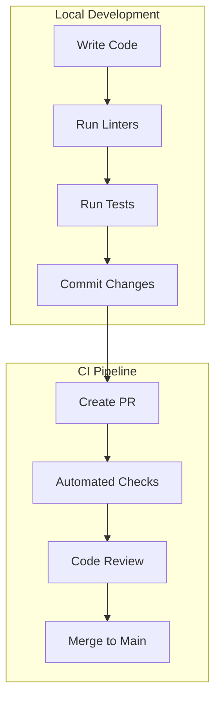
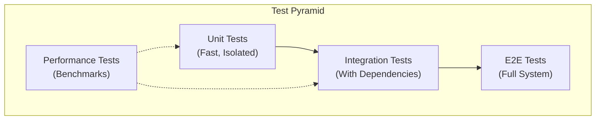
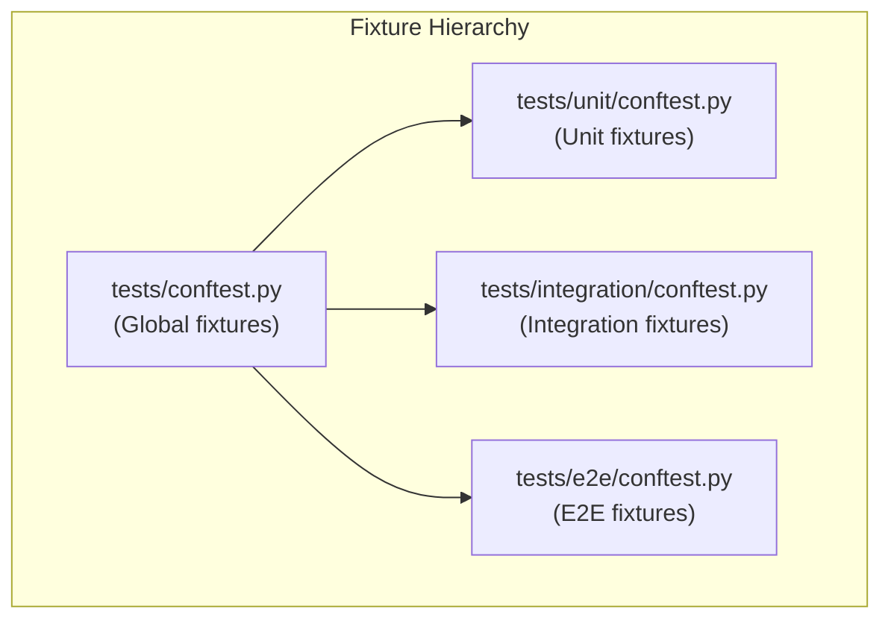

# Development Guide

This guide covers local development setup, coding standards, and contribution guidelines.

## Prerequisites

- Python 3.14+
- Redis 7+
- [uv](https://github.com/astral-sh/uv) (recommended) or pip
- Docker (optional, for containerized development)

## Development Setup

### 1. Clone and Install

```bash
# Clone repository
git clone https://github.com/your-org/recipe-scraper-service.git
cd recipe-scraper-service

# Install with uv (recommended)
uv sync

# Or with pip
pip install -e ".[dev]"
```

### 2. Start Redis

```bash
# Using Docker
docker run -d --name redis -p 6379:6379 redis:7-alpine

# Or using local Redis
redis-server
```

### 3. Configure Environment

```bash
# Copy example environment file
cp .env.example .env

# Edit configuration
vim .env
```

### 4. Run the Service

```bash
# Development server with hot reload
uvicorn app.main:app --reload

# Or using the entry point
python -m app.main
```

### 5. Run the Worker (optional)

```bash
# In a separate terminal
python -m app.workers.arq
```

## Development Workflow



## Code Quality Tools

### Pre-commit Hooks

Pre-commit hooks run automatically on `git commit`:

```bash
# Install hooks
pre-commit install

# Run manually on all files
pre-commit run --all-files
```

### Linting with Ruff

```bash
# Check for issues
ruff check .

# Auto-fix issues
ruff check --fix .

# Format code
ruff format .
```

### Type Checking with mypy

```bash
# Run type checker
mypy src/

# With strict mode (configured in pyproject.toml)
mypy src/ --strict
```

### Security Scanning with Bandit

```bash
# Run security linter
bandit -r src/
```

## Testing

### Test Structure



### Running Tests

```bash
# Run all tests
pytest

# Run by category
pytest -m unit           # Unit tests only
pytest -m integration    # Integration tests (requires Redis)
pytest -m e2e            # End-to-end tests
pytest -m performance    # Benchmark tests

# Run specific file
pytest tests/unit/auth/test_jwt.py -v

# Run specific test
pytest tests/unit/auth/test_jwt.py::TestCreateToken::test_creates_valid_token -v

# With coverage
pytest --cov=app --cov-report=html
open htmlcov/index.html
```

### Writing Tests

#### Unit Test Example

```python
"""Unit tests for JWT module."""
import pytest
from freezegun import freeze_time

from app.auth.jwt import create_access_token, decode_token


class TestCreateAccessToken:
    """Tests for access token creation."""

    def test_creates_valid_token(self) -> None:
        """Should create a valid JWT token."""
        token = create_access_token(
            subject="user-123",
            roles=["user"],
            permissions=["read"],
        )

        assert token is not None
        assert len(token.split(".")) == 3  # JWT has 3 parts

    @freeze_time("2024-01-01 12:00:00")
    def test_token_has_correct_expiry(self) -> None:
        """Should set correct expiration time."""
        token = create_access_token(subject="user-123")
        payload = decode_token(token)

        assert payload.exp > payload.iat
```

#### Integration Test Example

```python
"""Integration tests for Redis cache."""
import pytest
from testcontainers.redis import RedisContainer


@pytest.fixture(scope="session")
def redis_container():
    """Start Redis container for tests."""
    with RedisContainer("redis:7-alpine") as redis:
        yield redis


@pytest.mark.integration
class TestCacheOperations:
    """Tests for cache operations."""

    @pytest.mark.asyncio
    async def test_set_and_get(self, cache_manager):
        """Should store and retrieve values."""
        await cache_manager.set("key", "value", ttl=60)
        result = await cache_manager.get("key")

        assert result == "value"
```

### Test Fixtures

Common fixtures are defined in `conftest.py` files:



| Fixture           | Scope    | Description                   |
| ----------------- | -------- | ----------------------------- |
| `test_settings`   | function | Override settings for tests   |
| `app`             | function | FastAPI test application      |
| `client`          | function | AsyncClient for HTTP testing  |
| `redis_container` | session  | Testcontainers Redis instance |
| `auth_headers`    | function | Valid JWT auth headers        |

## Project Structure

```text
recipe-scraper-service/
├── src/app/                    # Application source
│   ├── api/                    # API layer
│   │   └── v1/
│   │       ├── endpoints/      # Route handlers
│   │       └── router.py       # Version router
│   ├── auth/                   # Authentication
│   ├── cache/                  # Caching layer
│   ├── core/                   # Core framework
│   │   ├── config.py           # Settings
│   │   ├── exceptions.py       # Exceptions
│   │   ├── events/             # Lifecycle
│   │   └── middleware/         # HTTP middleware
│   ├── observability/          # Monitoring
│   ├── schemas/                # Pydantic models
│   ├── services/               # Business logic
│   ├── workers/                # Background jobs
│   └── main.py                 # Entry point
├── tests/                      # Test suite
├── docs/                       # Documentation
├── k8s/                        # Kubernetes manifests
├── scripts/                    # Utility scripts
└── pyproject.toml              # Project config
```

## Adding a New Endpoint

### 1. Create Schema

```python
# src/app/schemas/recipes.py
from pydantic import BaseModel, Field


class RecipeCreate(BaseModel):
    """Request model for creating a recipe."""

    url: str = Field(..., description="URL to scrape")


class RecipeResponse(BaseModel):
    """Response model for recipe data."""

    id: str
    title: str
    ingredients: list[str]
    instructions: list[str]
```

### 2. Create Service (if needed)

```python
# src/app/services/recipes.py
from app.schemas.recipes import RecipeCreate, RecipeResponse


class RecipeService:
    """Service for recipe operations."""

    async def scrape(self, data: RecipeCreate) -> RecipeResponse:
        """Scrape recipe from URL."""
        # Implementation
        pass
```

### 3. Create Endpoint

```python
# src/app/api/v1/endpoints/recipe_scraper/recipes.py
from fastapi import APIRouter, Depends

from app.auth.dependencies import get_current_user
from app.schemas.recipes import RecipeCreate, RecipeResponse
from app.services.recipes import RecipeService

router = APIRouter(tags=["Recipes"])


@router.post("", response_model=RecipeResponse)
async def create_recipe(
    data: RecipeCreate,
    current_user=Depends(get_current_user),
    service: RecipeService = Depends(),
) -> RecipeResponse:
    """Create a recipe from a URL."""
    return await service.scrape(data)
```

### 4. Register Router

```python
# src/app/api/v1/router.py
from fastapi import APIRouter
from app.api.v1.endpoints import health
from app.api.v1.endpoints.recipe_scraper import recipes

router = APIRouter()
router.include_router(health.router)

# Recipe Scraper endpoints under /api/v1/recipe-scraper/
recipe_scraper_router = APIRouter(prefix="/recipe-scraper", tags=["Recipe Scraper"])
recipe_scraper_router.include_router(recipes.router, prefix="/recipes")
router.include_router(recipe_scraper_router)
```

### 5. Add Tests

```python
# tests/unit/api/test_recipes.py
class TestCreateRecipe:
    """Tests for recipe creation endpoint."""

    @pytest.mark.asyncio
    async def test_requires_authentication(self, client):
        """Should require auth token."""
        response = await client.post("/api/v1/recipe-scraper/recipes")
        assert response.status_code == 401
```

## Debugging

### VS Code Launch Configuration

```json
{
  "version": "0.2.0",
  "configurations": [
    {
      "name": "FastAPI",
      "type": "python",
      "request": "launch",
      "module": "uvicorn",
      "args": ["app.main:app", "--reload"],
      "jinja": true,
      "justMyCode": false
    },
    {
      "name": "ARQ Worker",
      "type": "python",
      "request": "launch",
      "module": "app.workers.arq",
      "justMyCode": false
    },
    {
      "name": "Pytest",
      "type": "python",
      "request": "launch",
      "module": "pytest",
      "args": ["-v", "${file}"],
      "justMyCode": false
    }
  ]
}
```

### Logging

Enable debug logging:

```bash
LOG_LEVEL=DEBUG uvicorn app.main:app --reload
```

### Interactive Shell

```bash
# Start IPython with app context
python -c "from app.core.config import settings; import IPython; IPython.embed()"
```

## Common Tasks

### Update Dependencies

```bash
# Update lockfile
uv lock

# Sync with lockfile
uv sync

# Add new dependency
uv add package-name

# Add dev dependency
uv add --dev package-name
```

### Database Migrations (future)

```bash
# Create migration
alembic revision --autogenerate -m "description"

# Apply migrations
alembic upgrade head

# Rollback
alembic downgrade -1
```

### Generate OpenAPI Schema

```bash
# Export schema to file
python -c "from app.main import app; import json; print(json.dumps(app.openapi()))" > openapi.json
```
