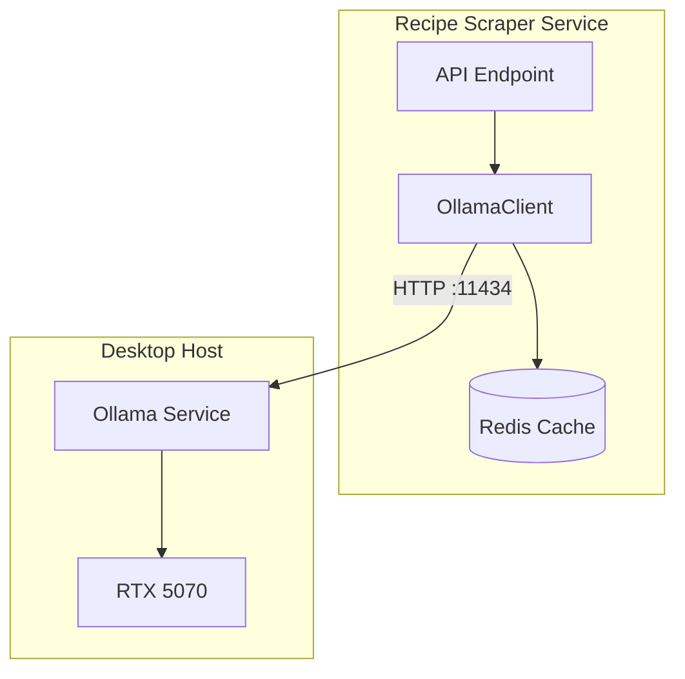
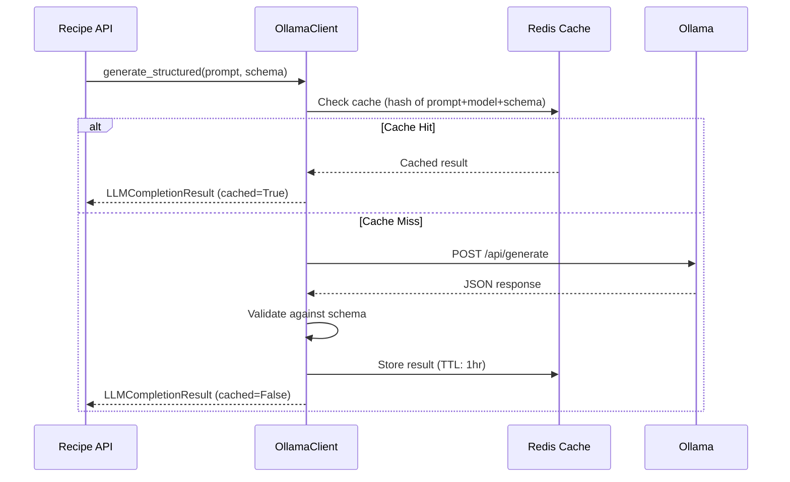

# LLM Integration

This document describes the LLM integration for the Recipe Scraper Service,
including architecture, usage patterns, and configuration.

## Overview

The service uses a local Ollama LLM for AI-powered features:

- **Recipe Extraction**: Parse unstructured HTML into structured recipe data
- **Ingredient Parsing**: Normalize ingredient text (quantity, unit, name)
- **Substitutions**: AI-powered ingredient substitution suggestions
- **Pairings**: Recipe pairing recommendations

## Architecture



### Why Host-Based Ollama?

Ollama runs on the host machine (not in Kubernetes) to:

1. **Share GPU with display server** - The desktop GPU serves 4 monitors and LLM inference
2. **Simplify deployment** - No GPU scheduling complexity in K8s
3. **Resource efficiency** - Single Ollama instance serves all environments

See [Ollama Setup Guide](./ollama-setup.md) for host installation.

## Client Usage

### Basic Generation

```python
from app.llm import OllamaClient

client = OllamaClient(
    base_url="http://localhost:11434",
    model="mistral:7b",
)
await client.initialize()

# Simple text generation
result = await client.generate("Summarize this recipe: ...")
print(result.raw_response)

await client.shutdown()
```

### Structured Output

Use Pydantic models for type-safe structured output:

```python
from pydantic import BaseModel

class ExtractedRecipe(BaseModel):
    title: str
    ingredients: list[str]
    instructions: list[str]
    prep_time_minutes: int | None = None

# LLM returns validated Pydantic model
recipe = await client.generate_structured(
    prompt="Extract recipe from: ...",
    schema=ExtractedRecipe,
    system="You are a recipe extraction assistant.",
)

print(recipe.title)  # Type-safe access
```

### With Caching

Responses are cached in Redis to reduce GPU load:

```python
from app.cache.redis import get_cache_client

cache = await get_cache_client()
client = OllamaClient(
    base_url="http://localhost:11434",
    model="mistral:7b",
    cache_client=cache,
    cache_enabled=True,
    cache_ttl=3600,  # 1 hour
)

# First call: hits Ollama
result1 = await client.generate("prompt")  # result1.cached = False

# Second call: returns cached response
result2 = await client.generate("prompt")  # result2.cached = True
```

### Skip Cache for Fresh Results

```python
# Force fresh generation, bypass cache
result = await client.generate("prompt", skip_cache=True)
```

## Prompt Templates

Use `BasePrompt` for standardized, reusable prompts:

```python
from typing import ClassVar
from pydantic import BaseModel
from app.llm.prompts.base import BasePrompt

class ParsedIngredient(BaseModel):
    name: str
    amount: float
    unit: str

class IngredientParsingPrompt(BasePrompt[ParsedIngredient]):
    output_schema: ClassVar[type[ParsedIngredient]] = ParsedIngredient
    system_prompt: ClassVar[str] = "Parse ingredient text into structured format."
    temperature: ClassVar[float] = 0.1

    def format(self, ingredient_text: str) -> str:
        return f"Parse this ingredient: {ingredient_text}"

# Usage
prompt = IngredientParsingPrompt()
result = await client.generate_structured(
    prompt=prompt.format(ingredient_text="2 cups flour, sifted"),
    schema=prompt.output_schema,
    system=prompt.system_prompt,
    options=prompt.get_options(),
)
```

## Request Flow



## Configuration

### Base Configuration

```yaml
# config/base/llm.yaml
llm:
  enabled: true
  provider: ollama
  ollama:
    url: http://localhost:11434
    model: mistral:7b
    timeout: 60.0
    max_retries: 2
  cache:
    enabled: true
    ttl: 3600
```

### Environment Overrides

```yaml
# config/environments/production/llm.yaml
llm:
  ollama:
    url: http://192.168.1.100:11434 # Desktop IP
    timeout: 90.0
```

### Environment Variables

```bash
LLM__ENABLED=true
LLM__OLLAMA__URL=http://192.168.1.100:11434
LLM__OLLAMA__MODEL=mistral:7b
```

## Error Handling

```python
from app.llm.exceptions import (
    LLMError,              # Base exception
    LLMUnavailableError,   # Connection/timeout issues
    LLMTimeoutError,       # Request timeout
    LLMResponseError,      # HTTP errors from Ollama
    LLMValidationError,    # Schema validation failed
    LLMRateLimitError,     # Rate limited
)

try:
    result = await client.generate_structured(prompt, schema=MySchema)
except LLMValidationError as e:
    # LLM returned invalid JSON for the schema
    logger.warning(f"Invalid LLM response: {e}")
    # Fallback logic...
except LLMUnavailableError as e:
    # Ollama not reachable
    logger.error(f"LLM unavailable: {e}")
    # Graceful degradation...
```

## Dependency Injection

In FastAPI endpoints, use the global client:

```python
from app.core.events.lifespan import get_llm_client

@router.post("/extract")
async def extract_recipe(url: str) -> ExtractedRecipe:
    client = get_llm_client()
    # ... use client
```

## Model Recommendations

| Model         | VRAM | Best For                      |
| ------------- | ---- | ----------------------------- |
| `llama3.2:3b` | ~4GB | Fast responses, simple tasks  |
| `mistral:7b`  | ~6GB | Structured output, reasoning  |
| `llama3.1:8b` | ~8GB | Complex parsing, best quality |

Default: `mistral:7b` - good balance of quality and speed for structured output.

## Deployment

### NetworkPolicy

The K8s NetworkPolicy allows egress to the host Ollama:

```yaml
# k8s/base/networkpolicy.yaml
- to:
    - ipBlock:
        cidr: 192.168.0.0/16
  ports:
    - protocol: TCP
      port: 11434
```

### Host Setup

See [Ollama Setup Guide](./ollama-setup.md) for:

- Installing Ollama on your desktop
- Configuring resource limits
- Firewall configuration
- GPU sharing with display server

## Testing

Tests use mocked HTTP responses - no LLM required:

```bash
# Unit tests (no external dependencies)
pytest tests/unit/llm/ -v

# Integration tests (requires Docker for Redis)
pytest tests/integration/llm/ -v

# E2E tests (recorded responses)
pytest tests/e2e/llm/ -v
```

See `tests/fixtures/llm_responses.py` for recorded response fixtures.
