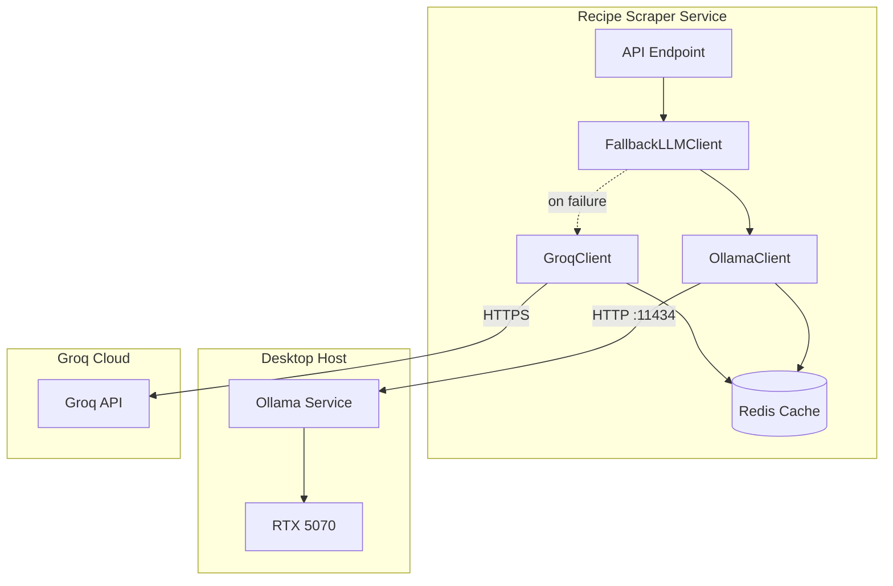
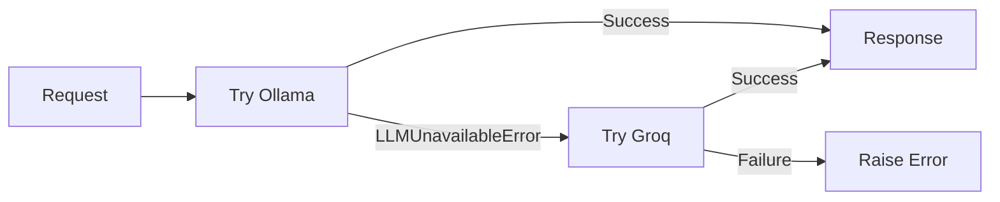
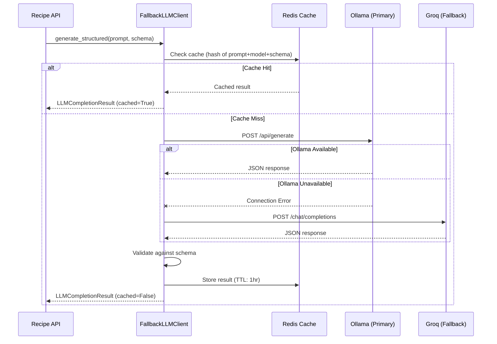

# LLM Integration

This document describes the LLM integration for the Recipe Scraper Service,
including architecture, usage patterns, and configuration.

## Overview

The service uses LLM providers for AI-powered features:

- **Recipe Extraction**: Parse unstructured HTML into structured recipe data
- **Ingredient Parsing**: Normalize ingredient text (quantity, unit, name)
- **Substitutions**: AI-powered ingredient substitution suggestions
- **Pairings**: Recipe pairing recommendations

### Provider Strategy

| Provider   | Role     | Description                             |
| ---------- | -------- | --------------------------------------- |
| **Ollama** | Primary  | Local inference on host GPU (RTX 5070)  |
| **Groq**   | Fallback | Cloud inference when Ollama unavailable |

The system automatically falls back to Groq when Ollama is unreachable,
ensuring LLM features remain available even during local GPU issues.

## Architecture



### Why Host-Based Ollama?

Ollama runs on the host machine (not in Kubernetes) to:

1. **Share GPU with display server** - The desktop GPU serves 4 monitors and LLM inference
2. **Simplify deployment** - No GPU scheduling complexity in K8s
3. **Resource efficiency** - Single Ollama instance serves all environments

See [Ollama Setup Guide](./ollama-setup.md) for host installation.

### Why Groq Fallback?

Groq provides cloud-based inference as a backup:

1. **High availability** - LLM features work even when local GPU is busy/unavailable
2. **Free tier** - 14,400 requests/day for `llama-3.1-8b-instant`
3. **Fast inference** - Groq's LPU technology provides low latency
4. **Model consistency** - Both providers run Llama-family models

## Fallback Behavior

The `FallbackLLMClient` wraps both providers and handles automatic failover:



### Fallback Triggers

| Error Type            | Triggers Fallback? | Reason                                |
| --------------------- | ------------------ | ------------------------------------- |
| `LLMUnavailableError` | Yes                | Connection refused, network errors    |
| `LLMTimeoutError`     | Yes                | Request timed out                     |
| `LLMValidationError`  | No                 | Schema mismatch - retrying won't help |
| `LLMResponseError`    | No                 | HTTP 4xx/5xx errors                   |
| `LLMRateLimitError`   | No                 | Should backoff, not shift load        |

### Observability

When fallback occurs, the system logs:

```text
WARNING: Primary LLM unavailable, falling back to secondary
         primary_error="Cannot connect to Ollama: Connection refused"
```

## Client Usage

### Basic Generation

```python
from app.core.events.lifespan import get_llm_client

# Get the client (FallbackLLMClient wrapping Ollama + Groq)
client = get_llm_client()

# Simple text generation - automatically uses Ollama, falls back to Groq
result = await client.generate("Summarize this recipe: ...")
print(result.raw_response)
print(f"Model used: {result.model}")  # Shows which provider responded
```

### Structured Output

Use Pydantic models for type-safe structured output:

```python
from pydantic import BaseModel

class ExtractedRecipe(BaseModel):
    title: str
    ingredients: list[str]
    instructions: list[str]
    prep_time_minutes: int | None = None

# LLM returns validated Pydantic model
recipe = await client.generate_structured(
    prompt="Extract recipe from: ...",
    schema=ExtractedRecipe,
    system="You are a recipe extraction assistant.",
)

print(recipe.title)  # Type-safe access
```

### With Caching

Responses are cached in Redis to reduce load on both providers:

```python
# First call: hits Ollama (or Groq if Ollama unavailable)
result1 = await client.generate("prompt")  # result1.cached = False

# Second call: returns cached response (regardless of provider)
result2 = await client.generate("prompt")  # result2.cached = True
```

### Skip Cache for Fresh Results

```python
# Force fresh generation, bypass cache
result = await client.generate("prompt", skip_cache=True)
```

## Prompt Templates

Use `BasePrompt` for standardized, reusable prompts:

```python
from typing import ClassVar
from pydantic import BaseModel
from app.llm.prompts.base import BasePrompt

class ParsedIngredient(BaseModel):
    name: str
    amount: float
    unit: str

class IngredientParsingPrompt(BasePrompt[ParsedIngredient]):
    output_schema: ClassVar[type[ParsedIngredient]] = ParsedIngredient
    system_prompt: ClassVar[str] = "Parse ingredient text into structured format."
    temperature: ClassVar[float] = 0.1

    def format(self, ingredient_text: str) -> str:
        return f"Parse this ingredient: {ingredient_text}"

# Usage
prompt = IngredientParsingPrompt()
result = await client.generate_structured(
    prompt=prompt.format(ingredient_text="2 cups flour, sifted"),
    schema=prompt.output_schema,
    system=prompt.system_prompt,
    options=prompt.get_options(),
)
```

## Request Flow



## Configuration

### Base Configuration

```yaml
# config/base/llm.yaml
llm:
  enabled: true
  provider: ollama

  # Primary: Local Ollama
  ollama:
    url: http://localhost:11434
    model: mistral:7b
    timeout: 60.0
    max_retries: 2

  # Fallback: Groq Cloud
  groq:
    url: https://api.groq.com/openai/v1
    model: llama-3.1-8b-instant
    timeout: 30.0
    max_retries: 2

  # Fallback behavior
  fallback:
    enabled: true
    secondary_provider: groq

  # Response caching
  cache:
    enabled: true
    ttl: 3600
```

### Environment Overrides

```yaml
# config/environments/production/llm.yaml
llm:
  ollama:
    url: http://192.168.1.100:11434 # Desktop IP
    timeout: 90.0
```

### Environment Variables

```bash
# Ollama configuration
LLM__ENABLED=true
LLM__OLLAMA__URL=http://192.168.1.100:11434
LLM__OLLAMA__MODEL=mistral:7b

# Fallback configuration
LLM__FALLBACK__ENABLED=true

# Groq API key (required for fallback)
GROQ_API_KEY=gsk_xxxxxxxxxxxxxxxxxxxx
```

### Groq API Key Setup

1. Create account at [console.groq.com](https://console.groq.com)
2. Generate API key
3. Add to your environment:

```bash
# Local development (.env)
GROQ_API_KEY=gsk_xxxxxxxxxxxxxxxxxxxx

# Kubernetes (secrets.env)
GROQ_API_KEY=gsk_xxxxxxxxxxxxxxxxxxxx

# GitHub Actions (repository secret)
# Add GROQ_API_KEY to repository secrets
```

If `GROQ_API_KEY` is not set, the system logs a warning and operates
without fallback capability.

## Error Handling

```python
from app.llm.exceptions import (
    LLMError,              # Base exception
    LLMUnavailableError,   # Connection/timeout issues (triggers fallback)
    LLMTimeoutError,       # Request timeout (triggers fallback)
    LLMResponseError,      # HTTP errors from provider
    LLMValidationError,    # Schema validation failed
    LLMRateLimitError,     # Rate limited
)

try:
    result = await client.generate_structured(prompt, schema=MySchema)
except LLMValidationError as e:
    # LLM returned invalid JSON for the schema
    # This does NOT trigger fallback - the issue is with the prompt/schema
    logger.warning(f"Invalid LLM response: {e}")
except LLMUnavailableError as e:
    # Both Ollama AND Groq are unavailable
    # Fallback was attempted but also failed
    logger.error(f"All LLM providers unavailable: {e}")
except LLMRateLimitError as e:
    # Provider rate limited - implement backoff
    logger.warning(f"Rate limited: {e}")
```

## Dependency Injection

In FastAPI endpoints, use the global client:

```python
from app.core.events.lifespan import get_llm_client

@router.post("/extract")
async def extract_recipe(url: str) -> ExtractedRecipe:
    client = get_llm_client()  # Returns FallbackLLMClient
    # ... use client
```

## Model Recommendations

### Ollama (Primary)

| Model         | VRAM | Best For                      |
| ------------- | ---- | ----------------------------- |
| `llama3.2:3b` | ~4GB | Fast responses, simple tasks  |
| `mistral:7b`  | ~6GB | Structured output, reasoning  |
| `llama3.1:8b` | ~8GB | Complex parsing, best quality |

Default: `mistral:7b` - good balance of quality and speed for structured output.

### Groq (Fallback)

| Model                     | Context | Best For                 |
| ------------------------- | ------- | ------------------------ |
| `llama-3.1-8b-instant`    | 128K    | Fast responses (default) |
| `llama-3.1-70b-versatile` | 128K    | Complex reasoning        |
| `mixtral-8x7b-32768`      | 32K     | Balanced quality/speed   |

Default: `llama-3.1-8b-instant` - fast inference, generous free tier.

## Deployment

### NetworkPolicy

The K8s NetworkPolicy allows egress to both providers:

```yaml
# k8s/base/networkpolicy.yaml
egress:
  # Ollama on host
  - to:
      - ipBlock:
          cidr: 192.168.0.0/16
    ports:
      - protocol: TCP
        port: 11434

  # Groq API (HTTPS)
  - to:
      - ipBlock:
          cidr: 0.0.0.0/0
    ports:
      - protocol: TCP
        port: 443
```

### Kubernetes Secrets

The Groq API key is managed via Kubernetes secrets:

```yaml
# Created by GitHub Actions during deployment
kubectl create secret generic recipe-scraper-secrets \
--from-literal=groq-api-key="${GROQ_API_KEY}"
```

### Host Setup

See [Ollama Setup Guide](./ollama-setup.md) for:

- Installing Ollama on your desktop
- Configuring resource limits
- Firewall configuration
- GPU sharing with display server

## Testing

Tests use mocked HTTP responses - no LLM required:

```bash
# Unit tests (no external dependencies)
pytest tests/unit/llm/ -v

# Integration tests (requires Docker for Redis)
pytest tests/integration/llm/ -v
```

Unit tests cover:

- `OllamaClient` - Request/response handling, caching, retries
- `GroqClient` - OpenAI-compatible API, JSON mode, error handling
- `FallbackLLMClient` - Fallback triggering, error propagation

See `tests/fixtures/llm_responses.py` for mock response fixtures.

## Troubleshooting

### Fallback Not Working

1. Check `GROQ_API_KEY` is set:

   ```bash
   echo $GROQ_API_KEY
   ```

2. Check fallback is enabled in config:

   ```yaml
   llm:
     fallback:
       enabled: true
   ```

3. Check logs for warnings:

   ```text
   WARNING: LLM fallback enabled but GROQ_API_KEY not set
   ```

### Both Providers Failing

1. **Ollama**: Check host connectivity and service status

   ```bash
   curl http://localhost:11434/api/tags
   ```

2. **Groq**: Check API key validity and rate limits

   ```bash
   curl -H "Authorization: Bearer $GROQ_API_KEY" \
        https://api.groq.com/openai/v1/models
   ```

### High Latency

1. Check if responses are being cached (`result.cached`)
2. Consider reducing `timeout` values
3. For Ollama, ensure GPU is not overloaded
