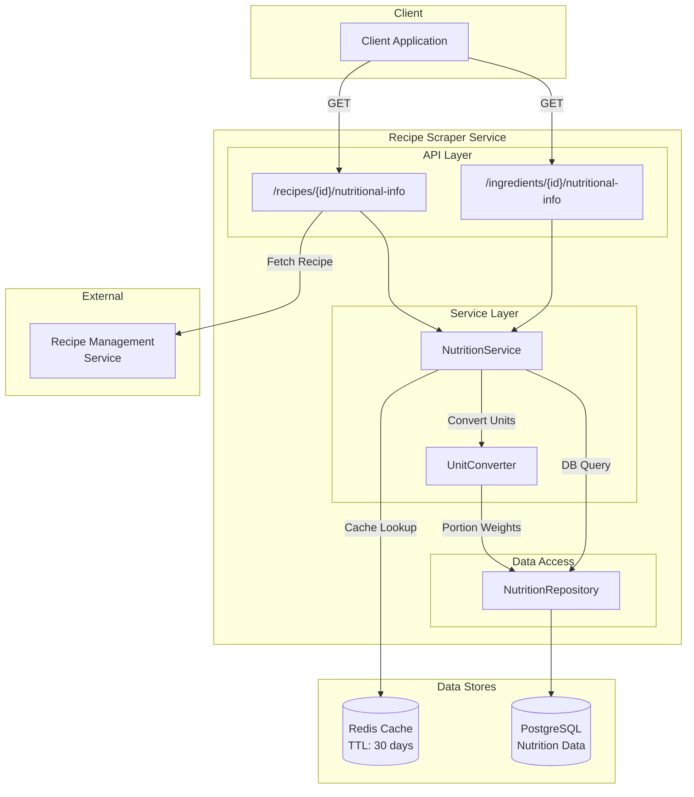
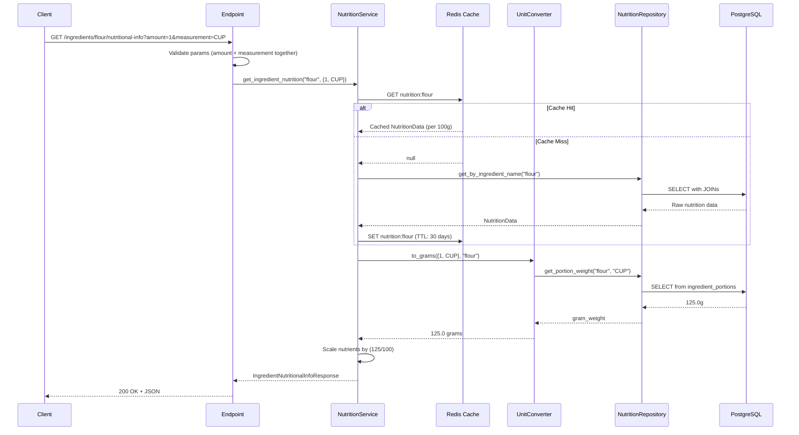
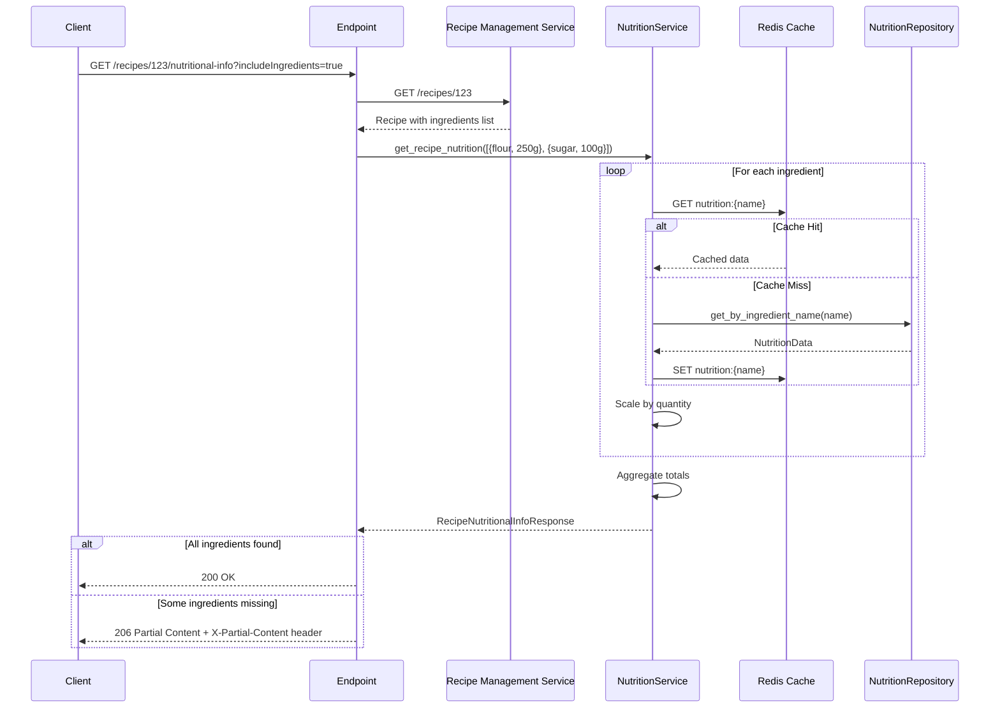
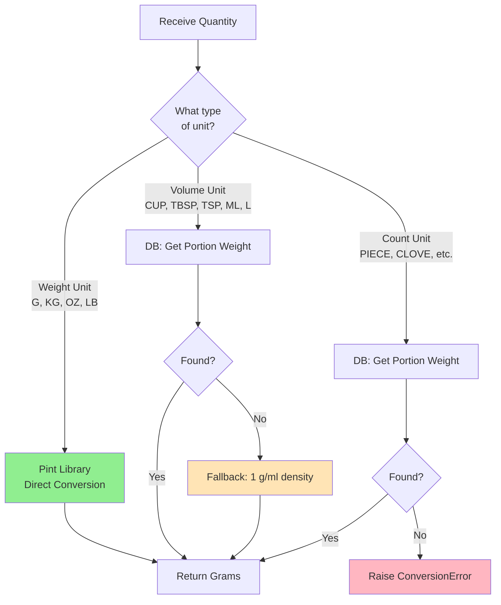
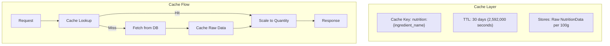
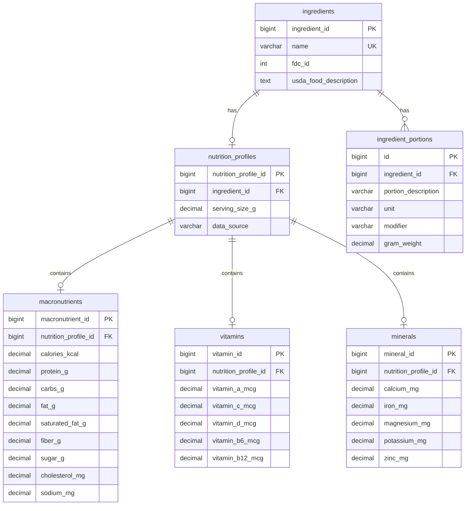

# Nutritional Information Feature

This document explains the nutritional information lookup and aggregation system, which provides USDA FoodData Central
nutritional data for ingredients and recipes.

## Table of Contents

1. [Overview](#1-overview)
2. [API Endpoints](#2-api-endpoints)
3. [Processing Flow](#3-processing-flow)
4. [Unit Conversion](#4-unit-conversion)
5. [Caching Strategy](#5-caching-strategy)
6. [Database Schema](#6-database-schema)
7. [Error Handling](#7-error-handling)
8. [Data Attribution](#8-data-attribution)

---

## 1. Overview

The nutritional information feature provides comprehensive nutritional data including macronutrients, vitamins, and
minerals for both individual ingredients and complete recipes. Data is sourced from the USDA FoodData Central database.

### High-Level Architecture



### Key Components

| Component           | Purpose                                                    |
| ------------------- | ---------------------------------------------------------- |
| NutritionService    | Orchestrates caching, conversion, and database operations  |
| UnitConverter       | Converts between measurement units using Pint library      |
| NutritionRepository | PostgreSQL access for nutritional data and portion weights |
| Redis Cache         | 30-day caching of raw nutritional data per ingredient      |

---

## 2. API Endpoints

### Ingredient Nutritional Info

**Endpoint:** `GET /ingredients/{ingredient_id}/nutritional-info`

Retrieves nutritional data for a single ingredient with optional quantity scaling.

| Parameter     | Type   | Required | Description                                  |
| ------------- | ------ | -------- | -------------------------------------------- |
| ingredient_id | string | Yes      | Ingredient name/identifier                   |
| amount        | float  | No       | Quantity amount (must be with measurement)   |
| measurement   | enum   | No       | Unit of measurement (G, KG, CUP, TBSP, etc.) |

**Response (200 OK):**

```json
{
  "quantity": {"amount": 100.0, "measurement": "G"},
  "usdaFoodDescription": "Flour, wheat, all-purpose, enriched",
  "macroNutrients": {
    "calories": {"amount": 364.0, "measurement": "KILOCALORIE"},
    "carbs": {"amount": 76.3, "measurement": "GRAM"},
    "protein": {"amount": 10.3, "measurement": "GRAM"},
    "fats": {"total": {"amount": 1.0, "measurement": "GRAM"}}
  },
  "vitamins": {...},
  "minerals": {...}
}
```

### Recipe Nutritional Info

**Endpoint:** `GET /recipes/{recipeId}/nutritional-info`

Aggregates nutritional data for all ingredients in a recipe.

| Parameter          | Type | Required | Default | Description                      |
| ------------------ | ---- | -------- | ------- | -------------------------------- |
| recipeId           | int  | Yes      | -       | Recipe identifier                |
| includeTotal       | bool | No       | true    | Include aggregated totals        |
| includeIngredients | bool | No       | false   | Include per-ingredient breakdown |

**Response Codes:**

- **200 OK** - All ingredients found
- **206 Partial Content** - Some ingredients missing (X-Partial-Content header lists missing IDs)

```json
{
  "total": {
    "quantity": {"amount": 350.0, "measurement": "G"},
    "macroNutrients": {"calories": {"amount": 1297.0, "measurement": "KILOCALORIE"}}
  },
  "ingredients": {
    "101": {"quantity": {...}, "macroNutrients": {...}},
    "102": {"quantity": {...}, "macroNutrients": {...}}
  },
  "missingIngredients": [103]
}
```

---

## 3. Processing Flow

### Single Ingredient Lookup



### Recipe Aggregation Flow



---

## 4. Unit Conversion

The UnitConverter uses a three-tier strategy to convert measurements to grams:



### Supported Units

| Category | Units                        | Conversion Method            |
| -------- | ---------------------------- | ---------------------------- |
| Weight   | G, KG, OZ, LB                | Direct Pint conversion       |
| Volume   | CUP, TBSP, TSP, ML, L, FL_OZ | DB lookup → 1 g/ml fallback  |
| Count    | PIECE, CLOVE, SLICE, etc.    | DB lookup → Error if missing |

### Portion Weight Database

The `ingredient_portions` table stores weight equivalents:

```text
| ingredient | portion_description | unit   | gram_weight |
|------------|---------------------|--------|-------------|
| flour      | 1 cup               | CUP    | 125.0       |
| butter     | 1 tablespoon        | TBSP   | 14.2        |
| eggs       | 1 large             | PIECE  | 50.0        |
```

---

## 5. Caching Strategy



### Key Design Decisions

1. **Raw Data Caching**: Cache stores per-100g values, not scaled values

   - Enables reuse across different quantity requests
   - Scaling is inexpensive at response time

2. **Long TTL**: 30-day expiration for nutritional data

   - USDA data changes infrequently
   - Reduces database load significantly

3. **Graceful Degradation**: Cache failures don't fail requests
   - Falls back to direct database access
   - Errors logged but not propagated

---

## 6. Database Schema



### Query Pattern

The repository uses LEFT JOINs to handle ingredients with partial nutritional data:

```sql
SELECT i.*, np.*, m.*, v.*, mn.*
FROM recipe_manager.ingredients i
LEFT JOIN recipe_manager.nutrition_profiles np ON i.ingredient_id = np.ingredient_id
LEFT JOIN recipe_manager.macronutrients m ON np.nutrition_profile_id = m.nutrition_profile_id
LEFT JOIN recipe_manager.vitamins v ON np.nutrition_profile_id = v.nutrition_profile_id
LEFT JOIN recipe_manager.minerals mn ON np.nutrition_profile_id = mn.nutrition_profile_id
WHERE LOWER(i.name) = LOWER($1)
```

---

## 7. Error Handling

### Error Codes Reference

| HTTP Status | Error Code              | Scenario                                   |
| ----------- | ----------------------- | ------------------------------------------ |
| 200         | -                       | Success - all data found                   |
| 206         | -                       | Partial Content - some ingredients missing |
| 400         | INVALID_QUANTITY_PARAMS | Only amount or only measurement provided   |
| 404         | INGREDIENT_NOT_FOUND    | Ingredient not in database                 |
| 422         | CONVERSION_ERROR        | Unit conversion failed                     |
| 502         | DOWNSTREAM_ERROR        | Recipe Management Service error            |
| 503         | SERVICE_UNAVAILABLE     | Recipe Management Service unavailable      |

### Error Response Format

```json
{
  "error": "INGREDIENT_NOT_FOUND",
  "message": "No nutritional data found for ingredient: unicorn-meat"
}
```

### Partial Content Response

When recipe aggregation encounters missing ingredients:

```http
HTTP/1.1 206 Partial Content
X-Partial-Content: 103,105

{
  "total": {...},
  "ingredients": {...},
  "missingIngredients": [103, 105]
}
```

---

## 8. Data Attribution

All nutritional information in this service is sourced from the USDA FoodData Central database:

> **U.S. Department of Agriculture, Agricultural Research Service. FoodData Central, 2019. fdc.nal.usda.gov.**

For more information about the data source, visit [FoodData Central](https://fdc.nal.usda.gov/).

### FDC IDs

Each ingredient is linked to a USDA FDC ID for traceability:

- The `fdc_id` column in the ingredients table stores this reference
- The `usda_food_description` field provides the official USDA food name
