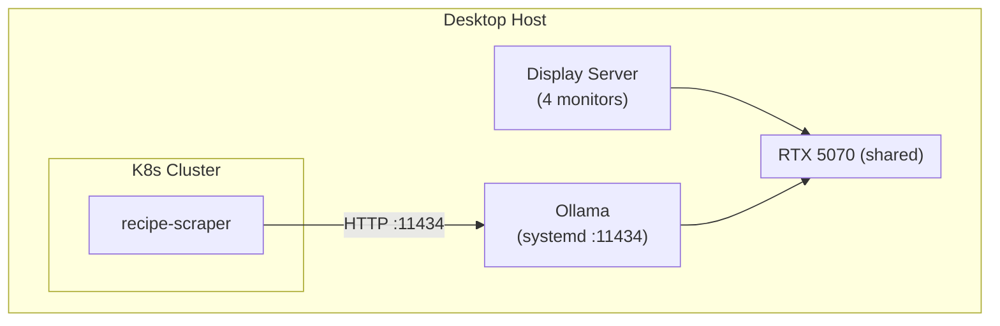

# Ollama Setup Guide

This guide covers setting up Ollama on your desktop machine to provide LLM capabilities for the recipe-scraper service.

## Architecture

Ollama runs as a host service (not in Kubernetes) to share the GPU with your display server:



## Prerequisites

- NVIDIA GPU with updated drivers
- Ubuntu/Debian-based Linux (or adapt commands for your distro)
- `curl` installed

## Installation

### 1. Install Ollama

```bash
curl -fsSL https://ollama.com/install.sh | sh
```

This automatically:

- Installs the Ollama binary
- Creates a systemd service
- Starts the service

### 2. Verify Installation

```bash
# Check service status
systemctl status ollama

# Test the API
curl http://localhost:11434/api/tags
```

### 3. Pull the Required Model

```bash
# Recommended model for structured output
ollama pull mistral:7b

# Alternative: faster but less capable
# ollama pull llama3.2:3b

# Alternative: higher quality but slower
# ollama pull llama3.1:8b
```

### 4. Configure Resource Limits

Create a systemd override to balance GPU usage with your display:

```bash
sudo mkdir -p /etc/systemd/system/ollama.service.d

sudo tee /etc/systemd/system/ollama.service.d/override.conf << 'EOF'
[Service]
# Listen on all interfaces (required for K8s access)
Environment="OLLAMA_HOST=0.0.0.0:11434"

# Limit concurrent requests to prevent GPU overload
Environment="OLLAMA_NUM_PARALLEL=2"

# Only keep one model loaded in VRAM
Environment="OLLAMA_MAX_LOADED_MODELS=1"

# Unload model after 10 minutes of inactivity
Environment="OLLAMA_KEEP_ALIVE=10m"
EOF

# Apply changes
sudo systemctl daemon-reload
sudo systemctl restart ollama
```

### 5. Configure Firewall (if enabled)

Allow connections from your K8s cluster:

```bash
# UFW
sudo ufw allow from 192.168.0.0/16 to any port 11434

# Or firewalld
sudo firewall-cmd --permanent --add-rich-rule=\
'rule family="ipv4" source address="192.168.0.0/16" port port="11434" protocol="tcp" accept'
sudo firewall-cmd --reload
```

### 6. Find Your Desktop IP

```bash
ip addr show | grep "inet 192.168"
# or
hostname -I
```

Note this IP - you'll need it for the recipe-scraper configuration.

## Configuration

Update the recipe-scraper production config with your desktop IP:

```yaml
# config/environments/production/llm.yaml
llm:
  ollama:
    url: http://YOUR_DESKTOP_IP:11434
```

## Verification

### Test from Desktop

```bash
curl http://localhost:11434/api/generate -d '{
  "model": "mistral:7b",
  "prompt": "List 3 ingredients for pasta:",
  "stream": false
}'
```

### Test from K8s Pod

```bash
kubectl run test-ollama --rm -it --image=curlimages/curl -- \
  curl http://YOUR_DESKTOP_IP:11434/api/tags
```

## Monitoring

### Check GPU Usage

```bash
# Real-time GPU monitoring
watch -n 1 nvidia-smi

# Or use nvtop for a nicer view
nvtop
```

### Check Ollama Logs

```bash
journalctl -u ollama -f
```

### Check Loaded Models

```bash
curl http://localhost:11434/api/ps
```

## Troubleshooting

### Model Not Loading

```bash
# Check available VRAM
nvidia-smi

# Unload all models and retry
curl http://localhost:11434/api/generate -d '{"model": "mistral:7b", "keep_alive": 0}'
ollama pull mistral:7b
```

### Connection Refused from K8s

1. Verify Ollama is listening on all interfaces:

   ```bash
   ss -tlnp | grep 11434
   # Should show 0.0.0.0:11434, not 127.0.0.1:11434
   ```

2. Check firewall rules
3. Verify NetworkPolicy allows egress to your IP

### Display Stuttering

If your display stutters during inference:

1. Reduce parallel requests:

   ```bash
   # In override.conf
   Environment="OLLAMA_NUM_PARALLEL=1"
   ```

2. Use a smaller model:

   ```bash
   ollama pull llama3.2:3b
   # Update config to use llama3.2:3b
   ```

## Environment Variables Reference

| Variable                   | Default            | Description                   |
| -------------------------- | ------------------ | ----------------------------- |
| `OLLAMA_HOST`              | `127.0.0.1:11434`  | Bind address                  |
| `OLLAMA_NUM_PARALLEL`      | `4`                | Max concurrent requests       |
| `OLLAMA_MAX_LOADED_MODELS` | `1`                | Models in VRAM simultaneously |
| `OLLAMA_KEEP_ALIVE`        | `5m`               | Unload model after idle time  |
| `OLLAMA_MODELS`            | `~/.ollama/models` | Model storage path            |

## Maintenance

### Update Ollama

```bash
curl -fsSL https://ollama.com/install.sh | sh
sudo systemctl restart ollama
```

### Update Models

```bash
ollama pull mistral:7b
```

### Clear Model Cache

```bash
# Remove unused models
ollama rm model-name

# Or clear everything
rm -rf ~/.ollama/models/*
```
