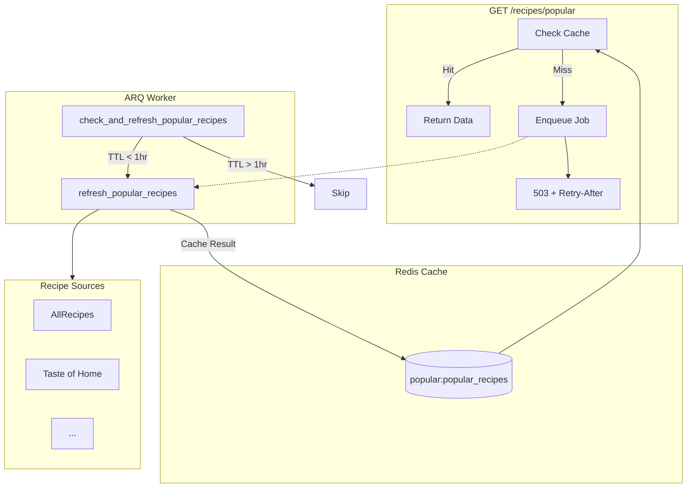

# Popular Recipes Feature

This document describes the popular recipes aggregation feature, including its architecture,
caching strategy, and background worker implementation.

## Overview

The popular recipes feature aggregates trending recipes from multiple curated sources
(AllRecipes, Taste of Home, etc.), scores them by engagement metrics, and serves them
via a fast cached endpoint.

Key characteristics:

- **Read-heavy workload**: High traffic endpoint with infrequent data updates
- **Background refresh**: CPU-intensive scraping runs in ARQ worker
- **Proactive caching**: Cron job refreshes cache before expiry
- **Graceful degradation**: Returns 503 with Retry-After on cache miss

## Architecture



## Request Flow

### Cache Hit (Normal Operation)

```text
Client -> GET /recipes/popular
       -> Check Redis cache
       -> Cache HIT
       -> Apply pagination (offset, limit)
       -> Return 200 with recipes
```

Response time: < 50ms

### Cache Miss (Cold Start / Cache Failure)

```text
Client -> GET /recipes/popular
       -> Check Redis cache
       -> Cache MISS
       -> Enqueue refresh job (deduplicated)
       -> Return 503 with Retry-After: 60
       -> Client retries after 60s
       -> (Worker has refreshed cache)
       -> Cache HIT
       -> Return 200 with recipes
```

Response time for 503: < 100ms

## Components

### Endpoint (`/api/v1/recipes/popular`)

**File:** `src/app/api/v1/endpoints/recipes.py`

The endpoint is intentionally simple - it only reads from cache:

```python
@router.get("/recipes/popular")
async def get_popular_recipes(
    cache_client: Annotated[Any, Depends(get_redis_cache_client)],
    limit: int = 50,
    offset: int = 0,
    count_only: bool = False,
) -> PopularRecipesResponse | JSONResponse:
    # Try cache
    cached = await cache_client.get(cache_key)
    if cached:
        return PopularRecipesResponse(...)

    # Cache miss - enqueue and return 503
    await enqueue_popular_recipes_refresh()
    return JSONResponse(status_code=503, headers={"Retry-After": "60"}, ...)
```

**Query Parameters:**

| Parameter   | Type | Default | Description                       |
| ----------- | ---- | ------- | --------------------------------- |
| `limit`     | int  | 50      | Max recipes to return (1-100)     |
| `offset`    | int  | 0       | Starting index for pagination     |
| `countOnly` | bool | false   | Return only count, no recipe data |

### Worker Task: `refresh_popular_recipes`

**File:** `src/app/workers/tasks/popular_recipes.py`

Performs the CPU-intensive work of:

1. Fetching HTML from configured recipe sources
2. Extracting recipe links (using LLM or regex)
3. Fetching individual recipe pages for metrics
4. Scoring and ranking by normalized popularity score
5. Caching the results

```python
async def refresh_popular_recipes(ctx: dict[str, Any]) -> dict[str, Any]:
    service = PopularRecipesService(
        cache_client=ctx.get("cache_client"),
        llm_client=ctx.get("llm_client"),
    )
    await service.initialize()
    try:
        data = await service.refresh_cache()
        return {"status": "completed", "recipe_count": data.total_count, ...}
    finally:
        await service.shutdown()
```

### Cron Job: `check_and_refresh_popular_recipes`

**File:** `src/app/workers/tasks/popular_recipes.py`

Runs every 30 minutes to proactively refresh cache before expiry:

```python
async def check_and_refresh_popular_recipes(ctx: dict[str, Any]) -> dict[str, Any]:
    ttl = await cache_client.ttl(cache_key)

    if ttl < 0:  # Missing or no expiry
        return await refresh_popular_recipes(ctx)

    if ttl < config.refresh_threshold:  # Less than 1 hour
        return await refresh_popular_recipes(ctx)

    return {"status": "skipped", "ttl_remaining": ttl}
```

### Service: `PopularRecipesService`

**File:** `src/app/services/popular/service.py`

Core business logic for:

- Fetching recipe listings from configured sources
- Extracting metrics (rating, reviews, favorites)
- Normalizing and scoring across sources
- Managing cache lifecycle

## Configuration

**File:** `config/base/scraping.yaml`

```yaml
popular_recipes:
  enabled: true
  cache_ttl: 86400 # 24 hours
  cache_key: "popular_recipes"
  refresh_threshold: 3600 # Refresh when TTL < 1 hour
  target_total: 20 # Target recipes to return
  fetch_timeout: 30.0 # HTTP timeout per source
  max_concurrent_fetches: 5 # Parallel source fetches

  # LLM extraction settings
  use_llm_extraction: true
  llm_extraction_max_html_chars: 8000
  llm_extraction_min_confidence: 0.5

  # Scoring weights (sum to 1.0)
  scoring:
    rating_weight: 0.35
    rating_count_weight: 0.25
    favorites_weight: 0.25
    reviews_weight: 0.10
    position_weight: 0.05

  sources:
    - name: "Taste of Home"
      base_url: "https://www.tasteofhome.com"
      popular_endpoint: "/collection/our-100-highest-rated-recipes-ever/"
      enabled: true
      max_recipes: 15
      source_weight: 1.0
```

**File:** `config/base/arq.yaml`

```yaml
arq:
  job_ids:
    popular_recipes_refresh: "popular_recipes_refresh"
  queue_name: "scraper:queue:jobs"
```

## Scoring Algorithm

Recipes are scored using weighted normalized metrics:

```text
score = (rating_norm × 0.35) +
        (rating_count_norm × 0.25) +
        (favorites_norm × 0.25) +
        (reviews_norm × 0.10) +
        (position_norm × 0.05)
```

Where each `*_norm` is min-max normalized to [0, 1] across all fetched recipes.

Missing metrics are handled by redistributing their weight proportionally
to available metrics.

## Error Handling

| Scenario             | Behavior                                 |
| -------------------- | ---------------------------------------- |
| Cache miss           | Return 503, enqueue refresh job          |
| Source fetch timeout | Log warning, continue with other sources |
| All sources fail     | Cache empty result, cron will retry      |
| LLM extraction fails | Fall back to regex extraction            |
| Redis unavailable    | Return 503, log error                    |

## Monitoring

### Logs

Key log messages (all tagged with `popular_recipes`):

```text
INFO  "Starting popular recipes refresh"
INFO  "Popular recipes refresh completed" total_count=20 sources_fetched=["AllRecipes", "Taste of Home"]
WARN  "Source fetch failed" source="AllRecipes" error="Connection timeout"
INFO  "Cache healthy, skipping refresh" ttl_remaining=7200
```

### Metrics

| Metric                                     | Type      | Description             |
| ------------------------------------------ | --------- | ----------------------- |
| `popular_recipes_cache_hits_total`         | Counter   | Cache hit count         |
| `popular_recipes_cache_misses_total`       | Counter   | Cache miss count        |
| `popular_recipes_refresh_duration_seconds` | Histogram | Worker refresh duration |

### Alerts

Recommended alerts:

- Cache empty for > 2 hours
- Worker job queue depth > 10
- Refresh duration > 5 minutes

## Testing

### Unit Tests

```bash
uv run pytest tests/unit/workers/tasks/test_popular_recipes.py -v
```

### Integration Tests

```bash
uv run pytest tests/integration/test_popular_recipes.py -v
```

### Performance Tests

```bash
uv run pytest tests/performance/test_popular_recipes_performance.py -v
```

### Manual Verification

```bash
# Clear cache
redis-cli DEL "popular:popular_recipes"

# Request (should return 503)
curl -i http://localhost:8000/api/v1/recipes/popular

# Wait for worker, then retry
sleep 120
curl http://localhost:8000/api/v1/recipes/popular | jq

# Check cache TTL
redis-cli TTL "popular:popular_recipes"
```

## Deployment Notes

1. **First deployment**: Cache will be cold. First request triggers refresh job.
   Expect 503 responses for ~2 minutes while worker fetches.

2. **Worker scaling**: Only one worker instance should run the cron job.
   ARQ handles this via job ID deduplication.

3. **Cache invalidation**: Use `service.invalidate_cache()` or:

   ```bash
   redis-cli DEL "popular:popular_recipes"
   ```

4. **Source updates**: Adding/removing sources requires deployment.
   Cache will refresh on next cron cycle.
