# Recipe Scraping Process

This document explains the complete flow of scraping a recipe from the web and storing it in the database. The process
involves multiple services, middleware layers, async job processing, and LLM-powered extraction.

## Table of Contents

1. [Overview](#1-overview)
2. [Request Lifecycle](#2-request-lifecycle)
3. [Middleware Stack](#3-middleware-stack)
4. [Authentication & Authorization](#4-authentication--authorization)
5. [Async Job Queue System](#5-async-job-queue-system)
6. [Recipe Processing Pipeline](#6-recipe-processing-pipeline)
7. [LLM Extraction Strategy](#7-llm-extraction-strategy)
8. [Data Models](#8-data-models)
9. [Error Handling](#9-error-handling)
10. [Observability](#10-observability)

---

## 1. Overview

The Recipe Scraper Service is a FastAPI-based microservice that extracts structured recipe data from web pages. It uses
an asynchronous job queue for background processing and LLM-powered extraction for intelligent parsing.

### High-Level Architecture

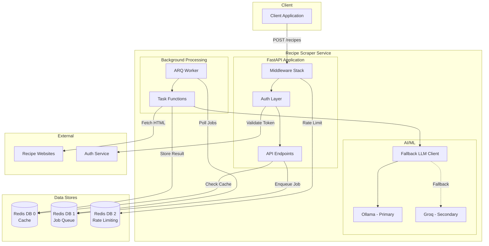

### Key Components

| Component | Purpose                                             |
| --------- | --------------------------------------------------- |
| FastAPI   | Web framework for API endpoints                     |
| ARQ       | Async Redis Queue for background jobs               |
| Redis     | Caching, job queue, and rate limiting (3 databases) |
| Ollama    | Local LLM for recipe extraction                     |
| Groq      | Cloud LLM fallback                                  |
| httpx     | Async HTTP client for web scraping                  |

---

## 2. Request Lifecycle

When a client submits a URL to scrape, the request flows through multiple layers before a job is enqueued.

### Request Flow Sequence

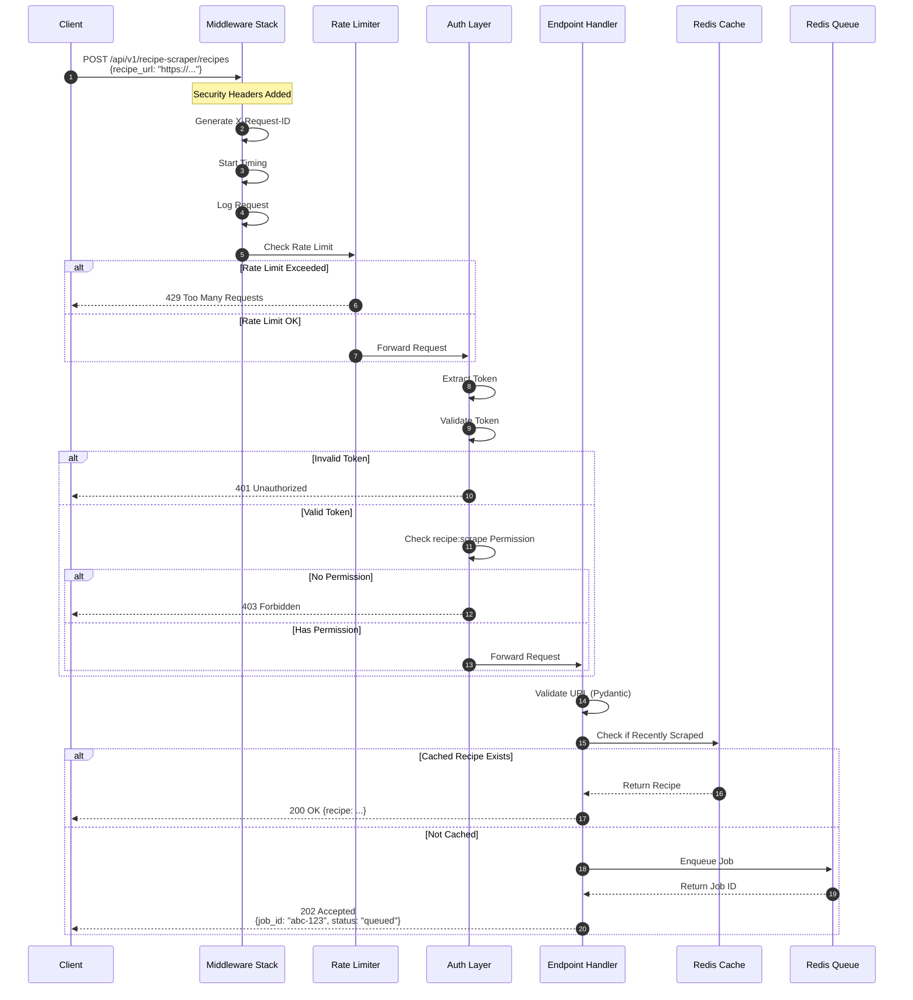

### Endpoint Details

**Endpoint:** `POST /api/v1/recipe-scraper/recipes`

**Request:**

```json
{
  "recipe_url": "https://example.com/recipe/chocolate-cake"
}
```

**Response (Cached):** `200 OK`

```json
{
  "recipe": {
    "recipe_id": 123,
    "title": "Chocolate Cake",
    "ingredients": [...],
    "steps": [...]
  }
}
```

**Response (Queued):** `202 Accepted`

```json
{
  "job_id": "abc-123-def-456",
  "status": "queued"
}
```

---

## 3. Middleware Stack

The middleware stack processes every request in a specific order. FastAPI executes middleware
in **reverse order of addition** on the request path.

### Middleware Execution Order

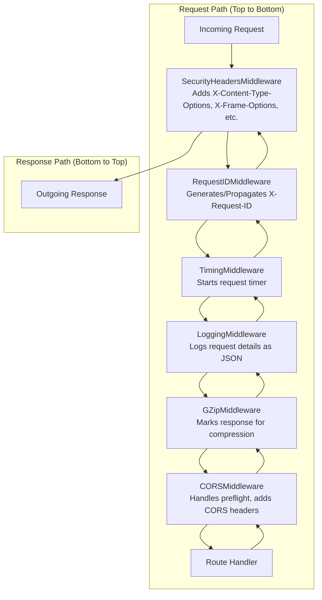

### Middleware Details

| Middleware                  | File                                  | Purpose                                               |
| --------------------------- | ------------------------------------- | ----------------------------------------------------- |
| `SecurityHeadersMiddleware` | `core/middleware/security_headers.py` | Adds security headers (CSP, X-Frame-Options, etc.)    |
| `RequestIDMiddleware`       | `core/middleware/request_id.py`       | Generates unique X-Request-ID for tracing             |
| `TimingMiddleware`          | `core/middleware/timing.py`           | Measures request duration, adds X-Process-Time header |
| `LoggingMiddleware`         | `core/middleware/logging.py`          | Structured JSON logging of requests/responses         |
| `GZipMiddleware`            | FastAPI built-in                      | Compresses responses > 1000 bytes                     |
| `CORSMiddleware`            | FastAPI built-in                      | Handles Cross-Origin Resource Sharing                 |

### Excluded Paths

The logging middleware excludes health/metrics endpoints to reduce noise:

- `/api/v1/recipe-scraper/health`
- `/api/v1/recipe-scraper/ready`
- `/api/v1/recipe-scraper/metrics`

---

## 4. Authentication & Authorization

The service uses a flexible authentication system with multiple modes and role-based access control (RBAC).

### Auth Decision Flow

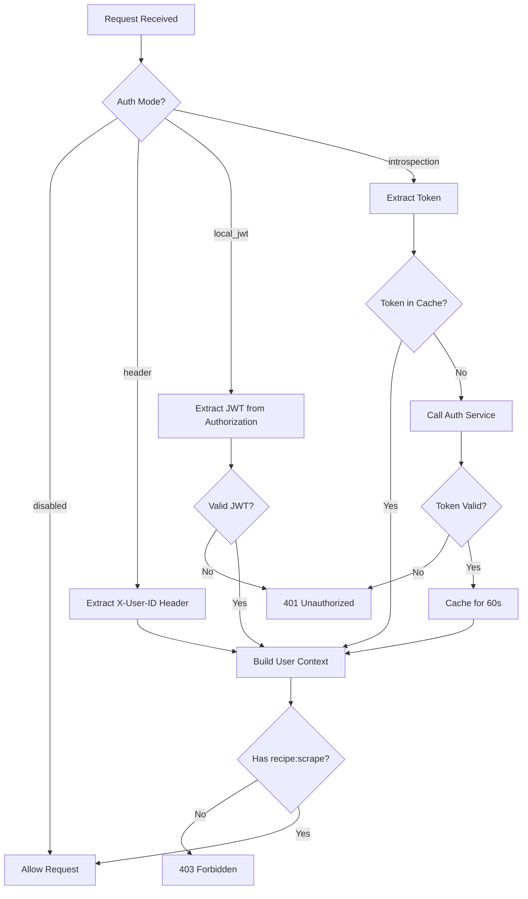

### Auth Modes

| Mode            | Use Case                      | Token Source                         |
| --------------- | ----------------------------- | ------------------------------------ |
| `disabled`      | Development/Testing           | None required                        |
| `header`        | Development with user context | `X-User-ID` header                   |
| `local_jwt`     | Production with JWT           | `Authorization: Bearer <token>`      |
| `introspection` | Production with external auth | Token validated against auth service |

### Role-Based Access Control

The `recipe:scrape` permission is required to use the scraping endpoint.

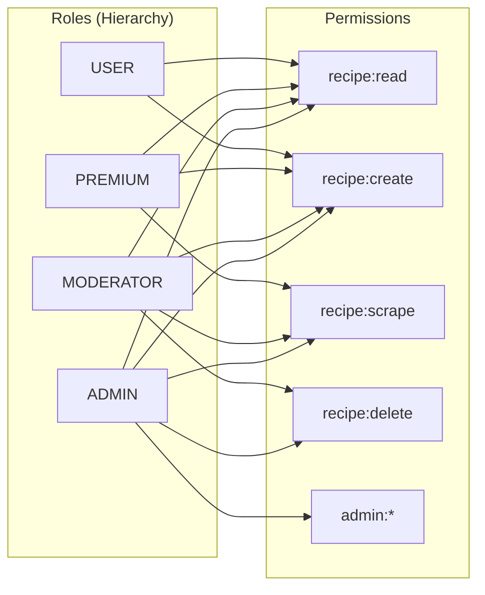

| Role      | Can Scrape? | Notes              |
| --------- | ----------- | ------------------ |
| USER      | No          | Basic access only  |
| PREMIUM   | Yes         | Paid feature       |
| MODERATOR | Yes         | Content management |
| ADMIN     | Yes         | Full access        |
| SERVICE   | Yes         | Internal services  |

---

## 5. Async Job Queue System

Recipe scraping is handled asynchronously using ARQ (Async Redis Queue) to avoid blocking API requests.

### Job Processing Flow

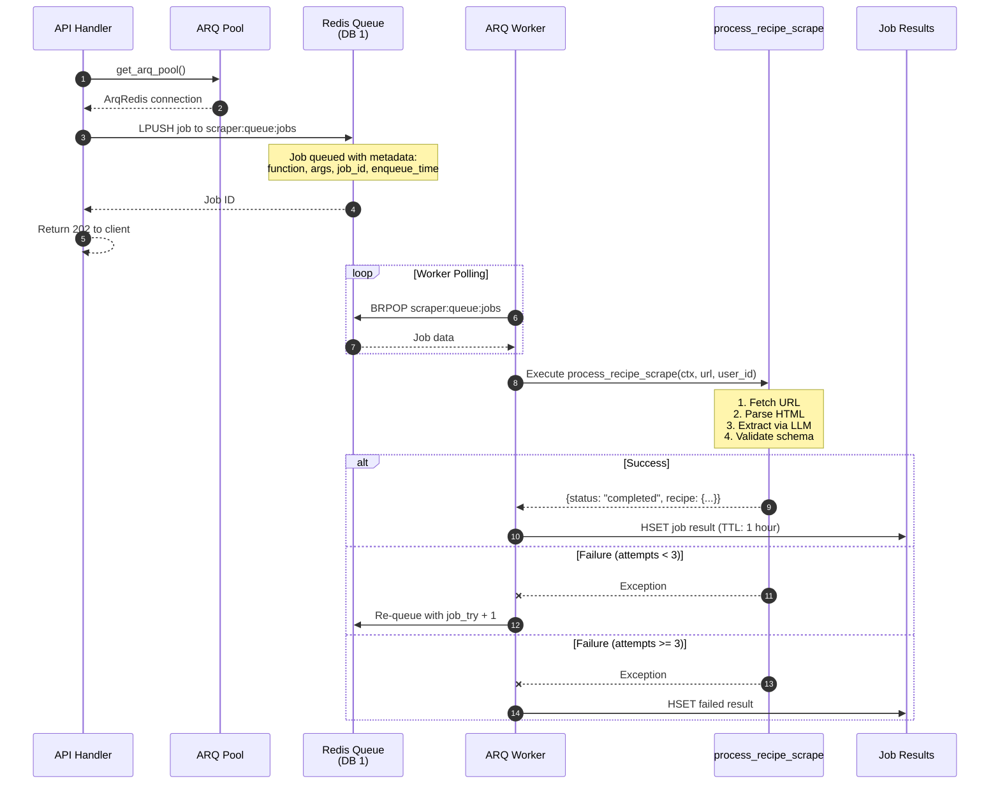

### Worker Configuration

From `src/app/workers/arq.py`:

| Setting            | Value                        | Description                    |
| ------------------ | ---------------------------- | ------------------------------ |
| `queue_name`       | `scraper:queue:jobs`         | Redis key for job queue        |
| `health_check_key` | `scraper:queue:health-check` | Worker health check key        |
| `job_timeout`      | 300s (5 min)                 | Max execution time per job     |
| `max_jobs`         | 10                           | Concurrent jobs per worker     |
| `keep_result`      | 3600s (1 hour)               | How long to keep job results   |
| `max_tries`        | 3                            | Retry attempts for failed jobs |

### Job Status Polling

Clients can poll for job completion:

**Endpoint:** `GET /api/v1/recipe-scraper/jobs/{job_id}`

**Response:**

```json
{
  "job_id": "abc-123-def-456",
  "status": "complete",
  "function": "process_recipe_scrape",
  "enqueue_time": "2024-01-15T10:30:00Z",
  "job_try": 1,
  "result": {
    "status": "completed",
    "url": "https://example.com/recipe",
    "recipe": { ... }
  }
}
```

### Job States

| Status        | Description                            |
| ------------- | -------------------------------------- |
| `queued`      | Job waiting in queue                   |
| `in_progress` | Worker is executing the job            |
| `complete`    | Job finished successfully              |
| `failed`      | Job failed after max retries           |
| `not_found`   | Job ID doesn't exist or result expired |

---

## 6. Recipe Processing Pipeline

Once a job is picked up by a worker, it goes through the processing pipeline.

### Processing Stages

```mermaid
flowchart TD
    START[Job Received] --> FETCH[Fetch URL]

    subgraph "URL Fetching"
        FETCH --> HEADERS[Set Headers<br/>User-Agent, Accept]
        HEADERS --> HTTP[httpx.get&#40;url&#41;]
        HTTP --> CHECK_STATUS{Status 200?}
        CHECK_STATUS -->|No| FETCH_ERR[Raise FetchError]
        CHECK_STATUS -->|Yes| EXTRACT_HTML[Extract HTML Content]
    end

    EXTRACT_HTML --> PARSE[Parse HTML]

    subgraph "HTML Parsing"
        PARSE --> CLEAN[Clean HTML<br/>Remove scripts, styles]
        CLEAN --> IDENTIFY[Identify Recipe Content<br/>JSON-LD, Microdata, hRecipe]
        IDENTIFY --> EXTRACT[Extract Raw Text]
    end

    EXTRACT --> LLM[LLM Extraction]

    subgraph "LLM Processing"
        LLM --> FORMAT[Format Prompt with HTML]
        FORMAT --> GENERATE[generate_structured&#40;&#41;]
        GENERATE --> VALIDATE{Schema Valid?}
        VALIDATE -->|No| LLM_ERR[Raise ValidationError]
        VALIDATE -->|Yes| RECIPE[Structured Recipe]
    end

    RECIPE --> POST[Post-Processing]

    subgraph "Post-Processing"
        POST --> NORMALIZE[Normalize Units]
        NORMALIZE --> DEDUPE[Deduplicate Ingredients]
        DEDUPE --> ENRICH[Enrich Metadata]
    end

    ENRICH --> CACHE_RESULT[Cache Recipe]
    CACHE_RESULT --> DONE[Return Result]

    FETCH_ERR --> FAIL[Job Failed]
    LLM_ERR --> FAIL
```

### URL Fetching

The service uses `httpx` for async HTTP requests with:

- Custom User-Agent to avoid bot detection
- Reasonable timeouts (30s connect, 60s read)
- Redirect following (up to 5 redirects)
- SSL verification

### Structured Data Detection

The parser looks for recipe data in multiple formats:

1. **JSON-LD** (`<script type="application/ld+json">`) - Preferred
2. **Microdata** (`itemtype="https://schema.org/Recipe"`)
3. **hRecipe** microformat (legacy)
4. **Plain text** extraction (fallback for LLM)

---

## 7. LLM Extraction Strategy

The service uses LLMs to intelligently extract structured recipe data from HTML content.

### Prompt Architecture

Prompts are defined using the `BasePrompt` pattern from `src/app/llm/prompts/base.py`:

```python
class BasePrompt[T: BaseModel](ABC):
    """Base class for all LLM prompts."""

    output_schema: ClassVar[type[BaseModel]]  # Pydantic model for output
    system_prompt: ClassVar[str | None] = None
    temperature: ClassVar[float] = 0.1  # Low for deterministic output
    max_tokens: ClassVar[int | None] = None

    @abstractmethod
    def format(self, **kwargs: Any) -> str:
        """Format the prompt template with input variables."""
        ...
```

### Recipe Extraction Prompt Example

```python
class RecipeExtractionPrompt(BasePrompt[Recipe]):
    output_schema = Recipe
    system_prompt = """You are a recipe extraction assistant.
    Extract structured recipe data from the provided HTML content.
    Return ONLY valid JSON matching the schema."""
    temperature = 0.1

    def format(self, html_content: str) -> str:
        return f"""Extract the recipe from this HTML:

{html_content}

Extract: title, description, servings, prep_time, cook_time,
difficulty, ingredients (with quantities), and steps."""
```

### Fallback LLM Architecture

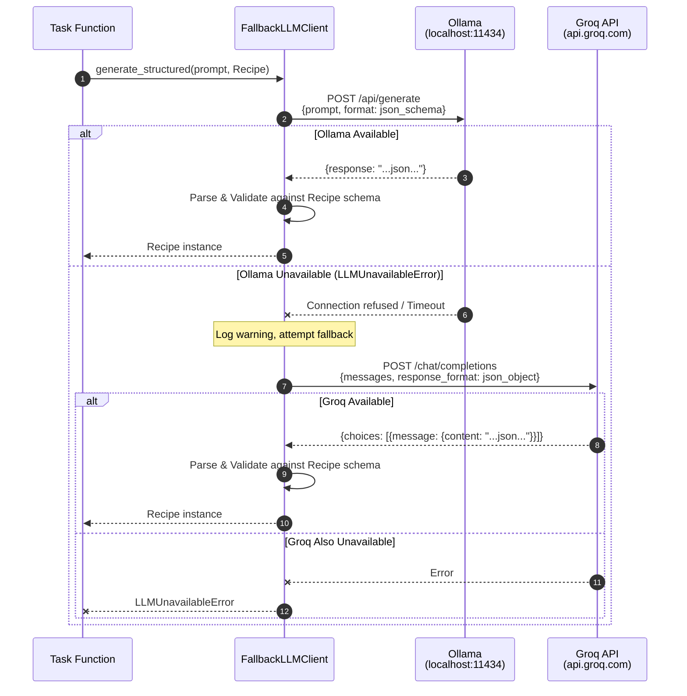

### Structured Output Generation

The `generate_structured()` method ensures type-safe output:

```python
async def generate_structured(
    self,
    prompt: str,
    schema: type[T],  # e.g., Recipe
    *,
    model: str | None = None,
    system: str | None = None,
    options: dict[str, Any] | None = None,
) -> T:  # Returns validated Recipe instance
```

**Ollama:** Uses the `format` field with a JSON schema derived from the Pydantic model.

**Groq:** Uses OpenAI-compatible `response_format: {"type": "json_object"}` with schema instructions in the prompt.

### LLM Configuration

| Provider | Model                       | Endpoint                                          | Use Case                  |
| -------- | --------------------------- | ------------------------------------------------- | ------------------------- |
| Ollama   | `mistral:7b` (configurable) | `http://localhost:11434/api/generate`             | Primary - Local inference |
| Groq     | `llama-3.1-8b-instant`      | `https://api.groq.com/openai/v1/chat/completions` | Fallback - Cloud API      |

### Fallback Triggers

| Error Type            | Triggers Fallback? | Reason                                 |
| --------------------- | ------------------ | -------------------------------------- |
| `LLMUnavailableError` | Yes                | Connection refused, network error      |
| `LLMTimeoutError`     | Yes                | Request timeout (subclass of above)    |
| `LLMValidationError`  | No                 | Schema mismatch - retrying won't help  |
| `LLMResponseError`    | No                 | HTTP 4xx/5xx errors                    |
| `LLMRateLimitError`   | No                 | Should implement backoff, not fallback |

---

## 8. Data Models

The service uses Pydantic models for request/response validation and LLM output schemas.

### Entity Relationship Diagram

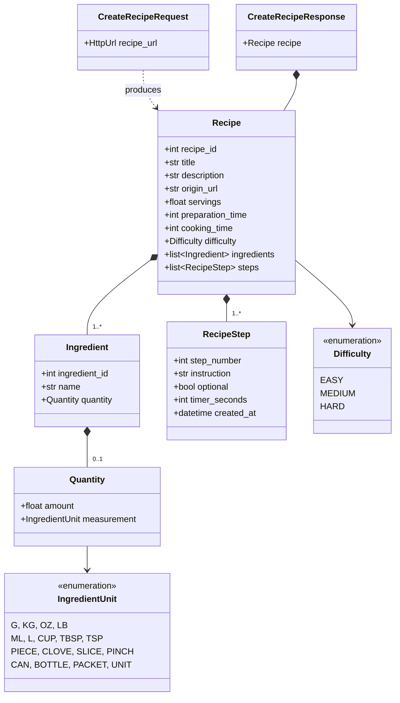

### Schema Definitions

**Location:** `src/app/schemas/`

| File            | Models                                                                |
| --------------- | --------------------------------------------------------------------- |
| `recipe.py`     | `Recipe`, `RecipeStep`, `CreateRecipeRequest`, `CreateRecipeResponse` |
| `ingredient.py` | `Ingredient`, `Quantity`, `WebRecipe`                                 |
| `enums.py`      | `Difficulty`, `IngredientUnit`, `Allergen`, `FoodGroup`               |
| `base.py`       | `APIRequest`, `APIResponse` (base classes)                            |

### IngredientUnit Categories

| Category | Units                                                 |
| -------- | ----------------------------------------------------- |
| Weight   | G, KG, OZ, LB                                         |
| Volume   | ML, L, CUP, TBSP, TSP                                 |
| Count    | PIECE, CLOVE, SLICE, PINCH, CAN, BOTTLE, PACKET, UNIT |

---

## 9. Error Handling

The service uses a structured exception hierarchy with consistent error responses.

### Exception Hierarchy

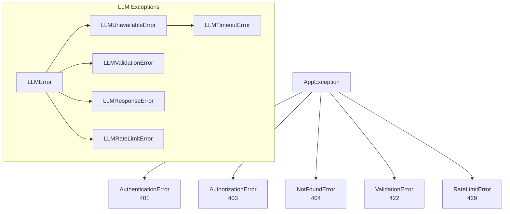

### HTTP Status Codes

| Code | Meaning               | When Used                          |
| ---- | --------------------- | ---------------------------------- |
| 200  | OK                    | Recipe returned from cache         |
| 202  | Accepted              | Async job enqueued                 |
| 400  | Bad Request           | Invalid URL format                 |
| 401  | Unauthorized          | Missing or invalid token           |
| 403  | Forbidden             | Missing `recipe:scrape` permission |
| 404  | Not Found             | Recipe or job not found            |
| 422  | Unprocessable Entity  | Pydantic validation failed         |
| 429  | Too Many Requests     | Rate limit exceeded                |
| 500  | Internal Server Error | Unhandled exception                |
| 503  | Service Unavailable   | Redis or dependencies down         |

### Error Response Format

```json
{
  "error": "authorization_error",
  "detail": "Missing required permission: recipe:scrape",
  "request_id": "abc-123-def-456"
}
```

### Job Retry Logic

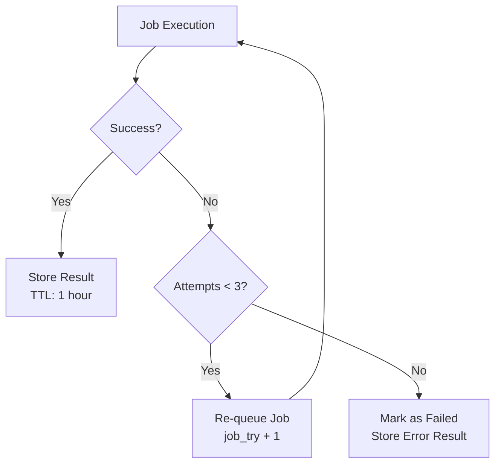

---

## 10. Observability

The service implements comprehensive observability through metrics, tracing, and structured logging.

### Observability Stack

| Component | Tool                                | Purpose                                |
| --------- | ----------------------------------- | -------------------------------------- |
| Metrics   | Prometheus + FastAPI Instrumentator | Request counts, latencies, error rates |
| Tracing   | OpenTelemetry + OTLP                | Distributed request tracing            |
| Logging   | Loguru                              | Structured JSON logging                |

### Prometheus Metrics

**Endpoint:** `GET /api/v1/recipe-scraper/metrics`

Key metrics exposed:

- `http_requests_total` - Request count by method, path, status
- `http_request_duration_seconds` - Request latency histogram
- `redis_operations_total` - Redis command counts
- `arq_jobs_total` - Job counts by status
- `llm_requests_total` - LLM API calls by provider

### Request Tracing

Every request gets a unique `X-Request-ID` that:

1. Is generated by `RequestIDMiddleware` (or accepted from client)
2. Is propagated to all downstream services
3. Is included in all log entries
4. Is returned in the response header
5. Is attached to OpenTelemetry spans

### Structured Logging

All logs are emitted as JSON with consistent fields:

```json
{
  "timestamp": "2024-01-15T10:30:00.123Z",
  "level": "INFO",
  "message": "Enqueued job",
  "request_id": "abc-123-def-456",
  "function": "process_recipe_scrape",
  "job_id": "xyz-789",
  "extra": {
    "url": "https://example.com/recipe"
  }
}
```

### Health Endpoints

| Endpoint                             | Purpose                                  |
| ------------------------------------ | ---------------------------------------- |
| `GET /api/v1/recipe-scraper/health`  | Liveness probe - service is running      |
| `GET /api/v1/recipe-scraper/ready`   | Readiness probe - dependencies available |
| `GET /api/v1/recipe-scraper/metrics` | Prometheus metrics                       |

---

## Source Files Reference

| File                               | Purpose                               |
| ---------------------------------- | ------------------------------------- |
| `src/app/factory.py`               | Application factory, middleware setup |
| `src/app/api/v1/router.py`         | API route configuration               |
| `src/app/schemas/recipe.py`        | Recipe data models                    |
| `src/app/schemas/ingredient.py`    | Ingredient models                     |
| `src/app/schemas/enums.py`         | Enumeration types                     |
| `src/app/workers/arq.py`           | ARQ worker configuration              |
| `src/app/workers/jobs.py`          | Job enqueueing functions              |
| `src/app/workers/tasks/example.py` | Background task implementations       |
| `src/app/auth/permissions.py`      | RBAC definitions                      |
| `src/app/llm/client/fallback.py`   | Fallback LLM client                   |
| `src/app/llm/prompts/base.py`      | Base prompt class                     |
| `src/app/llm/models.py`            | LLM request/response models           |
