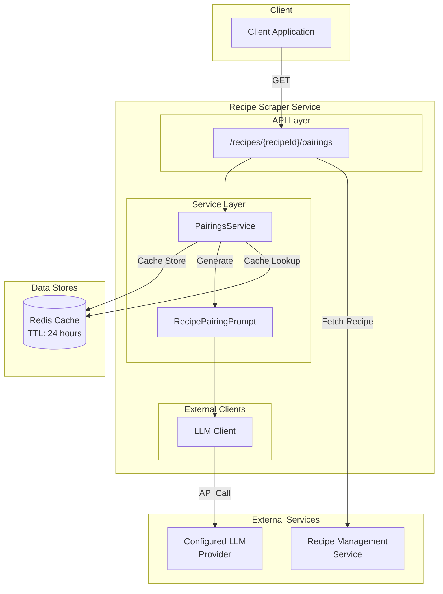
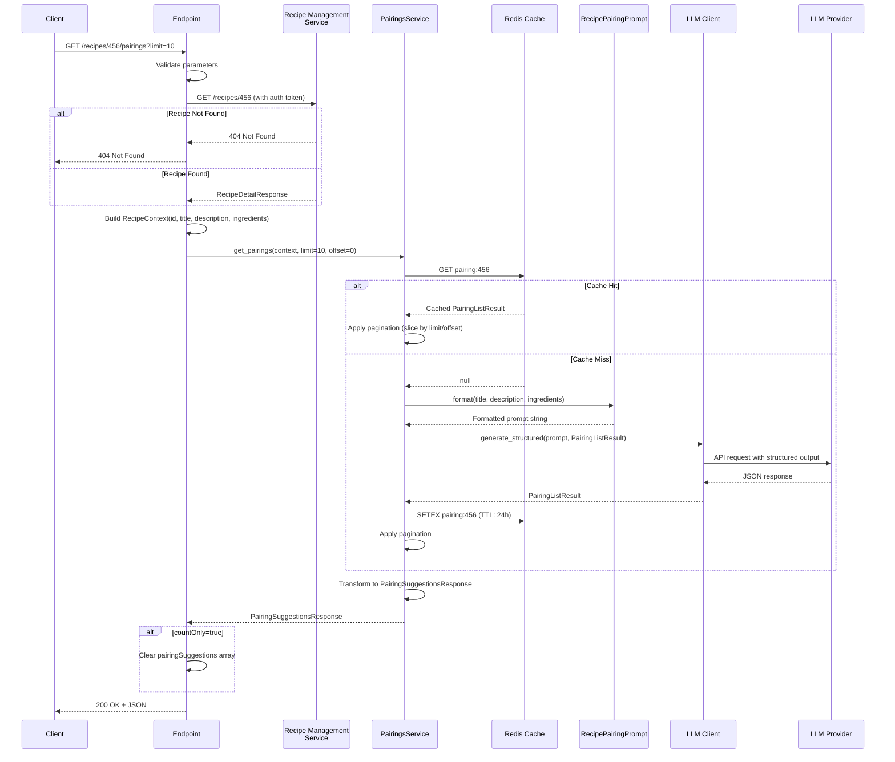
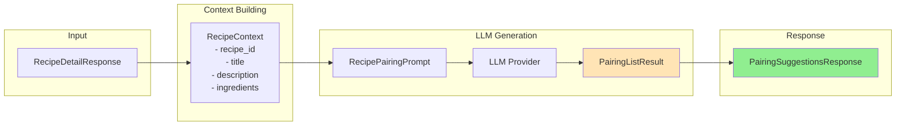
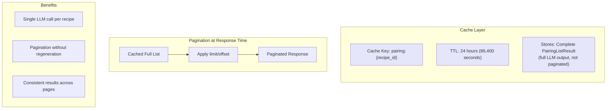
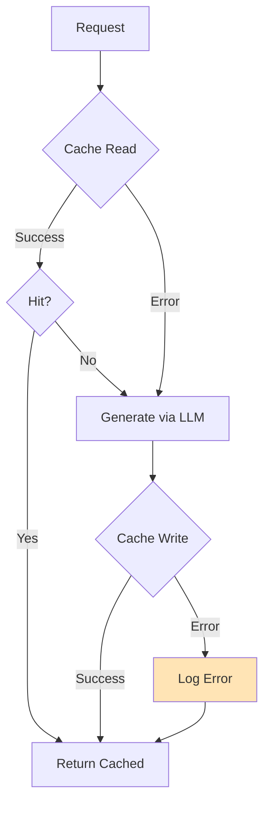
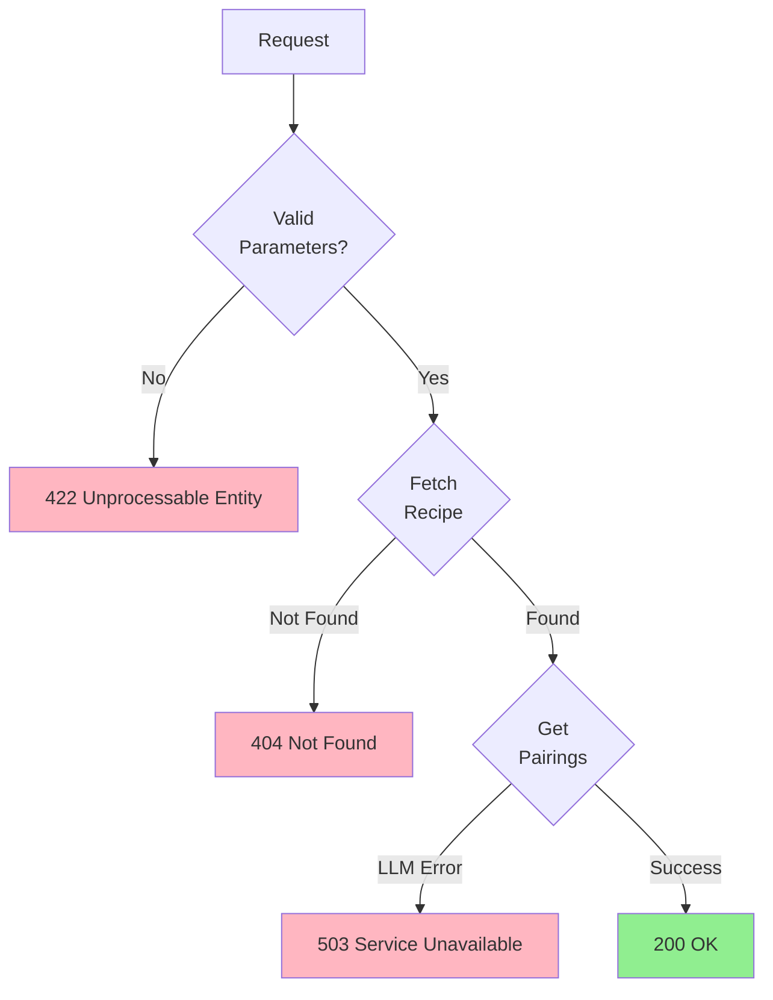

# Recipe Pairings Feature

This document explains the recipe pairing suggestions system, which uses LLM-powered recommendations to suggest
complementary recipes based on flavor profiles, cuisine types, and culinary traditions.

## Table of Contents

1. [Overview](#1-overview)
2. [API Endpoint](#2-api-endpoint)
3. [Processing Flow](#3-processing-flow)
4. [LLM Integration](#4-llm-integration)
5. [Caching Strategy](#5-caching-strategy)
6. [Error Handling](#6-error-handling)
7. [Configuration](#7-configuration)

---

## 1. Overview

The recipe pairings feature provides intelligent recommendations for dishes that complement a given recipe. The system
analyzes the recipe's title, description, and ingredients to suggest side dishes, appetizers, desserts, and beverages
that pair well together.

### High-Level Architecture



### Key Components

| Component           | Purpose                                                        |
| ------------------- | -------------------------------------------------------------- |
| PairingsService     | Orchestrates caching, LLM generation, and response formatting  |
| RecipePairingPrompt | Structures the LLM prompt with culinary context and guidelines |
| LLM Client          | Calls the primary configured LLM provider                      |
| Redis Cache         | 24-hour caching of generated pairing suggestions               |

### Pairing Categories

The LLM considers multiple categories when generating suggestions:

| Category    | Examples                                       |
| ----------- | ---------------------------------------------- |
| Side Dishes | Roasted vegetables, rice pilaf, salads         |
| Appetizers  | Bruschetta, soup, bread                        |
| Desserts    | Tiramisu, fruit tarts, ice cream               |
| Beverages   | Wine pairings, cocktails, non-alcoholic drinks |

---

## 2. API Endpoint

### Get Recipe Pairings

**Endpoint:** `GET /api/v1/recipe-scraper/recipes/{recipeId}/pairings`

Retrieves pairing suggestions for a recipe, with optional pagination.

| Parameter | Type | Required | Default | Description                       |
| --------- | ---- | -------- | ------- | --------------------------------- |
| recipeId  | int  | Yes      | -       | Recipe identifier (must be >= 1)  |
| limit     | int  | No       | 50      | Max results to return (1-100)     |
| offset    | int  | No       | 0       | Number of results to skip (>= 0)  |
| countOnly | bool | No       | false   | Return only count, no suggestions |

**Response (200 OK):**

```json
{
  "recipeId": 456,
  "pairingSuggestions": [
    {
      "recipeName": "Garlic Bread",
      "url": "https://www.allrecipes.com/recipe/garlic-bread"
    },
    {
      "recipeName": "Caesar Salad",
      "url": "https://www.foodnetwork.com/recipes/caesar-salad"
    },
    {
      "recipeName": "Tiramisu",
      "url": "https://www.epicurious.com/recipes/tiramisu"
    },
    {
      "recipeName": "Chianti Wine",
      "url": "https://www.wine.com/chianti"
    }
  ],
  "limit": 50,
  "offset": 0,
  "count": 4
}
```

**Response with countOnly=true:**

```json
{
  "recipeId": 456,
  "pairingSuggestions": [],
  "limit": 50,
  "offset": 0,
  "count": 4
}
```

**Response Codes:**

| Status | Description                                   |
| ------ | --------------------------------------------- |
| 200    | Success - pairing suggestions returned        |
| 404    | Recipe not found in Recipe Management Service |
| 422    | Invalid parameters (limit, offset, recipeId)  |
| 503    | LLM service unavailable or generation failed  |

---

## 3. Processing Flow

### Request Processing Sequence



### Data Flow Through Components



Note: The internal `PairingListResult` contains additional fields (`pairing_reason`, `cuisine_type`, `confidence`) that
help the LLM provide better suggestions but are not exposed in the API response.

---

## 4. LLM Integration

### Prompt Structure

The `RecipePairingPrompt` class defines the system prompt and user prompt format:

```mermaid
flowchart TB
    subgraph "System Prompt"
        SP[You are a culinary expert...<br/>Guidelines for pairing selection<br/>Output format requirements]
    end

    subgraph "User Prompt"
        UP[Recipe: {title}<br/>Description: {description}<br/>Ingredients: {ingredients}]
    end

    subgraph "LLM Output Schema"
        OS[PairingListResult]
    end

    SP --> LLM[LLM Provider]
    UP --> LLM
    LLM --> OS
```

### Prompt Configuration

| Setting       | Value             | Description                                   |
| ------------- | ----------------- | --------------------------------------------- |
| Temperature   | 0.4               | Lower temperature for more consistent results |
| Max Tokens    | 2048              | Sufficient for multiple pairing suggestions   |
| Output Schema | PairingListResult | Structured JSON output validation             |

### System Prompt Guidelines

The system prompt instructs the LLM to:

1. **Consider flavor profiles** - Match complementary and contrasting flavors
2. **Respect cuisine traditions** - Suggest culturally appropriate pairings
3. **Provide variety** - Include different categories (sides, appetizers, desserts, drinks)
4. **Include real URLs** - Link to actual recipe websites (AllRecipes, Food Network, etc.)
5. **Explain reasoning** - Provide pairing_reason for internal quality tracking

### LLM Client

The service uses the primary configured LLM client, obtained via `get_llm_client()` in lifespan.py. This ensures
consistent LLM usage across all features and allows the provider to be configured centrally.

---

## 5. Caching Strategy

### Cache Architecture



### Key Design Decisions

1. **Cache Full Results**: Store the complete LLM output, apply pagination at response time

   - Avoids multiple LLM calls for different pagination parameters
   - Ensures consistent ordering across paginated requests

2. **24-hour TTL**: Balances freshness with LLM cost

   - Pairing suggestions are relatively stable
   - Same TTL as other LLM-powered features (substitutions)

3. **Recipe ID Only Key**: Cache key is `pairing:{recipe_id}`
   - Same suggestions regardless of pagination parameters
   - Simpler cache invalidation

### Cache Key Format

```text
pairing:{recipe_id}

Examples:
- pairing:123
- pairing:456
- pairing:789
```

### Graceful Degradation



Cache errors are logged but do not fail requests - the service falls back to direct LLM generation.

---

## 6. Error Handling

### Error Scenarios and Responses



### Error Codes Reference

| HTTP Status | Error Code       | Scenario                                     |
| ----------- | ---------------- | -------------------------------------------- |
| 200         | -                | Success - pairing suggestions returned       |
| 404         | NOT_FOUND        | Recipe not found in Recipe Management Svc    |
| 422         | Validation Error | Invalid limit (0 or >100), negative offset   |
| 503         | LLM_UNAVAILABLE  | LLM timeout, rate limit, or generation error |

### Error Response Format

**404 Not Found:**

```json
{
  "error": "HTTP_ERROR",
  "message": "NOT_FOUND: Recipe with ID 999 not found",
  "details": null,
  "request_id": "abc-123"
}
```

**503 Service Unavailable:**

```json
{
  "error": "HTTP_ERROR",
  "message": "LLM_UNAVAILABLE: Failed to generate pairings",
  "details": null,
  "request_id": "abc-123"
}
```

### LLM Error Handling

The `PairingsService` wraps all LLM errors into `LLMGenerationError`:

| LLM Error           | Wrapped As         | HTTP Status |
| ------------------- | ------------------ | ----------- |
| LLMTimeoutError     | LLMGenerationError | 503         |
| LLMUnavailableError | LLMGenerationError | 503         |
| LLMRateLimitError   | LLMGenerationError | 503         |
| LLMValidationError  | LLMGenerationError | 503         |

---

## 7. Configuration

### Environment Variables

| Variable    | Description                      |
| ----------- | -------------------------------- |
| `REDIS_URL` | Redis connection URL for caching |

LLM configuration is managed centrally - see [llm.md](llm.md) for details.

### Constants

Defined in `src/app/services/pairings/constants.py`:

| Constant                     | Value   | Description          |
| ---------------------------- | ------- | -------------------- |
| `PAIRINGS_CACHE_KEY_PREFIX`  | pairing | Cache key prefix     |
| `PAIRINGS_CACHE_TTL_SECONDS` | 86400   | Cache TTL (24 hours) |

### Service Lifecycle

The `PairingsService` is initialized during application startup and shutdown:

```python
# In lifespan.py

async def _init_pairings_service() -> PairingsService:
    service = PairingsService(
        cache_client=get_cache_client(),
        llm_client=get_llm_client(),
    )
    await service.initialize()
    return service

# Startup: _init_pairings_service() called
# Shutdown: pairings_service.shutdown() called
```

### Dependency Injection

The service is available via FastAPI dependency:

```python
from app.api.dependencies import get_pairings_service

@router.get("/recipes/{recipeId}/pairings")
async def get_recipe_pairings(
    pairings_service: Annotated[PairingsService, Depends(get_pairings_service)],
    ...
):
    ...
```
