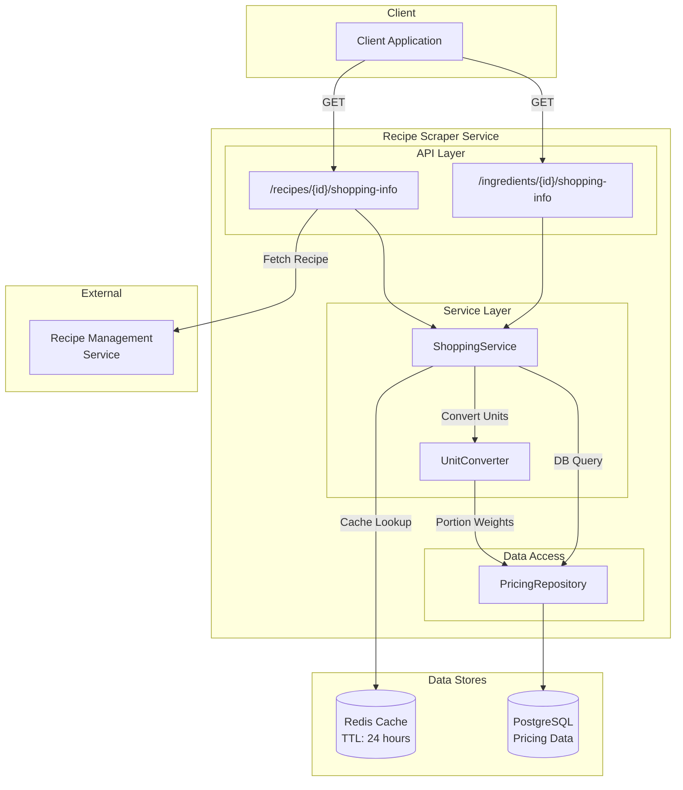
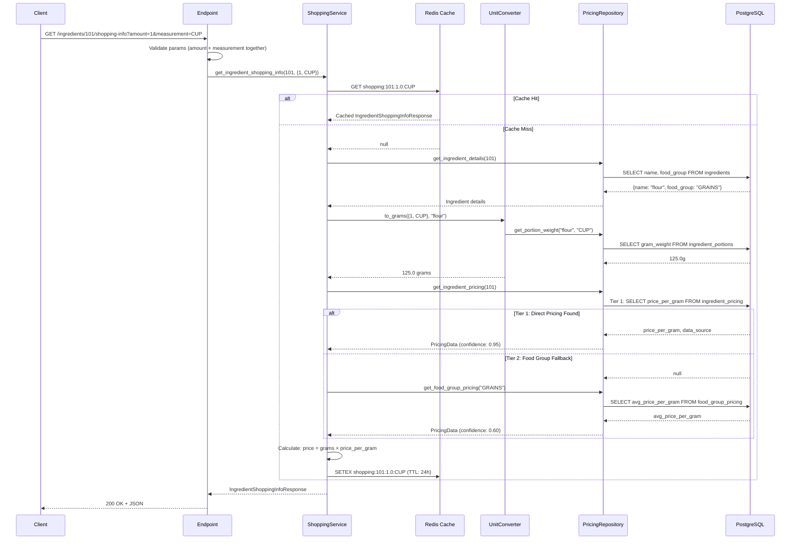
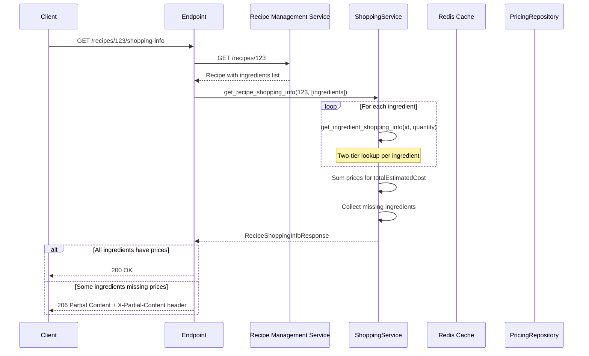
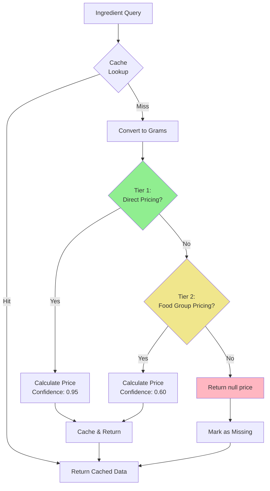
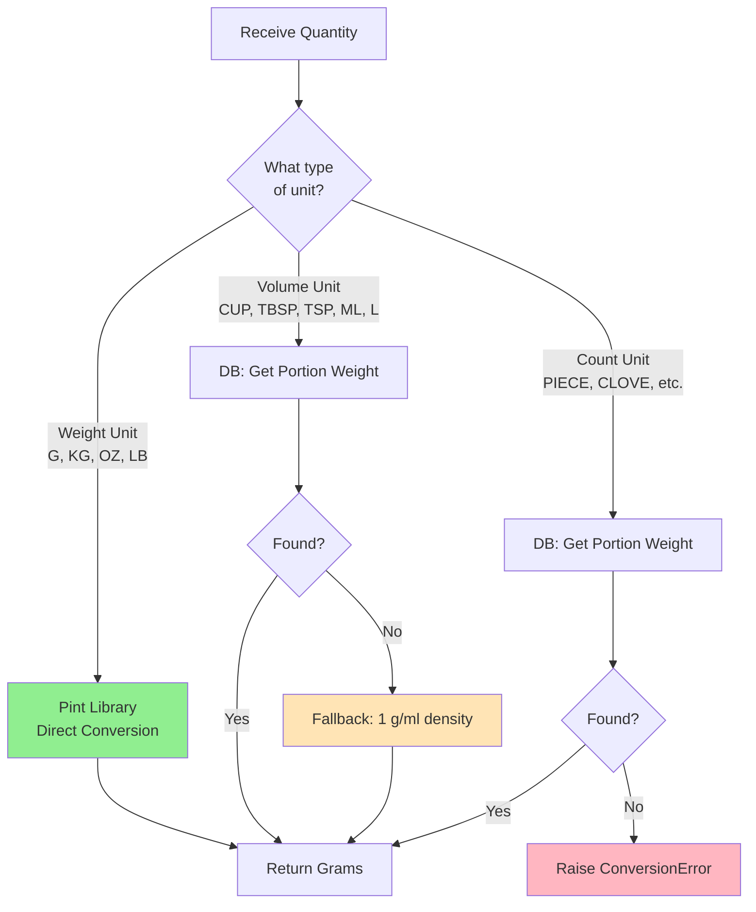
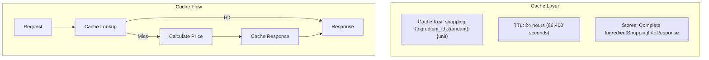
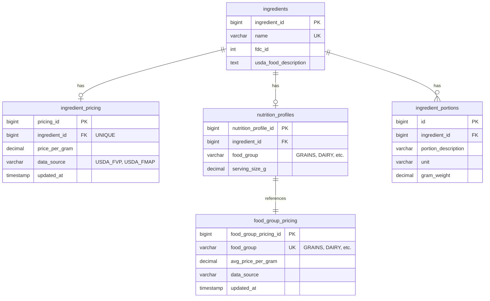

# Shopping Information Feature

This document explains the shopping/pricing information lookup and aggregation system, which provides estimated grocery
costs for ingredients and recipes using USDA pricing data.

## Table of Contents

1. [Overview](#1-overview)
2. [API Endpoints](#2-api-endpoints)
3. [Processing Flow](#3-processing-flow)
4. [Two-Tier Pricing Strategy](#4-two-tier-pricing-strategy)
5. [Unit Conversion](#5-unit-conversion)
6. [Caching Strategy](#6-caching-strategy)
7. [Database Schema](#7-database-schema)
8. [Error Handling](#8-error-handling)
9. [Data Attribution](#9-data-attribution)

---

## 1. Overview

The shopping information feature provides estimated grocery costs for both individual ingredients and complete recipes.
The system uses a two-tier pricing lookup strategy with USDA pricing data, falling back to food group averages when
direct ingredient pricing is unavailable.

### High-Level Architecture



### Key Components

| Component         | Purpose                                                      |
| ----------------- | ------------------------------------------------------------ |
| ShoppingService   | Orchestrates caching, conversion, and pricing calculations   |
| UnitConverter     | Converts between measurement units using Pint library        |
| PricingRepository | PostgreSQL access for ingredient and food group pricing data |
| Redis Cache       | 24-hour caching of computed pricing responses                |

### Pricing Tiers

| Tier | Source                    | Confidence | Description                          |
| ---- | ------------------------- | ---------- | ------------------------------------ |
| 1    | Direct Ingredient Pricing | 0.95       | Exact price per gram for ingredient  |
| 2    | Food Group Average        | 0.60       | Average price for ingredient's group |

---

## 2. API Endpoints

### Ingredient Shopping Info

**Endpoint:** `GET /api/v1/recipe-scraper/ingredients/{ingredient_id}/shopping-info`

Retrieves pricing data for a single ingredient with optional quantity scaling.

| Parameter     | Type  | Required | Description                                  |
| ------------- | ----- | -------- | -------------------------------------------- |
| ingredient_id | int   | Yes      | Ingredient database identifier               |
| amount        | float | No       | Quantity amount (must be with measurement)   |
| measurement   | enum  | No       | Unit of measurement (G, KG, CUP, TBSP, etc.) |

**Response (200 OK):**

```json
{
  "ingredientName": "flour",
  "quantity": { "amount": 250.0, "measurement": "G" },
  "estimatedPrice": "0.45",
  "priceConfidence": 0.95,
  "dataSource": "USDA_FVP",
  "currency": "USD"
}
```

**Notes:**

- If no quantity is provided, returns price for 100 grams
- Both `amount` and `measurement` must be provided together, or neither

### Recipe Shopping Info

**Endpoint:** `GET /api/v1/recipe-scraper/recipes/{recipeId}/shopping-info`

Aggregates pricing data for all ingredients in a recipe.

| Parameter | Type | Required | Description       |
| --------- | ---- | -------- | ----------------- |
| recipeId  | int  | Yes      | Recipe identifier |

**Response Codes:**

- **200 OK** - All ingredients have pricing data
- **206 Partial Content** - Some ingredients missing prices (X-Partial-Content header lists missing IDs)
- **404 Not Found** - Recipe not found
- **503 Service Unavailable** - Recipe Management Service unavailable

**Response (200 OK):**

```json
{
  "recipeId": 123,
  "ingredients": {
    "flour": {
      "ingredientName": "flour",
      "quantity": { "amount": 250.0, "measurement": "G" },
      "estimatedPrice": "0.45",
      "priceConfidence": 0.95,
      "dataSource": "USDA_FVP",
      "currency": "USD"
    },
    "butter": {
      "ingredientName": "butter",
      "quantity": { "amount": 227.0, "measurement": "G" },
      "estimatedPrice": "3.50",
      "priceConfidence": 0.95,
      "dataSource": "USDA_FVP",
      "currency": "USD"
    }
  },
  "totalEstimatedCost": "3.95",
  "missingIngredients": null
}
```

**Response (206 Partial Content):**

```http
HTTP/1.1 206 Partial Content
X-Partial-Content: 105,108
```

```json
{
  "recipeId": 123,
  "ingredients": {...},
  "totalEstimatedCost": "2.50",
  "missingIngredients": [105, 108]
}
```

---

## 3. Processing Flow

### Single Ingredient Lookup



### Recipe Aggregation Flow



---

## 4. Two-Tier Pricing Strategy

The ShoppingService uses a two-tier approach to maximize pricing data availability while indicating confidence levels.



### Confidence Scores

| Tier | Confidence | Description                                        |
| ---- | ---------- | -------------------------------------------------- |
| 1    | 0.95       | Direct ingredient pricing - highly accurate        |
| 2    | 0.60       | Food group average - less accurate but informative |
| -    | null       | No pricing data available                          |

### Data Sources

| Source    | Description                              |
| --------- | ---------------------------------------- |
| USDA_FVP  | USDA Fruit and Vegetable Prices          |
| USDA_FMAP | USDA Food Marketing and Analysis Program |

---

## 5. Unit Conversion

The UnitConverter converts ingredient quantities to grams for price calculation using a three-tier strategy:



### Supported Units

| Category | Units                        | Conversion Method            |
| -------- | ---------------------------- | ---------------------------- |
| Weight   | G, KG, OZ, LB                | Direct Pint conversion       |
| Volume   | CUP, TBSP, TSP, ML, L, FL_OZ | DB lookup → 1 g/ml fallback  |
| Count    | PIECE, CLOVE, SLICE, etc.    | DB lookup → Error if missing |

---

## 6. Caching Strategy



### Key Design Decisions

1. **Computed Response Caching**: Cache stores the complete response including calculated price

   - Different quantities result in different cache entries
   - Avoids recalculation for repeated identical requests

2. **24-hour TTL**: Shorter than nutrition (30 days) because:

   - Prices are more volatile than nutritional data
   - Still provides significant performance benefit

3. **Graceful Degradation**: Cache failures don't fail requests
   - Falls back to direct database calculation
   - Errors logged but not propagated

### Cache Key Format

```text
shopping:{ingredient_id}:{amount}:{unit}

Examples:
- shopping:101:100.0:G
- shopping:101:1.0:CUP
- shopping:102:2.0:TBSP
```

---

## 7. Database Schema



### Query Patterns

**Tier 1 - Direct Ingredient Pricing:**

```sql
SELECT price_per_gram, data_source
FROM recipe_manager.ingredient_pricing
WHERE ingredient_id = $1
```

**Tier 2 - Food Group Fallback:**

```sql
SELECT fgp.avg_price_per_gram, fgp.data_source
FROM recipe_manager.food_group_pricing fgp
JOIN recipe_manager.nutrition_profiles np
    ON fgp.food_group = np.food_group
WHERE np.ingredient_id = $1
```

---

## 8. Error Handling

### Error Codes Reference

| HTTP Status | Error Code              | Scenario                                         |
| ----------- | ----------------------- | ------------------------------------------------ |
| 200         | -                       | Success - all pricing data found                 |
| 206         | -                       | Partial Content - some ingredients missing price |
| 400         | INVALID_QUANTITY_PARAMS | Only amount or only measurement provided         |
| 404         | INGREDIENT_NOT_FOUND    | Ingredient not in database                       |
| 422         | CONVERSION_ERROR        | Unit conversion failed (e.g., PIECE without DB)  |
| 503         | SERVICE_UNAVAILABLE     | Recipe Management Service unavailable            |

### Error Response Format

```json
{
  "error": "HTTP_ERROR",
  "message": "{'error': 'INVALID_QUANTITY_PARAMS', 'message': 'Both amount and measurement must be provided together'}",
  "details": null,
  "request_id": "abc-123"
}
```

### Partial Content Response

When recipe aggregation encounters ingredients without pricing:

```http
HTTP/1.1 206 Partial Content
X-Partial-Content: 103,105

{
  "recipeId": 123,
  "ingredients": {...},
  "totalEstimatedCost": "5.25",
  "missingIngredients": [103, 105]
}
```

The `X-Partial-Content` header contains comma-separated ingredient IDs that could not be priced.

---

## 9. Data Attribution

Pricing information in this service is derived from USDA data sources:

> **U.S. Department of Agriculture, Economic Research Service.**
>
> - Fruit and Vegetable Prices (FVP)
> - Food Marketing and Analysis Program (FMAP)

### Notes on Pricing Data

- Prices are estimates based on national averages
- Actual grocery prices vary by location, season, and retailer
- Food group averages provide rough estimates when direct pricing unavailable
- Currency is USD; international pricing not currently supported

### Data Freshness

- Pricing data is updated periodically from USDA sources
- Cache TTL of 24 hours balances freshness with performance
- `updated_at` timestamps track when pricing data was last refreshed
